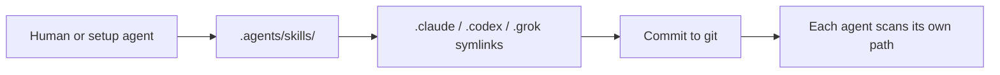

# Agent Skills

Project skills follow the [Agent Skills](https://agentskills.io) open standard. Each skill is a directory with a `SKILL.md` entrypoint and optional scripts, templates, and assets.

## Canonical location

```
.agents/skills/<skill-name>/
├── SKILL.md          # Required: metadata + instructions
├── README.md         # Optional: human notes, upstream link
├── scripts/          # Optional: executable code
└── assets/           # Optional: templates, binaries, static files
```

**Source of truth:** `.agents/skills/` — edit skills here only.

## What are Grok, Claude Code, and Codex?

They are **external AI coding assistants** from different vendors — not created by MedKarute:

| Name | Vendor | Typical interface |
| ---- | ------ | ----------------- |
| **Grok** | xAI | Grok in Cursor, Grok CLI |
| **Claude Code** | Anthropic | Claude Code CLI / desktop |
| **Codex** | OpenAI | Codex CLI |

Each product scans its own skill directory when you open a repo. MedKarute does **not** ship or install these tools; it only lays out paths so they can find shared skills.

## Agent discovery paths

| Agent | Project path | Notes |
| ----- | ------------ | ----- |
| **Codex** | `.agents/skills/` | Scans from CWD up to repo root |
| **Cursor** | `.agents/skills/`, `.cursor/skills/` | Also reads `.claude/skills/`, `.codex/skills/` |
| **Claude Code** | `.claude/skills/` | Symlinked from `.agents/skills/` |
| **Grok** | `.grok/skills/` | Symlinked from `.agents/skills/` |

Compatibility symlinks in this repo point to `.agents/skills/` so all agents share one skill tree:

```
.claude/skills/<name>  →  ../../.agents/skills/<name>
.codex/skills/<name>   →  ../../.agents/skills/<name>
.grok/skills/<name>    →  ../../.agents/skills/<name>
```

### Manual setup — agents do not create this for you

Folders `.claude/`, `.codex/`, `.grok/` and their `skills/` symlinks are **repo setup**, done once by a human or an agent in a setup session — then **committed to git**.

- Agents **read** skills from the paths above; they **do not** auto-create symlinks when you add a new skill.
- If a skill exists only under `.agents/skills/` with no symlinks, Claude Code / Grok / Codex may not see it until you run the symlink step in [Adding a new skill](#adding-a-new-skill).
- After adding symlinks, restart the agent session (or wait for live reload).



## Available skills

| Skill | Description | Upstream |
| ----- | ----------- | -------- |
| `md-to-docx` | Convert Markdown to formatted Word (.docx) with versioning and normalization | [pickle-an/md-to-docx-skill](https://github.com/pickle-an/md-to-docx-skill) (Python); also [awesome-copilot SKILL.md](https://github.com/github/awesome-copilot/blob/main/skills/md-to-docx/SKILL.md) for doc/feature updates |

Vendored skills in `.agents/skills/` may diverge from upstream (e.g. English `SKILL.md`, MedKarute symlink layout). Sync Python from pickle-an; diff awesome-copilot `SKILL.md` when refreshing instructions — see [`md-to-docx/README.md`](./skills/md-to-docx/README.md).

## Adding a new skill

For third-party skills, link the upstream repo in the skill table above and in `SKILL.md` / `README.md` under the skill folder (see [`md-to-docx`](./skills/md-to-docx/README.md) as reference).

1. Create `.agents/skills/<skill-name>/SKILL.md` with YAML frontmatter (`name`, `description`).
2. Add compatibility symlinks:

   ```bash
   SKILL=your-skill-name
   for dir in .claude/skills .codex/skills .grok/skills; do
     mkdir -p "$dir"
     ln -sfn "../../.agents/skills/$SKILL" "$dir/$SKILL"
   done
   ```

3. Restart the agent session (or wait for live reload) so discovery picks up the new skill.

## Invoking skills

- **Automatic:** Agents load skill name + description at startup; full `SKILL.md` loads when the task matches `description`.
- **Manual:** Type `/md-to-docx` (Claude Code, Cursor) or `$md-to-docx` (Codex CLI).