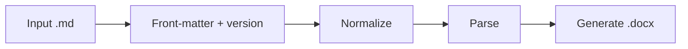

# md-to-docx

Vendored copy of the [md-to-docx-skill](https://github.com/pickle-an/md-to-docx-skill) Agent Skill for MedKarute.

| | |
| --- | --- |
| **Upstream (runtime)** | https://github.com/pickle-an/md-to-docx-skill — Python `scripts/` |
| **Reference (updates)** | https://github.com/github/awesome-copilot/blob/main/skills/md-to-docx/SKILL.md — GitHub Copilot skill (Node.js); compare docs/features, do not swap pipeline |
| **Agent entrypoint** | [`SKILL.md`](./SKILL.md) |
| **Project layout** | `.agents/skills/md-to-docx/` (see [`.agents/README.md`](../../README.md)) |
| **Cross-agent discovery** | Symlinks in `.claude/skills/`, `.codex/skills/`, `.grok/skills/` — manual repo setup, not auto-created by agents (see [`.agents/README.md`](../../README.md)) |

## Layout

```
md-to-docx/
├── SKILL.md              # Agent instructions (required)
├── README.md             # This file
├── scripts/
│   ├── md_to_docx.py     # Main converter (CLI entry)
│   ├── markdown_normalizer.py
│   ├── version_manager.py
│   ├── create_template.py
│   └── create_preview.py
└── assets/
    ├── template.docx
    └── template_preview.docx
```

## MedKarute enhancements

Single Python pipeline. Extra behavior layered on upstream pickle-an (all in `scripts/md_to_docx.py`):

| Feature | Implementation |
| ------- | -------------- |
| YAML front-matter (`title`, `date`, `version`, `audience`) | `extract_front_matter()` → cover page |
| Title / subtitle on `—` or `–` | `split_title_subtitle()` |
| Static table of contents | `add_table_of_contents()` after cover |
| Skip duplicate `#` title when front-matter title exists | `titles_match()` |
| Mermaid placeholder in Word | `add_code_block()` when `language == mermaid` |
| Alternating table row shading | `#F2F7FB` on odd data rows |
| Image-not-found placeholder | `[Image not found: <path>]` |

After syncing `.py` files from pickle-an upstream, re-check these helpers still merge cleanly.

## vs upstream (pickle-an)

Still **one** Python converter — not a second pipeline. MedKarute adds steps inside the same run:



| Step | Upstream | MedKarute |
| ---- | -------- | --------- |
| Read input | `.md` as-is | Strip YAML `---` block first; metadata → cover |
| Versioning | `_V1`, `_V2`, `_normalized.md` | Same |
| Normalize / parse | `markdown_normalizer` + line parser | Same |
| Generate | Cover from first `#` only; Chinese labels | Cover from YAML or `#`; TOC; extras below |
| Layout | Scripts beside `SKILL.md` | `scripts/` + `assets/` |

### Output labels (upstream CN → MedKarute EN)

| Field | Upstream | MedKarute |
| ----- | -------- | --------- |
| Version on cover | `版本：V1` | `Version: V1` |
| Date on cover | `编制日期：2026年07月06日` | `Date: 2026-07-06` |
| Audience | — | `Audience: …` |
| TOC page title | — (no TOC) | `Table of Contents` |
| Missing image | `[图片加载失败: …]` | `[Image not found: …]` |
| Body font | `宋体` / SimSun | `Times New Roman` (default) |

Typography: Times New Roman throughout (code: Consolas), 0.74cm first-line indent, page break before `##`.

### What is actually better

| Improvement | Why it helps |
| ----------- | ------------ |
| YAML front-matter | Session/writing `.md` often already has `title`, `date`, `version`, `audience` — no extra CLI/chat metadata |
| Title — subtitle split | One YAML line → two-line cover |
| Static TOC | Long exports get a navigable page before body content |
| Skip duplicate `#` title | Front-matter title + body `#` no longer prints twice |
| Mermaid placeholder | Research diagrams stay in `.md`; Word gets a clear note instead of raw fences |
| Zebra tables + clearer image errors | Easier to read; agents/users see paths when assets are missing |
| English labels + ISO dates | Matches EN skill/docs and mixed-language research sessions |

**Unchanged from upstream (already strong):** auto versioning, markdown normalizer (incl. Chinese numerals in headings), template support, formal document styles.

### When you notice the difference

- **Large win:** front-matter present, or many `##`–`####` headings (cover + TOC + no duplicate title).
- **Small win:** short `.md` without YAML — mostly label/date format and image error text; conversion logic is nearly the same.

## Run

```bash
cd .agents/skills/md-to-docx
pip install python-docx
python scripts/md_to_docx.py path/to/document.md
```

Optional front-matter example:

```yaml
---
title: Project Name — Executive Summary
date: 2026-07-06
version: V2
audience: Research team
---
```

## Regenerate template assets

```bash
cd .agents/skills/md-to-docx
python3 -m venv .venv && .venv/bin/pip install python-docx
.venv/bin/python scripts/create_template.py    # assets/template.docx
.venv/bin/python scripts/create_preview.py     # assets/template_preview.docx
```

`template_preview.docx` content is defined in `scripts/create_preview.py`. `template.docx` is a blank style-only base from `scripts/create_template.py`.

**Language policy:** User-visible labels in generated `.docx` files and skill docs are English. `markdown_normalizer.py` keeps Chinese characters only as **input** tokens for numeral normalization (e.g. `一、` → `1.`).

## Sync from upstream

**1. Python (pickle-an)** — scripts and template:

```bash
git clone --depth 1 https://github.com/pickle-an/md-to-docx-skill /tmp/md-to-docx-skill
cp /tmp/md-to-docx-skill/*.py .agents/skills/md-to-docx/scripts/
cp /tmp/md-to-docx-skill/template.docx .agents/skills/md-to-docx/assets/
# Re-apply MedKarute enhancements in md_to_docx.py if the merge overwrote them
```

**2. awesome-copilot (reference)** — skill docs / feature checklist:

```bash
curl -sL -o /tmp/awesome-md-to-docx-SKILL.md \
  https://raw.githubusercontent.com/github/awesome-copilot/main/skills/md-to-docx/SKILL.md
# Diff against .agents/skills/md-to-docx/SKILL.md — port doc/UX ideas only (runtime stays Python)
```

| Source | Stack | Use for |
| ------ | ----- | ------- |
| [pickle-an/md-to-docx-skill](https://github.com/pickle-an/md-to-docx-skill) | Python + `python-docx` | Converter code, template, bug reports |
| [awesome-copilot `md-to-docx`](https://github.com/github/awesome-copilot/blob/main/skills/md-to-docx/SKILL.md) | Node.js + `docx`/`marked` | Updating `SKILL.md`, missing features (e.g. PNG embed sizing notes) |

Report converter bugs to [pickle-an/md-to-docx-skill](https://github.com/pickle-an/md-to-docx-skill). Report MedKarute integration issues in this repo.