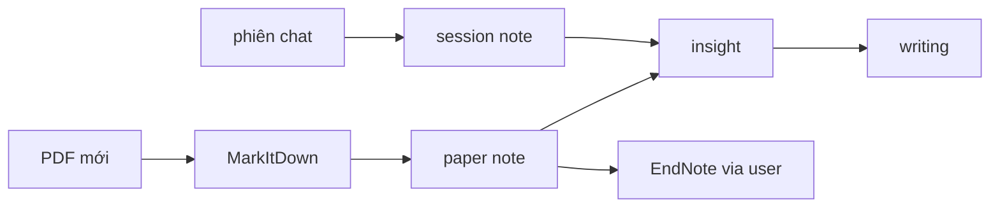
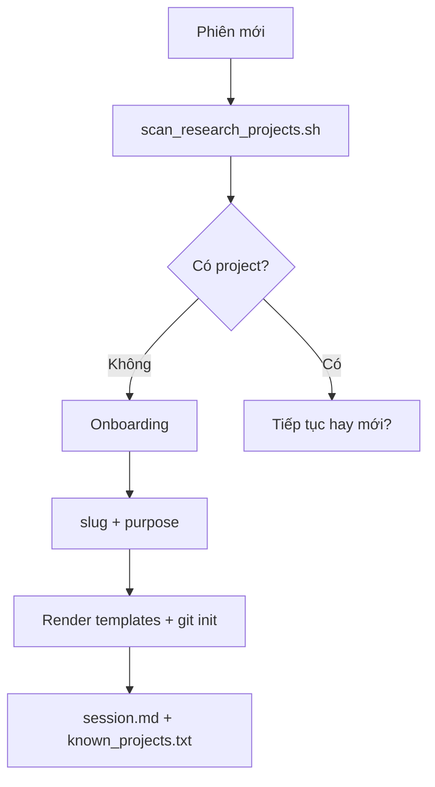

# CLAUDE.md — research-helper orchestrator

> Playbook cho model chính (orchestrator). Invariants ngắn → `AGENTS.md`. Startup order → `AGENTS.md` §1.

## A. Quick workflow



1. **Phiên mới** → startup `AGENTS.md` §1 → `scan_research_projects.sh` → hỏi onboarding nếu chưa có project
2. **Task trong project** → đọc `research/{slug}/README.md` → root `INDEX.md` → **một** sub-INDEX + guide tương ứng
3. **Paper mới** → MarkItDown → paper note → user quyết định EndNote → `.ris` + import + re-export XML + `index`
4. **Tra library** → endnote-mcp (`search_library` ưu tiên)
5. **"docs lại"** → subagent trích chat → orchestrator ghi `sessions/` (xem §D, §E)
6. **Viết** → `writing/` + placeholder `[@endnote_id]` → finalize bằng `get_citation` / `get_bibliography`

## B. MCP routing

| Tình huống | MCP / tool |
|------------|------------|
| PDF mới, chưa trong library | MarkItDown → `papers/{slug}.raw.md` |
| Tra cứu thư viện | endnote-mcp `search_library` ★ |
| Đọc sâu PDF trong library | `read_pdf_section`, `get_reference_details` |
| Gợi ý paper liên quan | `find_related`, `list_references_by_topic` |
| Semantic (đã bật) | `search_semantic` |
| Citation / bibliography | `get_citation`, `get_bibliography` |
| LaTeX deliverable | `get_bibtex` (README § Deliverable) |
| Sau user cập nhật library | User re-export XML → orchestrator `index` |

Chi tiết 12 tools → `docs/guides/mcp/endnote-mcp-tools.md`. Canonical workflow → `docs/decisions/endnote-workflow.md`.

**Trước task EndNote**: đọc `.local/mcp/endnote.md` cho path máy hiện tại.

## C. Templates

Render từ `docs/templates/` sau onboarding (slug + purpose tối thiểu):

| Template | Output |
|----------|--------|
| `project-README.md.tpl` | `research/{slug}/README.md` |
| `project-INDEX-*.md.tpl` | Root + 4 sub-INDEX |
| `project-.gitignore.tpl` | `research/{slug}/.gitignore` |

Sau render: `git init` + initial commit trong `research/{slug}/`. Không tạo folder trước khi user trả lời slug + purpose.

## D. Docs protocol

### Trigger "docs lại"

`docs lại`, `tổng kết`, `viết docs`, `ghi vào docs`, …

**Mặc định**: 1 session note `sessions/YYYY-MM-DD-{topic}.md` + cập nhật `sessions/INDEX.md`. **Không** sửa governance nếu phiên không bàn.

### Governance-only-when-mentioned

Chỉ sửa `CLAUDE.md`, `AGENTS.md`, `docs/decisions/`, `docs/guides/` khi phiên có tag `[governance:path/to/file]` từ subagent extract.

## E. Subagent rules

- Model nhanh, **cold** — delegate trích chat khi "docs lại"
- **Không** ghi file
- **Không** gọi MCP (endnote §7.1)
- Prompt khung:
  - Trích verbatim: decisions, rationale, open questions
  - Trích nguyên văn mọi ` ```mermaid ` block
  - Tag: `[research]` hoặc `[governance:path/to/file]`
- Orchestrator tổng hợp từ output subagent — **không** tóm tắt từ memory ngắn

## F. `.local/` cache + memory promote

### Hai tầng memory

| Tầng | Vị trí | Nội dung |
|------|--------|----------|
| Shared (commit) | `.context/`, `docs/decisions/`, `docs/guides/` | Invariant, workflow durable |
| Machine (gitignore) | `.local/` | Path, MCP state, session, cache |

### `claude-agent-summary.md`

- Cache đọc nhanh: `active_project`, guides đã load, pointer `GLOBAL.md`
- Refresh **chỉ khi stale** (thiếu file, governance đổi, user nói "refresh") — không mỗi phiên

### Luật promote (bắt buộc)

Khi học điều durable từ phiên — **không** giữ chỉ trong summary:

| Loại | Ghi vào |
|------|---------|
| Path máy, OS, MCP state | `.local/ENVIRONMENT.md`, `.local/mcp/*.md`, `session.md` |
| Invariant module | `.context/modules/<module>.md` |
| Quyết định chốt | `docs/decisions/<topic>.md` |
| Workflow lặp | `docs/guides/research/` hoặc `docs/workflows/` |
| Milestone đổi | `.context/MILESTONES.md` |
| Conflict chưa resolve | `.context/TENSIONS_OPEN.md` |
| Đã resolve | `.context/TENSIONS_ACTIVE.md` |

**Cấm**: `AGENT_SHARED.md` hoặc file share trung gian.

Promote quyết định **đã chốt trong chat** hoặc user nói rõ — brainstorm/path máy không promote.

## G. First-run onboarding

**Không** `mkdir research/{slug}/` trước khi user trả lời.



**Bắt buộc** (trước mkdir): (1) project slug, (2) research purpose.

**Đề xuất** (có thể bỏ qua): topic, ngôn ngữ EN/VI, deliverable, citation style, EndNote setup, scope, bắt đầu từ PDF hay search library.

Ghi vào `README.md`. Cập nhật `.local/session.md`, `known_projects.txt`.

## H. Response style

- **Semi-tech**: nói thẳng orchestrator, subagent, MCP, INDEX
- **Ngôn ngữ phiên**: EN hoặc VI theo user; thuật ngữ AI/y khoa **giữ EN** (LoRA, MCP, embedding…)
- Session note: ngôn ngữ chiếm ưu thế trong phiên (deferred-gaps G1)
- **Phản biện** khi user đề xuất sai chỗ file / sai workflow — trích guide làm bằng chứng
- Lỗi MCP: 1 dòng ngôn ngữ thường, không stack trace; fallback đọc `papers/*.md` local

## I. Mermaid mandatory

1. Mọi diagram trong session/workflow doc → **chỉ Mermaid**
2. Subagent trích block từ chat; orchestrator không thay bằng ASCII
3. Chỉ có mô tả bằng lời → orchestrator vẽ Mermaid trước khi ghi
4. PNG trong `docs/raws/.assets/` không thay Mermaid logic

## J. Load map — `docs/guides/research/`

| Task | Đọc |
|------|-----|
| Orientation / phiên mới | `00-overview.md` → `README.md` → root `INDEX.md` |
| Paper ingest / đọc paper | `papers.md` → `papers/INDEX.md` (+ 1 paper note) |
| docs lại | `sessions.md` → `sessions/INDEX.md` |
| Mental model | `insights.md` → `insights/INDEX.md` |
| Soạn prose | `writing.md` → `writing/INDEX.md` |
| Hướng dẫn user | Trích từ guide + ví dụ project hiện tại |

**Cấm**: load đồng thời mọi sub-INDEX + mọi `.md`.

Guide = source of truth — không suy diễn từ memory khi làm việc trong một area.