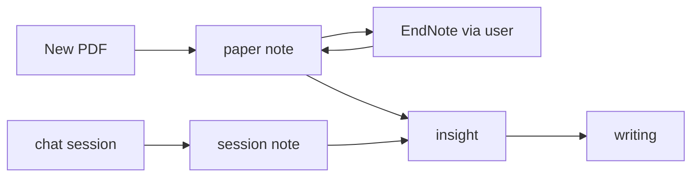

# research-helper

> **Languages**: [Tiếng Việt](docs/readme/README.vi.md) — more in [docs/readme/](docs/readme/) (human-only, not in agent load map)

**research-helper** is a chat-driven research assistant: an agent (orchestrator) runs the research workflow via chat, writes results to Markdown under `research/{slug}/`, and calls two MCP servers — **MarkItDown** (new PDFs) and **endnote-mcp** (curated EndNote library). Governance (`AGENTS.md`, `CLAUDE.md`, `docs/`) defines how the agent behaves; research data lives in separate per-project folders.

## Getting started

1. Clone or open this repo.
2. Use an **agent coding tool** (Claude Code, Grok CLI, Cursor, …) **or** a plain CLI (`claude`, `grok`, …) — from the repo root, say **"bắt đầu"** (or "start").
3. The agent reads `AGENTS.md` / `CLAUDE.md` → runs onboarding (slug + purpose) → creates `research/{slug}/` if you have no project yet.

**Nothing fancy.** A coding tool or IDE only makes files, diffs, and the tree easier to see — the agent still works from committed `.md` files. Plain CLI without an IDE **works the same**; no specific tool is required.

> `huong-dan-su-dung.md` (distilled end-user guide) — not written yet; deferred until guides have real content.

## Workflow (overview)

Artifacts, INDEX routing, per-project git → [docs/guides/research/00-overview.md](docs/guides/research/00-overview.md).

## Tools & roles

| Tool | Role in research-helper |
|------|-------------------------|
| **MarkItDown MCP** | Convert new PDFs → token-efficient Markdown for the agent (papers not yet in EndNote) |
| **endnote-mcp** | Read curated EndNote library — search, deep PDF read, citation/bibliography. Read-only (writes via EndNote desktop) |
| **whyschools** ([`docs/raws/research-helper.md`](docs/raws/research-helper.md)) | Original design inspiration for combining MarkItDown + endnote-mcp — **not a runtime dependency**, reference only |
| **context-mapping pattern** ([`docs/raws/agent-memory-and-load-protocol.md`](docs/raws/agent-memory-and-load-protocol.md) §0, from skvn-marine) | `.context/` architecture (GLOBAL/MILESTONES/TENSIONS/modules) — AI memory convention, **not an installable tool** |
| **Markpad** | Local `.md` viewer for the user — not an MCP, viewer only |

## Quick links

| File | Purpose |
|------|---------|
| [AGENTS.md](AGENTS.md) | Invariants, startup order |
| [CLAUDE.md](CLAUDE.md) | Orchestrator playbook |
| [docs/guides/research/00-overview.md](docs/guides/research/00-overview.md) | `research/` workflow detail |
| [docs/decisions/endnote-workflow.md](docs/decisions/endnote-workflow.md) | EndNote workflow (canonical) |