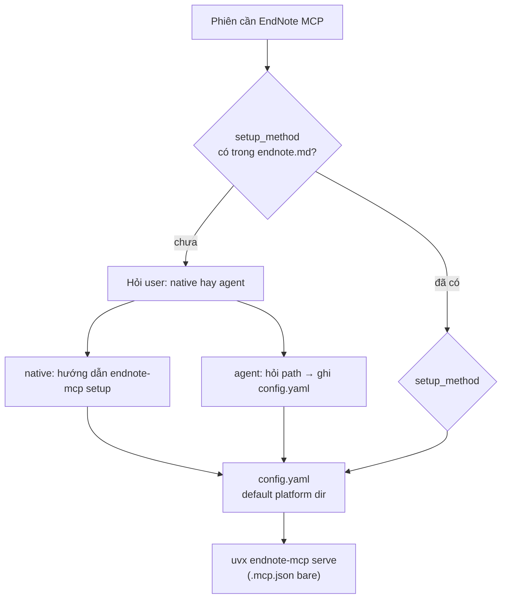

# Decision — EndNote workflow

> Canonical. Chi tiết vận hành → `docs/guides/mcp/endnote-mcp-tools.md`. Nguồn: `docs/raws/endnote-workflow-open-questions.md` §1–§8 (đã duyệt 2026-07-03).

## 1. Setup

| Quyết định | Chi tiết |
|------------|----------|
| OS | Mac ưu tiên (persona bác sĩ); **không** hard-code path trong governance |
| Path runtime | `.local/ENVIRONMENT.md` + `.local/mcp/endnote.md` — đa OS profile |
| XML stale check | So `mtime` XML với `xml_mtime_at_index` / `last_indexed` — **không** hỏi mỗi phiên |
| Lần đầu index | `index` (đủ khi chưa có DB); `rebuild_index` khi index hỏng |
| Log | `.local/mcp/endnote-index.log` — timestamp, lệnh, số ref, thời gian, kết quả |
| Semantic | **BM25 trước** (`search_library`). Bật semantic khi library > ~100 ref hoặc `semantic_miss_count` chạm ngưỡng |
| MCP config | `.mcp.json` bare `uvx endnote-mcp serve`; `config.yaml` ở default platform dir — onboarding chọn `setup_method` — xem §MCP config resolution |

**Nguyên tắc**: Mọi thứ check được bằng file/mtime → agent tự check; chỉ hỏi khi cần hành động user (export XML, add reference).

## MCP config resolution

**Bối cảnh** (verify 2026-07-03, `endnote_mcp==1.4.8` — xem `docs/raws/2026-07-03-endnote-mcp-verify-report.md`, `.context/TENSIONS_ACTIVE.md` T-001): `endnote-mcp serve` không nhận flag; `Config.load()` tự tìm `config.yaml` ở **default platform dir** (`~/Library/Application Support/endnote-mcp/` Mac, `%APPDATA%\endnote-mcp\` Win, `~/.config/endnote-mcp/` Linux) nếu không có `ENDNOTE_MCP_CONFIG`. Wizard `endnote-mcp setup` tự ghi đúng vào default dir này. Biến `ENDNOTE_XML_PATH` trong skeleton cũ **không tồn tại** trong package.

**Quyết định** (T-001, 2026-07-03): **Bỏ wrapper script** — cả 2 hướng dưới đây đều kết thúc bằng `config.yaml` nằm đúng default platform dir, nên `.mcp.json` trở lại **bare**:

```json
{ "mcpServers": { "endnote-mcp": { "command": "uvx", "args": ["endnote-mcp", "serve"] } } }
```

**Thiết kế — hỏi lúc onboarding, lưu lựa chọn, không hỏi lại**:

Khi phiên đầu tiên cần EndNote MCP mà `.local/mcp/endnote.md` chưa có `setup_method` — agent hỏi trong chat, đưa 2 lựa chọn kèm phân tích ngắn lợi/hại:

| # | Lựa chọn | Cách làm | Ưu | Nhược |
|---|----------|----------|-----|-------|
| **1** | **Setup thủ công (native wizard)** | User tự mở terminal, chạy `endnote-mcp setup` — 1 lần lúc cài máy. Tool tự tìm XML/PDF dir (heuristic có sẵn, tốt hơn agent đoán), tự ghi `config.yaml` default dir | Chịu khó 1 lần, nhưng **dễ kiểm soát** (đúng tool gốc, auto-detect mạnh), **tiết kiệm** — không tốn token agent | Cần tự tay mở terminal, đọc prompt tiếng Anh cơ bản |
| **2** | **Agent làm hộ (qua chat)** | Agent hỏi path XML/PDF trong chat → tự ghi trực tiếp `config.yaml` vào đúng default platform dir (biết trước theo `os_profile` trong `.local/ENVIRONMENT.md`) → tự chạy `index` | **Nhàn** — không đụng terminal, hoàn toàn qua chat | **Tốn token** (agent xử lý path, lỗi format, retry); **khó kiểm soát hơn** — không có auto-detect mạnh như wizard, rủi ro path sai mà agent không phát hiện ngay |

- Lưu lựa chọn: field `setup_method: native | agent` trong `.local/mcp/endnote.md`
- Nếu `native`: agent chỉ hướng dẫn 1 lần, chờ user xác nhận đã chạy xong (check `config.yaml` tồn tại ở default dir), không tự ghi gì
- Nếu `agent`: agent hỏi path trong chat → tự ghi `config.yaml` (4 field: `endnote_xml`, `pdf_dir`, `db_path`, `max_pdf_pages: 30`) vào default dir theo `os_profile` → tự `index`
- Cả 2 nhánh: sau khi có `config.yaml`, mọi thứ khác (mtime check, re-index, v.v.) giữ nguyên như §2–§8 — không đổi gì



**Launcher**: `.mcp.json` gọi `uvx endnote-mcp serve` trực tiếp. `markitdown` giữ `uvx` trực tiếp.

## 2. Paper mới

endnote-mcp **read-only** — chỉ user add vào EndNote desktop.

| Bước | Ai |
|------|-----|
| PDF → MarkItDown → paper note | Agent |
| User quyết định giữ | User |
| Sinh `.ris` (không BibTeX) | Agent |
| Import EndNote | User |
| Re-export XML | User (agent nhắc + check mtime) |
| `index` incremental | Orchestrator (sau user xác nhận) |
| Verify DOI → `endnote_id` | Agent |

**Invariant**: Add reference mới ⇒ **bắt buộc re-export XML** rồi `index`. XML là snapshot tĩnh.

**PDF**: Sau `in-endnote`, EndNote attachment là **bản chính**. `papers/*.pdf` inbound cho paper mới; không sync 2 chiều.

## 3. Tra cứu

| Tool | Khi nào |
|------|---------|
| `search_library` ★ | Mặc định |
| `search_semantic` | Đã bật semantic + tìm theo khái niệm |
| `find_related` | Đã có paper neo, mở rộng Related Work |
| `read_pdf_section` | Đọc có mục tiêu — không đọc cả PDF |
| `list_references_by_topic` | Onboarding project / khởi tạo insight |

Fallback search: `search_library` → semantic → hỏi user thêm từ khóa.

**Subagent**: không gọi MCP — chỉ orchestrator.

## 4. Citation & writing

- Style từ `README.md § Citation style` — không hỏi mỗi lần
- Draft: placeholder `[@{endnote_id}]`
- Finalize: `get_citation` + `get_bibliography`
- `get_bibtex` chỉ khi deliverable LaTeX

## 5. Insight & session link

- Insight Evidence: link `papers/foo.md` bắt buộc; không duplicate `endnote_id`
- Pending EndNote: `session.md` + `- [ ] add to EndNote: {slug}`
- Status `papers/INDEX`: `new` → `processed` → `in-endnote` → `linked-insight` (cao nhất đạt được)

## 6. Bảo trì & đồng bộ

| # | Quyết định |
|---|------------|
| 6.1 | Re-index **event-driven** — không cron |
| 6.2 | **Không realtime sync** — agent không tự biết user sửa/xóa ref trong EndNote desktop. Con đường duy nhất: user re-export XML → mtime đổi → `index` → diff ref count trong log → nếu giảm, báo user. **Không hứa automation phát hiện sửa/xóa live.** |
| 6.3 | Mặc định `index`; `rebuild_index` khi đổi path, index hỏng, xóa nhiều ref, đổi version MCP |
| 6.4 | Đổi PDF attachment → re-export + re-index; nghi ngờ thì `rebuild_index` |
| 6.5 | Nhắc export XML: chỉ khi phiên có task library **và** XML cũ hơn **7 ngày** |

## 7. Agent & `.local`

- Orchestrator-only MCP calls
- Log side-effect ops: `index`, `rebuild_index`, `embed`, lỗi — không log search vặt
- MCP lỗi: 1 dòng user-friendly; fallback `papers/*.md`; chi tiết kỹ thuật vào log

### Schema `.local/mcp/endnote.md`

```
setup_method:             # native | agent — lựa chọn onboarding, không hỏi lại
xml_export_path:
pdf_dir:                  # optional — sync từ config.yaml hoặc user cung cấp
sqlite_index_path:
library_name:
last_xml_export:
last_indexed:
xml_mtime_at_index:
index_log_path: .local/mcp/endnote-index.log
semantic_enabled: false
semantic_miss_count: 0
default_citation_style:
notes:
```

## 8. Git & privacy

- XML export, SQLite index: **không commit** — chỉ `.local` hoặc path ngoài repo
- Máy mới: **không migrate** SQLite — export XML + `index` lại
- `.ris`, `.raw.md`: gitignore trong project — sinh lại được