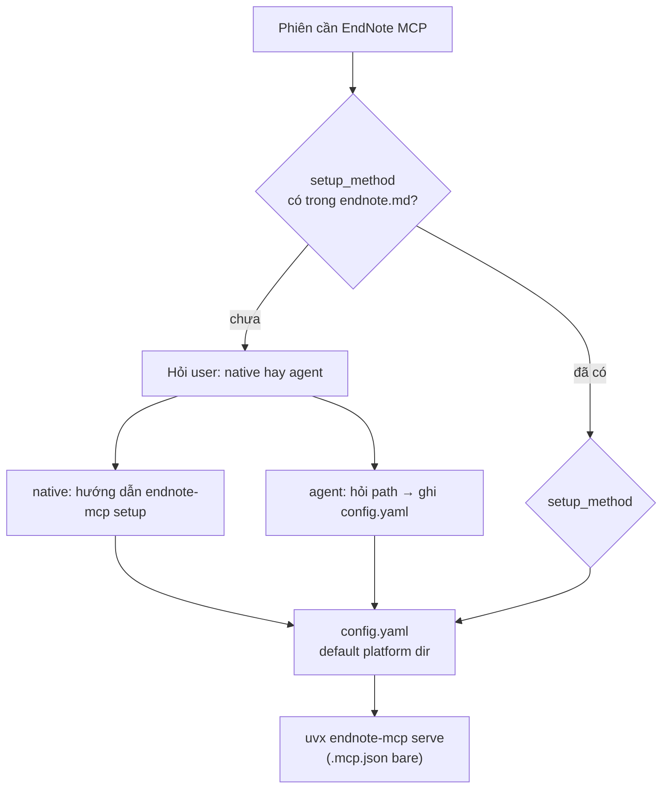

# Decision — EndNote workflow

> Canonical. Chi tiết vận hành → `docs/guides/mcp/endnote-mcp-tools.md`. Nguồn: `docs/raws/endnote-workflow-open-questions.md` §1–§8 (đã duyệt 2026-07-03).

## 1. Setup

| Quyết định | Chi tiết |
|------------|----------|
| OS | Mac ưu tiên (persona bác sĩ); **không** hard-code path trong governance |
| Path runtime | `.local/ENVIRONMENT.md` + `.local/mcp/endnote.md` — đa OS profile |
| XML stale check | So `mtime` XML với `xml_mtime_at_index` / `last_indexed` — **không** hỏi mỗi phiên |
| Lần đầu index | `index` (đủ khi chưa có DB); `rebuild_index` khi index hỏng |
| Log | `.local/mcp/endnote-index.log` — timestamp, lệnh, số ref, thời gian, kết quả |
| Semantic | **BM25 trước** (`search_library`). Bật semantic khi library > ~100 ref hoặc `semantic_miss_count` chạm ngưỡng |
| MCP config | `.mcp.json` bare `uvx endnote-mcp serve`; `config.yaml` ở default platform dir — onboarding chọn `setup_method` — xem §MCP config resolution |

**Nguyên tắc**: Mọi thứ check được bằng file/mtime → agent tự check; chỉ hỏi khi cần hành động user (export XML, add reference).

## MCP config resolution

**Bối cảnh** (verify 2026-07-03, `endnote_mcp==1.4.8` — xem `docs/raws/2026-07-03-endnote-mcp-verify-report.md`, `.context/TENSIONS_ACTIVE.md` T-001): `endnote-mcp serve` không nhận flag; `Config.load()` tự tìm `config.yaml` ở **default platform dir** (`~/Library/Application Support/endnote-mcp/` Mac, `%APPDATA%\endnote-mcp\` Win, `~/.config/endnote-mcp/` Linux) nếu không có `ENDNOTE_MCP_CONFIG`. Wizard `endnote-mcp setup` tự ghi đúng vào default dir này. Biến `ENDNOTE_XML_PATH` trong skeleton cũ **không tồn tại** trong package.

**Quyết định** (T-001, 2026-07-03): **Bỏ wrapper script** — cả 2 hướng dưới đây đều kết thúc bằng `config.yaml` nằm đúng default platform dir, nên `.mcp.json` trở lại **bare**:

```json
{ "mcpServers": { "endnote-mcp": { "command": "uvx", "args": ["endnote-mcp", "serve"] } } }
```

**Thiết kế — hỏi lúc onboarding, lưu lựa chọn, không hỏi lại**:

Khi phiên đầu tiên cần EndNote MCP mà `.local/mcp/endnote.md` chưa có `setup_method` — agent hỏi trong chat, đưa 2 lựa chọn kèm phân tích ngắn lợi/hại:

| # | Lựa chọn | Cách làm | Ưu | Nhược |
|---|----------|----------|-----|-------|
| **1** | **Setup thủ công (native wizard)** | User tự mở terminal, chạy `endnote-mcp setup` — 1 lần lúc cài máy. Tool tự tìm XML/PDF dir (heuristic có sẵn, tốt hơn agent đoán), tự ghi `config.yaml` default dir | Chịu khó 1 lần, nhưng **dễ kiểm soát** (đúng tool gốc, auto-detect mạnh), **tiết kiệm** — không tốn token agent | Cần tự tay mở terminal, đọc prompt tiếng Anh cơ bản |
| **2** | **Agent làm hộ (qua chat)** | Agent hỏi path XML/PDF trong chat → tự ghi trực tiếp `config.yaml` vào đúng default platform dir (biết trước theo `os_profile` trong `.local/ENVIRONMENT.md`) → tự chạy `index` | **Nhàn** — không đụng terminal, hoàn toàn qua chat | **Tốn token** (agent xử lý path, lỗi format, retry); **khó kiểm soát hơn** — không có auto-detect mạnh như wizard, rủi ro path sai mà agent không phát hiện ngay |

- Lưu lựa chọn: field `setup_method: native | agent` trong `.local/mcp/endnote.md`
- Nếu `native`: agent chỉ hướng dẫn 1 lần, chờ user xác nhận đã chạy xong (check `config.yaml` tồn tại ở default dir), không tự ghi gì
- Nếu `agent`: agent hỏi path trong chat → tự ghi `config.yaml` (4 field: `endnote_xml`, `pdf_dir`, `db_path`, `max_pdf_pages: 30`) vào default dir theo `os_profile` → tự `index`
- Cả 2 nhánh: sau khi có `config.yaml`, mọi thứ khác (mtime check, re-index, v.v.) giữ nguyên như §2–§8 — không đổi gì



**Launcher**: `.mcp.json` gọi `uvx endnote-mcp serve` trực tiếp (case macOS/Windows-native).

> **Sửa lại (2026-07-03, smoke-test thật phát hiện)**: nhận định cũ "`markitdown` không cần path cá nhân nên giữ `uvx` trực tiếp, không cần bridge" **sai lý do** — bridge không chỉ vì path cá nhân (XML/PDF library), mà vì **`uvx` có tồn tại trên PATH của process đang gọi hay không**. Máy chọn case Windows+WSL thường **không cài `uv`/`uvx` trên Windows native** (chỉ cài trong WSL) → `markitdown` nếu giữ `command: uvx` trực tiếp sẽ **lỗi ngay khi khởi động MCP** (`uvx` not found). Test thật xác nhận: `where uvx` trên Windows native của máy dev → not found; nhưng `wsl.exe -d Debian -e bash -lc "uvx markitdown-mcp"` → handshake OK (`serverInfo: markitdown v1.8.1`). **Quyết định đúng**: mọi server `uvx`-based (kể cả `markitdown`, không riêng `endnote-mcp`) bridge theo **cùng `os_profile`/`wsl_distro`** của máy — không có server nào "miễn bridge".

### Platform case — macOS / Windows native / Windows+WSL

`get_config_dir()` trong `config.py` chọn default dir theo **process nào đang chạy `serve`** (`platform.system()`), không theo máy vật lý — nên "Windows + WSL" là 1 case launcher riêng, không tự nhiên hoạt động chỉ vì cài `uv` trong WSL.

**Windows — hỏi native hay WSL trước, không mặc định**: khi `os_profile` detect/khai là Windows và chưa có quyết định lưu, agent hỏi user chọn 1 trong 2, kèm phân tích ngắn lợi/hại:

| # | Lựa chọn | Ưu | Nhược |
|---|----------|-----|-------|
| **1** | **Windows native** | Đơn giản nhất — `.mcp.json` bare 3 dòng giống macOS, không cần bridge, không cần cài thêm WSL | Nếu user vốn quen làm việc trong môi trường Linux/WSL cho các tool khác thì tách biệt, không tận dụng được |
| **2** | **Windows + WSL bridge** | Môi trường Linux quen thuộc hơn nếu user đã dùng WSL cho dev việc khác; tránh 1 số edge-case path/encoding riêng của Windows | Thêm 1 lớp bridge (`wsl.exe` launcher) phải đúng 3 điểm kỹ thuật (xem dưới); cần cài `uv` riêng trong WSL; path phải qua `/mnt/c/`; phức tạp hơn để debug; **chưa smoke-test thật** |

- Lưu quyết định vào `.local/ENVIRONMENT.md` field `os_profile:` — chọn native thì giữ `windows`, chọn bridge thì đổi thành `wsl`
- Không hỏi lại khi `os_profile` đã có giá trị

| Case | `.mcp.json` command | Config.yaml nằm ở đâu | Ghi chú | Đã smoke-test thật? |
|---|---|---|---|---|
| **macOS** | `uvx endnote-mcp serve` (bare) | `~/Library/Application Support/endnote-mcp/config.yaml` | Mặc định, không cần bridge | **Chưa** — xem §Mac status verify dưới |
| **Windows native** | `uvx endnote-mcp serve` (bare) | `%APPDATA%\endnote-mcp\config.yaml` | Mặc định, `uv`/`uvx` cài thẳng trên Windows | Chưa (nhưng cùng cơ chế bare như Mac — rủi ro thấp hơn) |
| **Windows + WSL bridge** | `wsl.exe` làm launcher — xem dưới | `~/.config/endnote-mcp/config.yaml` **bên trong WSL** (Linux path, vì process con là Linux) | Chỉ dùng khi muốn `serve` chạy hẳn trong WSL thay vì Windows native | **Có** — handshake JSON-RPC thật 2026-07-03, `docs/raws/2026-07-03-endnote-mcp-verify-report.md` §7 |

### Mac — status verify (T-002, `.context/TENSIONS_OPEN.md`)

**Mac là persona chính** (§1 "OS") nhưng **chưa có 1 lần chạy thật nào** — mọi điểm dưới đây chỉ verify qua đọc source code thật (`config.py`/`cli.py`, package `endnote_mcp==1.4.8`), không phải test trên máy Mac. Gom lại 1 chỗ để không phải lục rải rác:

| Điểm | Biết gì (qua source code) | Chưa biết (cần máy Mac thật) |
|---|---|---|
| Config path | `get_config_dir()` → `~/Library/Application Support/endnote-mcp/config.yaml` khi `platform.system()=="Darwin"` | Chưa xác nhận `setup` wizard ghi đúng path này trên máy Mac thật |
| Cài `uv`/`uvx` | Không có sẵn trên Mac mặc định (giống Windows) | Chưa có hướng dẫn cài (`brew install uv` hay curl script) trong bất kỳ guide nào — **gap, chưa từng ghi ở đâu** |
| `setup` wizard scan XML/PDF | Source có logic bỏ qua `iCloud`/`.Library` để tránh treo máy (`_find_or_ask_xml`/`_find_or_ask_pdf_dir`) | Chưa test với iCloud Drive bật thật — không biết heuristic có thực sự tránh treo/miss path không |
| `endnote-mcp install` (đăng ký Claude Desktop) | `_install_claude_desktop()` ghi vào `~/Library/Application Support/Claude/claude_desktop_config.json` | Chưa chạy thật `endnote-mcp install` trên Mac |

**Quy trình cập nhật khi có máy Mac thật** (chốt 2026-07-03): người test thật chạy onboarding → phát hiện sai lệch so với bảng trên → sửa qua **PR** (không sửa thẳng `main`/`master`) → cập nhật lại bảng này với cột "Đã smoke-test thật?" ở trên.

**Windows + WSL — `.mcp.json`**:

```json
{
  "mcpServers": {
    "endnote-mcp": {
      "command": "wsl.exe",
      "args": ["-d", "Debian", "-e", "bash", "-lc", "uvx endnote-mcp serve"]
    }
  }
}
```

**3 điểm bắt buộc đúng khi dùng case này**:

| Điểm | Vì sao | Cách đúng |
|---|---|---|
| `-d <Distro>` chỉ định rõ tên distro | Không có `-d` → dùng default distro của máy, đổi default sau là vỡ config im lặng | Pin cứng tên distro trong `args` |
| `bash -lc "..."` chứ không `-e uvx` thẳng | `-e` không chạy login shell → không source `.bashrc`/`.profile` → `uvx` (cài ở `~/.local/bin`) không nằm trong PATH → lỗi "command not found" | Bắt buộc `bash -lc` |
| `uv`/`uvx` cài **bên trong WSL** riêng | Cài trên Windows native không giúp gì — 2 PATH tách biệt hoàn toàn, không kế thừa | Trong WSL: `curl -LsSf https://astral.sh/uv/install.sh \| sh` |

**Path dữ liệu (case Windows+WSL)**: EndNote desktop chạy trên Windows, xuất XML/PDF vào path Windows — `config.yaml` (ghi bên trong WSL) trỏ:

- `endnote_xml`, `pdf_dir` → qua `/mnt/c/Users/<user>/...` (DrvFs, đọc được, chấp nhận chậm hơn native chút)
- `db_path` → **để mặc định**, không override sang `/mnt/c/...` — SQLite nên nằm native ext4 (`~/.config/endnote-mcp/library.db`) để tránh file-locking issue trên DrvFs

stdio (JSON-RPC qua stdin/stdout) — `wsl.exe` forward pipe bình thường khi bị spawn làm subprocess con, không cần cấu hình thêm.

> **Smoke-test thật đã xác nhận** (2026-07-03) — gửi JSON-RPC `initialize` qua stdin xuyên `wsl.exe → bash -lc → uvx → endnote-mcp serve`, nhận đúng response MCP protocol (`serverInfo`, `capabilities`). Bridge hoạt động đúng — chi tiết `docs/raws/2026-07-03-endnote-mcp-verify-report.md` §7.
>
**Git — `.mcp.json` là file sinh ra từ template (CHỐT 2026-07-03)**: `.mcp.json` chứa giá trị riêng máy (tên distro WSL) nên **không track git**. Cơ chế:

| File | Track git? | Vai trò |
|---|---|---|
| `.mcp.json.tpl` | **Có** — commit | Canonical bare skeleton (macOS/Windows-native mặc định). Nguồn để render |
| `.mcp.json` | **Không** — trong `.gitignore` | File thật MCP client đọc, sinh ra từ `.tpl` lúc onboarding/setup, mỗi máy khác nhau tuỳ case |

- Onboarding: nếu `.mcp.json` chưa tồn tại → copy nguyên `.mcp.json.tpl` → `.mcp.json`
- Case Windows+WSL bridge: sau khi chọn xong distro (`.local/ENVIRONMENT.md wsl_distro`) → agent sửa `.mcp.json` (đã sinh từ template) — thay block `endnote-mcp` bằng bridge form bake `-d <wsl_distro>` — **không sửa `.mcp.json.tpl`**
- Máy đổi distro sau này: sửa `.mcp.json` trực tiếp (không phải template) + `wsl_distro:` cùng lúc

**Chọn distro — hỏi lúc onboarding case Windows+WSL, không áp đặt**:

1. Agent check distro đã cài chưa: `wsl -l -v` (read-only, an toàn để tự chạy)
2. **Chưa có distro nào** → hướng dẫn cài: `wsl --install -d Debian` (đề xuất Debian vì nhẹ, phổ biến cho dev — không bắt buộc)
3. **Đã có 1+ distro** → hỏi user muốn dùng distro nào trong số đã cài (không ép đổi sang Debian nếu đã có sẵn Ubuntu/khác)
4. Sau khi chốt tên distro → ghi **1 lần** vào `.local/ENVIRONMENT.md` field `wsl_distro:` — coi là **fact của máy local**, không hỏi lại
5. Agent tự sửa `.mcp.json` **của máy này** — bake tên distro thật vào `args` (`-d <wsl_distro>`) theo template ở trên

**Hệ quả cần biết**: `.mcp.json` ở case Windows+WSL sẽ **khác** với bare-skeleton macOS/Windows-native — đây là divergence *mong đợi*, không phải conflict governance (mỗi bác sĩ 1 máy, 1 clone repo riêng — không phải nhiều người share chung 1 `.mcp.json` runtime). Nếu máy đổi distro sau này, sửa lại `wsl_distro:` + `.mcp.json` cùng lúc.

## 2. Paper mới

endnote-mcp **read-only** — chỉ user add vào EndNote desktop.

| Bước | Ai |
|------|-----|
| PDF → MarkItDown → paper note | Agent |
| User quyết định giữ | User |
| Sinh `.ris` (không BibTeX) | Agent |
| Import EndNote | User |
| Re-export XML | User (agent nhắc + check mtime) |
| `index` incremental | Orchestrator (sau user xác nhận) |
| Verify DOI → `endnote_id` | Agent |

**Invariant**: Add reference mới ⇒ **bắt buộc re-export XML** rồi `index`. XML là snapshot tĩnh.

**PDF**: Sau `in-endnote`, EndNote attachment là **bản chính**. `papers/*.pdf` inbound cho paper mới; không sync 2 chiều.

## 3. Tra cứu

| Tool | Khi nào |
|------|---------|
| `search_library` ★ | Mặc định |
| `search_semantic` | Đã bật semantic + tìm theo khái niệm |
| `find_related` | Đã có paper neo, mở rộng Related Work |
| `read_pdf_section` | Đọc có mục tiêu — không đọc cả PDF |
| `list_references_by_topic` | Onboarding project / khởi tạo insight |

Fallback search: `search_library` → semantic → hỏi user thêm từ khóa.

**Subagent**: không gọi MCP — chỉ orchestrator.

## 4. Citation & writing

- Style từ `README.md § Citation style` — không hỏi mỗi lần
- Draft: placeholder `[@{endnote_id}]`
- Finalize: `get_citation` + `get_bibliography`
- `get_bibtex` chỉ khi deliverable LaTeX

## 5. Insight & session link

- Insight Evidence: link `papers/foo.md` bắt buộc; không duplicate `endnote_id`
- Pending EndNote: `session.md` + `- [ ] add to EndNote: {slug}`
- Status `papers/INDEX`: `new` → `processed` → `in-endnote` → `linked-insight` (cao nhất đạt được)

## 6. Bảo trì & đồng bộ

| # | Quyết định |
|---|------------|
| 6.1 | Re-index **event-driven** — không cron |
| 6.2 | **Không realtime sync** — agent không tự biết user sửa/xóa ref trong EndNote desktop. Con đường duy nhất: user re-export XML → mtime đổi → `index` → diff ref count trong log → nếu giảm, báo user. **Không hứa automation phát hiện sửa/xóa live.** |
| 6.3 | Mặc định `index`; `rebuild_index` khi đổi path, index hỏng, xóa nhiều ref, đổi version MCP |
| 6.4 | Đổi PDF attachment → re-export + re-index; nghi ngờ thì `rebuild_index` |
| 6.5 | Nhắc export XML: chỉ khi phiên có task library **và** XML cũ hơn **7 ngày** |

## 7. Agent & `.local`

- Orchestrator-only MCP calls
- Log side-effect ops: `index`, `rebuild_index`, `embed`, lỗi — không log search vặt
- MCP lỗi: 1 dòng user-friendly; fallback `papers/*.md`; chi tiết kỹ thuật vào log

### Schema `.local/mcp/endnote.md`

```
setup_method:             # native | agent — lựa chọn onboarding, không hỏi lại
xml_export_path:
pdf_dir:                  # optional — sync từ config.yaml hoặc user cung cấp
sqlite_index_path:
library_name:
last_xml_export:
last_indexed:
xml_mtime_at_index:
index_log_path: .local/mcp/endnote-index.log
semantic_enabled: false
semantic_miss_count: 0
default_citation_style:
notes:
```

## 8. Git & privacy

- XML export, SQLite index: **không commit** — chỉ `.local` hoặc path ngoài repo
- Máy mới: **không migrate** SQLite — export XML + `index` lại
- `.ris`, `.raw.md`: gitignore trong project — sinh lại được