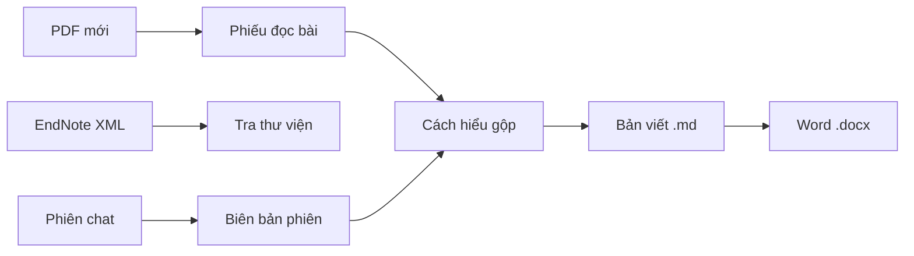

# Hướng dẫn sử dụng — cho bác sĩ / người nghiên cứu

> Đọc file này **một lần** trước khi bắt đầu. Không cần đọc `CLAUDE.md`/`AGENTS.md`/`docs/decisions/` — đó là sổ tay vận hành cho AI, không phải cho bạn. Chi tiết sâu hơn khi cần → xem mục **10. Đọc thêm** cuối file.

---

## 1. MedKarute là gì

Bạn chat với AI (Claude, Grok, Cursor, …) như bình thường — nhưng thay vì để mọi thứ trôi trong lịch sử chat, AI **ghi lại có cấu trúc**: bài đã đọc, buổi thảo luận, cách hiểu gộp, đoạn đang viết. Tuần sau mở lại, AI đọc file cũ, không hỏi lại từ đầu.

Bốn việc AI làm giúp bạn:

1. **Đọc PDF** — bài scan/PDF dài, AI chuyển thành text đọc được, tóm tắt (công cụ **MarkItDown**)
2. **Tra thư viện EndNote** — hỏi "bài nào về X" thay vì tự lục tay (công cụ **endnote-mcp**)
3. **Ghi chép có chỗ** — mọi kết luận quan trọng nằm trong file, không chỉ trong đầu
4. **Xuất Word** — từ bản viết Markdown, AI tạo file `.docx` có bìa, mục lục, phiên bản V1/V2… (skill **md-to-docx**)

## 2. Cài đặt lần đầu (một lần duy nhất)

**Bước 1 — cài `uv`/`uvx`** (công cụ chạy AI cần, chưa có sẵn trên máy nào):

- **Mac**: mở Terminal, gõ `brew install uv` (nếu đã có Homebrew) — hoặc `curl -LsSf https://astral.sh/uv/install.sh | sh`
- Nếu không quen Terminal — nhờ người hướng dẫn bạn làm hộ bước này, chỉ cần 1 lần

**Bước 2 — mở chat với AI** (Claude Code, Grok, Cursor, hoặc app tương đương), gõ **"bắt đầu"**.

**Bước 3 — AI sẽ hỏi bạn vài câu**:

- Tên đề tài nghiên cứu (bắt buộc) + mục đích nghiên cứu (bắt buộc)
- Cách kết nối thư viện EndNote — AI đưa 2 lựa chọn, giải thích ngắn lợi/hại, bạn chọn 1:
  - **Tự làm (native)**: bạn tự gõ 1 lệnh trong Terminal (`endnote-mcp setup`), công cụ tự tìm file — chịu khó 1 lần nhưng chắc chắn hơn
  - **Nhờ AI làm** (agent): bạn chỉ cần cho AI biết file XML/thư mục PDF của EndNote nằm đâu, AI tự cấu hình — nhàn hơn nhưng bạn cần biết đúng đường dẫn

Sau bước này, AI **không hỏi lại** — nó nhớ lựa chọn của bạn.

## 3. Việc bạn làm hằng ngày

| Bạn muốn | Bạn gõ trong chat | AI làm gì |
|---|---|---|
| Đọc 1 bài PDF mới | Gửi/nhắc tên file PDF | Tóm tắt, tạo phiếu đọc bài |
| Tìm bài trong thư viện | "Bài nào về [chủ đề]?" | Tra EndNote, trả lời kèm nguồn |
| Ghi lại buổi thảo luận hôm nay | "docs lại" hoặc "tổng kết" | Tự viết biên bản, không cần bạn tóm tắt tay |
| Soạn đoạn viết có trích dẫn | "Viết đoạn về..." | Soạn nháp, trích dẫn tạm — chốt citation chuẩn khi bạn duyệt |
| Xuất bản viết sang Word | "Xuất Word file …" / "convert sang docx" | Tạo file `.docx` cạnh file `.md` trong `writing/` (tự tăng V1, V2, V3…) |

## 3b. Luồng công cụ (sơ lược)

Hai công cụ ngoài (**MCP**) AI gọi khi cần đọc PDF hoặc tra EndNote. Một **agent skill** (`md-to-docx`) AI dùng khi bạn muốn file Word — không cần bạn cài thêm app convert.



| Công cụ | Bạn thấy gì | Ghi chú |
|---|---|---|
| **MarkItDown** | AI đọc PDF mới nhanh hơn | Chỉ paper chưa có trong EndNote |
| **endnote-mcp** | AI trả lời kèm nguồn từ thư viện | Bạn vẫn import/export EndNote bằng tay |
| **md-to-docx** | File Word mở được trong Microsoft Word | Input thường là `writing/…md`; output `…_V1.docx`, `…_V2.docx` |

**Mẹo bìa đẹp khi xuất Word** — thêm đầu file `.md` (AI có thể giúp viết):

```yaml
---
title: Tên đề tài — Tóm tắt ngắn
date: 2026-07-06
version: V1
audience: Nhóm nghiên cứu, hội đồng
---
```

Dòng `title` có dấu `—` sẽ tách thành tiêu đề + phụ đề trên bìa Word.

## 4. Việc của bạn vs việc của AI

| Bạn làm | AI làm |
|---|---|
| Quyết định mục tiêu nghiên cứu | Gợi ý bước tiếp theo |
| Import/export file EndNote (AI không tự sửa thư viện của bạn) | Đọc, tìm, trích dẫn từ thư viện |
| Duyệt nội dung AI viết | Viết nháp, ghi chép, tự lưu file |

**Lưu ý duy nhất dễ quên**: sau khi bạn thêm tài liệu mới vào EndNote, nhớ **export lại file XML** — AI nhắc bạn khi cần, nhưng thao tác export là bạn tự làm (AI không có quyền sửa thư viện EndNote của bạn).

## 5. Nếu có gì đó không chạy đúng

- AI sẽ **tự thử sửa trước** (không làm phiền bạn với chi tiết kỹ thuật)
- Nếu thử vài lần vẫn chưa xong, AI sẽ **báo bạn bằng lời thường**, giải thích đang vướng gì
- Đôi khi AI hỏi bạn có đồng ý "gửi bản sửa lại cho dự án gốc" không (gọi là **PR** — không phải quảng cáo, chỉ là cách chia sẻ bản sửa cho người dùng khác) — bạn chỉ cần trả lời có/không, AI làm hết phần kỹ thuật
- Bạn từ chối cũng không sao — máy bạn vẫn dùng bản đã sửa bình thường

## 6. Điều AI sẽ không tự ý làm

- Không tự sửa thư viện EndNote của bạn
- Không tự đổi quy tắc vận hành khi bạn không yêu cầu
- Không tự gửi thay đổi lên GitHub khi chưa hỏi bạn trước

## 7. Muốn góp ý / báo lỗi

Không cần biết Git. Cứ nói với AI trong chat bạn thấy gì chưa ổn — AI sẽ tự lo phần còn lại (xem mục 5). Chi tiết đầy đủ cho ai tò mò → `CONTRIBUTING.md`.

## 8. Ví dụ một vòng làm việc

> Bạn nhận 1 bài guideline mới qua email → gửi PDF cho AI → AI tóm tắt, hỏi bạn có muốn thêm vào EndNote không → bạn đồng ý → AI soạn sẵn để import → bạn import vào EndNote + export XML → AI cập nhật lại thư viện tìm kiếm → sau đó bạn hỏi "bài này liên quan gì tới 3 bài tuần trước" → AI tra thư viện, trả lời kèm trích dẫn → cuối tuần bạn nói "xuất Word bản viết case-01" → AI tạo `case-01_V1.docx` trong `writing/` → bạn mở Word, gửi đồng nghiệp duyệt.

## 9. Từ vựng nhanh (không cần nhớ, chỉ tra khi thấy lạ)

| Từ | Nghĩa đơn giản |
|---|---|
| MCP | Cách AI "gọi" công cụ ngoài (đọc PDF, tra EndNote) |
| agent skill | Gói hướng dẫn + script AI dùng cho một việc cụ thể (vd. xuất Word) |
| md-to-docx | Skill xuất file Markdown → Word có format |
| orchestrator | AI chính bạn đang chat cùng |
| session note | Biên bản 1 buổi làm việc |
| insight | Cách hiểu gộp từ nhiều bài, không phải tóm tắt 1 bài |
| paper note | Phiếu đọc 1 bài |
| `_V1.docx`, `_V2.docx` | Phiên bản Word tự tăng — mỗi lần xuất lại không ghi đè bản cũ |

## 10. Đọc thêm (khi cần, không bắt buộc)

| Muốn hiểu sâu hơn về | Xem |
|---|---|
| Bức tranh tổng thể + ví dụ y khoa chi tiết | `docs/raws/2026-07-03-GIOI-THIEU-VA-WORKFLOW.md` |
| Cách góp ý/báo lỗi đầy đủ | `CONTRIBUTING.md` |
| Quy tắc EndNote chi tiết | `docs/decisions/endnote-workflow.md` |
| Workflow bản viết + citation | `docs/guides/research/writing.md` |
| Xuất Word (chi tiết kỹ thuật) | `.agents/skills/md-to-docx/README.md` |

---

*Hướng dẫn sử dụng — MedKarute. Cập nhật 2026-07-06: thêm md-to-docx, luồng MCP + skill.*
