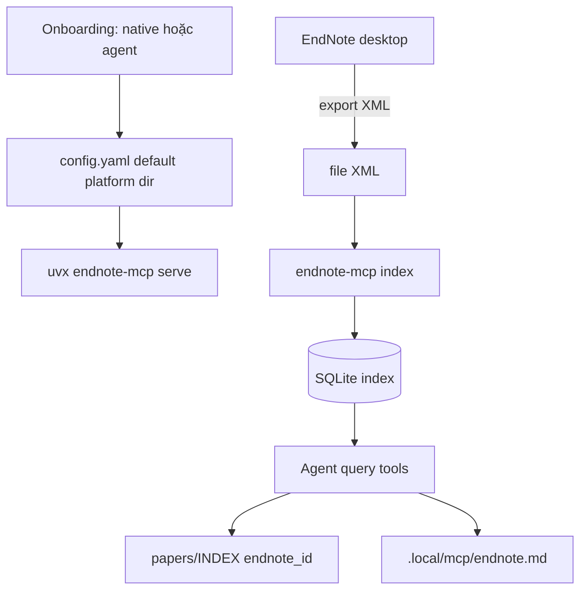

# endnote-mcp — 12 tools

> Vận hành. Quyết định canonical → `docs/decisions/endnote-workflow.md`. Machine state → `.local/mcp/endnote.md`.

## Prerequisite

1. **Cấu hình endnote-mcp** (một lần — xem `docs/decisions/endnote-workflow.md §MCP config resolution`):
   - `.mcp.json` bare: `uvx endnote-mcp serve` (không wrapper)
   - Nếu `.local/mcp/endnote.md` chưa có `setup_method` → orchestrator hỏi user chọn **native** (`endnote-mcp setup` wizard) hoặc **agent** (agent ghi `config.yaml` vào default platform dir theo `os_profile`)
   - Cả 2 nhánh kết thúc bằng `config.yaml` ở default platform dir; lưu `setup_method` vào `.local/mcp/endnote.md`
2. User export EndNote library ra **XML** (đường dẫn cố định — ghi `.local/mcp/endnote.md` `xml_export_path`)
3. Orchestrator chạy `index` (lần đầu) hoặc `index` incremental (sau thay đổi)
4. **Mọi thay đổi library = re-export XML + index** — bước dễ quên nhất



## 12 tools

| # | Tool | Mô tả | Khi nào |
|---|------|-------|---------|
| 1 | `search_references` | BM25 metadata | Tìm theo author/title/year |
| 2 | `search_fulltext` | BM25 trong PDF | Tìm concept trong fulltext |
| 3 | `search_library` ★ | Metadata + fulltext | **Ưu tiên** — tra cứu mặc định |
| 4 | `search_semantic` | Embedding | Khái niệm, không nhớ từ khóa (cần bật semantic) |
| 5 | `get_reference_details` | Metadata đầy đủ | Trước khi đọc sâu |
| 6 | `get_citation` | Format citation | Viết `writing/` |
| 7 | `get_bibtex` | BibTeX | LaTeX deliverable only |
| 8 | `get_bibliography` | Bibliography nhiều ref | Cuối bản viết |
| 9 | `find_related` | Paper liên quan | Related Work, insight |
| 10 | `read_pdf_section` | Đọc trang cụ thể | Methods/Results — max ~30 trang/call |
| 11 | `list_references_by_topic` | Liệt kê theo topic | Onboarding / khởi tạo insight |
| 12 | `rebuild_index` | Re-index toàn bộ | Index hỏng, đổi path, xóa nhiều ref |

**Lưu ý**: Không có tool write — add reference qua EndNote desktop + re-export XML.

## Routing

| Nhóm | Tools | Agent dùng khi |
|------|-------|----------------|
| Search | `search_library` ★, `search_references`, `search_fulltext`, `search_semantic` | Tra cứu |
| Read | `read_pdf_section`, `get_reference_details` | Đọc sâu 1 paper |
| Cite | `get_citation`, `get_bibliography`, `get_bibtex` | `writing/` |
| Discover | `find_related`, `list_references_by_topic` | Gợi ý, landscape |
| Maintain | `index`, `rebuild_index` | Sau user cập nhật library |

Thứ tự fallback: `search_library` → `search_semantic` → hỏi user từ khóa.

## Đọc PDF dài

1. `get_reference_details` — abstract + page count
2. Đọc **có mục tiêu** theo task (Methods ~trang 3–10, Results nửa sau)
3. Paper dài: 2–3 call theo range; ghi điểm chính ngay vào paper note; cập nhật cột `Sections` trong INDEX

## Maintain — index vs rebuild

| Lệnh | Khi nào |
|------|---------|
| `index` | Mặc định sau re-export XML |
| `rebuild_index` | Đổi `xml_export_path`, kết quả sai, xóa nhiều ref, đổi version MCP, đổi PDF attachment (nghi ngờ) |

Ghi mỗi lần chạy vào `.local/mcp/endnote-index.log`.

## Stale XML

Startup / trước task library: so XML `mtime` với `xml_mtime_at_index`.

- Không stale → im lặng
- Stale + task library → nhắc 1 dòng (ngưỡng 7 ngày nếu phiên cần library)
- User nói đã add nhưng mtime chưa đổi → cảnh báo trước khi `index`

## MCP lỗi — fallback

User message (1 dòng):

> *"Mình chưa kết nối được thư viện EndNote — tạm thời mình dùng các note đã có trong project."*

Fallback: `papers/*.md`, `.raw.md`. Citation → placeholder `[@slug]` until MCP OK. Chi tiết lỗi → log, không stack trace trong chat.

## Prompt mẫu

**Tra library:**
```
Dùng search_library tìm paper về "{topic}". Liệt kê top 5 kèm năm và DOI.
```

**Paper mới + so sánh:**
```
1. search_library cho "{concept}" trong library hiện có.
2. Với paper mới (đã có paper note {slug}), so sánh contribution.
3. Gợi ý có nên add EndNote không — lý do ngắn.
```

**Citation finalize:**
```
Trong writing/{slug}.md, thay mọi [@id] bằng citation {style từ README}
và tạo bibliography cuối file.
```