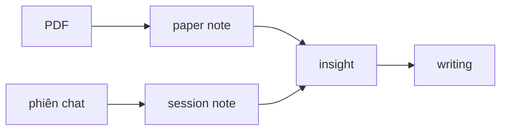

# Tổng quan — `research/`

> Governance guide. Agent đọc file này khi orientation hoặc phiên mới.

## Mục đích

`research/` chứa **dữ liệu nghiên cứu** theo từng project. Tách khỏi governance (root repo: `CLAUDE.md`, `docs/`, `.context/`).

- Root `.gitignore` ignore toàn bộ `research/`
- Mỗi `research/{slug}/` là **git repo riêng** (local, offline)
- Agent **tự commit** sau mỗi lượt ghi có nghĩa

## Bốn loại artifact

| Tên | Chỗ | Một câu |
|-----|-----|---------|
| **Paper note** | `papers/{slug}.md` | *Bài này nói gì?* |
| **Session note** | `sessions/YYYY-MM-DD-….md` | *Hôm nay trao đổi gì?* |
| **Insight** | `insights/{topic-slug}.md` | *Mình hiểu / mental model thế nào?* |
| **Writing** | `writing/{slug}.md` | *Mình viết ra sao?* |



## Cấu trúc project

```
research/{slug}/
├── README.md          ← identity (purpose, topic, scope)
├── INDEX.md           ← router mỏng
├── papers/            ← PDF + paper note
├── sessions/          ← log phiên chat
├── insights/          ← mental model cross-paper
└── writing/           ← prose, lit review
```

## Quy tắc agent

1. Trước task trong một area → đọc `docs/guides/research/{area}.md`
2. Guide = source of truth — không suy diễn từ memory
3. User hỏi "hướng dẫn" → trích guide + ví dụ từ project hiện tại

## Guides theo thư mục

| File | Mô tả |
|------|-------|
| [readme.md](readme.md) | `README.md` project |
| [index-routing.md](index-routing.md) | INDEX phân tầng |
| [papers.md](papers.md) | PDF, MarkItDown, EndNote |
| [sessions.md](sessions.md) | "docs lại" |
| [insights.md](insights.md) | Mental model |
| [writing.md](writing.md) | Prose, citation |

## Pack / share (ZIP, không git)

Gói ZIP cho máy không dùng git: script `tools/pack-share.sh` + ghi chú `share/BAN-CAP-NHAT-*.md` — **gitignore**, chỉ trên máy maintain, không commit.