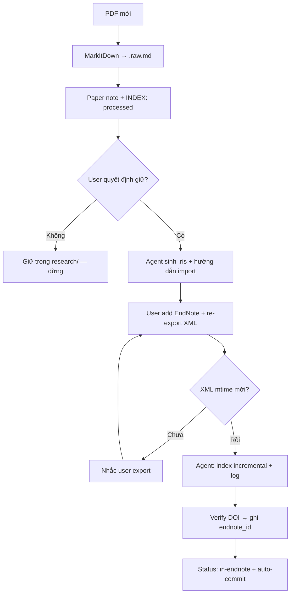
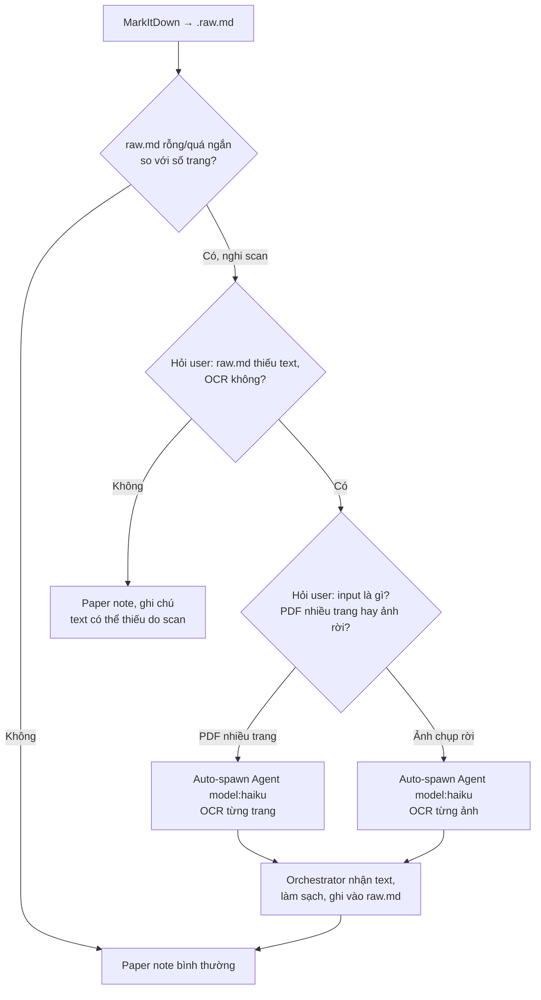

# Guide — `papers/`

## Layout

```
papers/
├── INDEX.md
├── {slug}.pdf          ← inbound, gitignore
├── {slug}.md           ← paper note (cùng slug)
├── {slug}.raw.md       ← MarkItDown, gitignore
└── {slug}.ris          ← import EndNote, gitignore
```

## Paper note vs insight

- **Paper note**: *Bài này nói gì?* — gắn 1 PDF/paper
- **Insight**: mental model cross-paper — xem [insights.md](insights.md)

## Luồng paper mới



1. User đưa PDF → `papers/{slug}.pdf`
2. MarkItDown → `papers/{slug}.raw.md`
3. Agent viết paper note + cập nhật INDEX (`Status: processed`)
4. User đọc, **quyết định** giữ hay không
5. Nếu giữ → agent sinh `.ris` (không BibTeX) + hướng dẫn File→Import EndNote
6. User add EndNote → **re-export XML** (bắt buộc)
7. User xác nhận → orchestrator `index` + ghi log
8. Verify bằng `search_references` (DOI, fallback title+year) → ghi `endnote_id` vào paper note + INDEX
9. `Status: processed` → `in-endnote`

**Invariant**: Mọi thay đổi library = re-export XML + `index`. Chi tiết → `docs/decisions/endnote-workflow.md`.

## OCR — khi `raw.md` là bản scan/ảnh chụp

Bước 2 (MarkItDown) giả định PDF có text layer. Bản scan/ảnh chụp màn hình ra `raw.md` rỗng hoặc quá ngắn so với số trang — cần OCR trước khi viết paper note.



1. Orchestrator phát hiện `raw.md` nghi là bản scan (rỗng/quá ngắn so với số trang PDF) → **hỏi user xác nhận có muốn OCR không** — không tự động chạy
2. Nếu có → **hỏi user cách input**: PDF nhiều trang (Haiku đọc từng trang) hay ảnh chụp màn hình rời (user cung cấp path/paste ảnh)
3. Orchestrator auto-spawn `Agent` (`model: haiku`, `subagent_type: general-purpose`) — OCR ra text thuần, **không ghi file**, chỉ trả kết quả
4. Orchestrator nhận kết quả, làm sạch (subagent có thể escape ký tự lạ — xem bài học ở `chien-luoc-erp-helper.md` project khác), ghi đè/append vào `papers/{slug}.raw.md`
5. Ghi 1 dòng log trong paper note: model dùng (haiku), số trang/ảnh OCR, thời gian — phục vụ audit
6. Tiếp tục luồng paper note bình thường (bước 3 trở đi ở trên)

**Không tự động OCR mà không hỏi** — quyết định tốn subagent-call thuộc về user mỗi lần, không suy đoán.

## Paper đã có trong EndNote

Không bắt buộc copy PDF vào `papers/` — `read_pdf_section` đọc attachment trong library.

Luồng nhẹ: tạo paper note với `endnote_id` + `source: endnote-mcp`; cột PDF ghi `(in EndNote)`.

Chỉ cần PDF local khi MarkItDown convert (paper chưa index fulltext).

Sau `in-endnote`: **EndNote attachment là bản chính** — `papers/*.pdf` có thể xóa (gitignore).

## Status flow

`new` → `processed` → `in-endnote` → `linked-insight`

- Giai đoạn **cao nhất đạt được** — không pipeline bắt buộc tuần tự
- Paper có thể `processed` → `linked-insight` mà không qua `in-endnote`

## Dedup

DOI trước (chính xác), title+year sau (fuzzy). Báo user chi tiết 2 bản — không chỉ nói "trùng".

## Tra cứu & đọc

| Tool | Khi nào |
|------|---------|
| `search_library` ★ | Tra cứu mặc định |
| `read_pdf_section` | Đọc Methods/Results — có mục tiêu, không đọc cả PDF |
| `get_reference_details` | Abstract + page count trước khi đọc sâu |

Paper chỉ trong `papers/`, chưa EndNote: đọc `.raw.md` hoặc paper note. Cite trong `writing/` mà chưa EndNote → cảnh báo placeholder chưa resolve.

## Kết quả search — ghi đâu?

*Phiên sau có cần lại không?*

- Có → `## Connections` trong paper note, hoặc `insights/` nếu landscape cross-paper
- Không (tra cứu vặt) → chat đủ