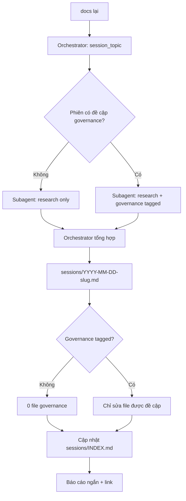

# Guide — `sessions/`

## Vai trò

*Hôm nay trao đổi gì?* — log phiên chat, không thay paper note hay insight.

## Trigger

`docs lại`, `tổng kết`, `viết docs`, `ghi vào docs`, …

## Luồng



**Mặc định**: 1 session note + cập nhật `sessions/INDEX.md`. **Không** sửa `CLAUDE.md`/`AGENTS.md` nếu phiên không bàn governance.

## Subagent

- Model nhanh, cold — **không** ghi file, **không** gọi MCP
- Trích verbatim: decisions, rationale, open questions
- Trích nguyên văn mọi ` ```mermaid ` block
- Tag: `[research]` hoặc `[governance:path/to/file]`
- Orchestrator tổng hợp từ output — không tóm tắt từ memory ngắn

## Session note template

```markdown
---
type: session
project: {slug}
session_topic: ...
date: YYYY-MM-DD
language: EN | VI
status: draft | final
---

# {topic}

## Context

## Key points

## Decisions

## Diagrams

```mermaid
...
```

## Extracts

## Open questions

## Related
```

## Pending actions

Session quyết định "thêm EndNote" → ghi `- [ ] add to EndNote: {slug}` trong note + mirror `.local/session.md` (`pending_actions`). Phiên sau startup đọc pending → follow-up.