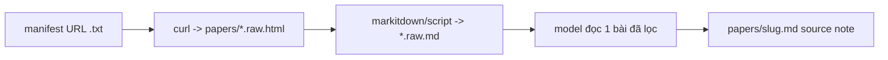

# Guide — Web ingest (edge case: nguồn web, không PDF/EndNote)

> Áp dụng cho project ingest tài liệu **web** thay vì PDF (vd `amis-docs-digest`).
> Study case gốc: [`docs/study-case/2026-07-03-misa-amis-san-xuat-knowledge-translation.md`](../../study-case/2026-07-03-misa-amis-san-xuat-knowledge-translation.md).
> Bổ sung cho [papers.md](papers.md) — thay bước MarkItDown/PDF bằng fetch web.

## Nguyên tắc token: tách "kéo về" khỏi "model đọc"

Token **chỉ** tốn khi nội dung chạy qua context của model. `curl` + script xử lý trên đĩa ≈ 0 token. Vì vậy:



**Luật:**
- Dựng **manifest URL** (file `.txt`) hoàn toàn ngoài context — model không đọc HTML thô.
- Tải hàng loạt ra `.raw.html`/`.raw.md` (gitignore) trước; **không** đổ cả mẻ vào context.
- Ingest **từng bài theo nhu cầu** — context chỉ giữ source note đã cô đọng, không giữ raw.
- Mọi file trung gian → `.local/` hoặc `papers/*.raw.*` (đã gitignore).

## Phương pháp khám phá cấu trúc site (thứ tự ưu tiên, rẻ → đắt)

Chạy theo thứ tự; dừng ở bước đầu tiên cho manifest sạch.

### 1. robots.txt + sitemap — rẻ nhất, thấy toàn bộ URL

```bash
curl -sL --max-time 15 "https://SITE/robots.txt"                 # tìm dòng Sitemap:
curl -sL --max-time 20 "https://SITE/sitemap.xml" | head -c 800  # index → các sitemap con
# WordPress: /wp-sitemap.xml ; post type riêng: /wp-sitemap-posts-<type>-1.xml
curl -sL "https://SITE/wp-sitemap-posts-ht_kb-1.xml" \
  | grep -oE '<loc>[^<]+</loc>' | sed -E 's/<\/?loc>//g' > .local/all_urls.txt
wc -l .local/all_urls.txt
```

**Lý do:** sitemap là danh sách URL chính chủ, không cần render JS, 1 request lấy hàng trăm URL.

**Cạm bẫy (đã gặp ở helpamis):** slug KB dạng câu hỏi, **trộn mọi sản phẩm** → lọc theo slug ra 0 kết quả:

```bash
grep -i "san-xuat" .local/all_urls.txt   # => 0. Sitemap KHÔNG segment theo sản phẩm.
```

### 2. WordPress REST API — lọc theo taxonomy, JSON gọn

```bash
curl -sL "https://SITE/wp-json/wp/v2/types" | tr ',' '\n' | grep -iE '"(slug|rest_base)"'
# ht_kb -> rest_base "ht-kb"; taxonomy ht_kb_category -> rest_base "ht-kb-category"
curl -sL "https://SITE/wp-json/wp/v2/ht-kb-category?per_page=100&_fields=id,name,count,slug" -o .local/cats.json
# chỉ lấy field cần (_fields=link,title) để JSON nhỏ, ít token nếu buộc phải đọc
```

**Lý do:** query đúng category → đúng subset; `_fields=` cắt payload.

**Cạm bẫy:** taxonomy có thể **không** tách theo sản phẩm (helpamis: category generic, `search=sản xuất` ra rỗng). Nếu vậy → bỏ, dùng bước 3.

### 3. Cây trang chuyên mục (curated) — neo sạch nhất khi taxonomy bẩn

Trang landing sản phẩm liệt kê đúng phạm vi. Trích link nội bộ:

```bash
curl -sL --max-time 25 "https://SITE/amis-san-xuat/" -o .local/landing.html
grep -oE 'href="https://SITE/[^"]+"' .local/landing.html \
  | sed -E 's/href="//;s/"//' | sort -u > .local/links_all.txt
grep -E "/(kb|ac)/" .local/links_all.txt        # /ac/ = hub chuyên mục, /kb/ = bài
```

**Lý do:** URL dưới `/amis-san-xuat/...` có tiền tố sản phẩm → scope sạch, không cần lọc chéo.

### 4. Cạm bẫy JS/AJAX — href tĩnh không đủ

Hub chuyên mục (`/ac/...` của Heroic KB) **load danh sách bài bằng AJAX** → `curl` tĩnh chỉ thấy nav, không thấy bài con:

```bash
curl -sL "https://SITE/amis-san-xuat/ac/ke-hoach-san-xuat/" \
  | grep -oE 'https://SITE/amis-san-xuat/[a-z/-]+' | sort | uniq -c   # thiếu bài con
```

**Xử lý khi gặp AJAX:** (a) đủ dùng → chỉ ingest bài thấy được ở landing + hub chính; (b) đầy đủ → gọi `admin-ajax.php` (action của plugin) hoặc fetch bản đã render.

## Tải hàng loạt (sau khi có manifest)

```bash
D=.local
while read url; do
  slug=$(echo "$url" | sed -E 's#.*/([^/]+)/?$#\1#')
  curl -sL --max-time 20 "$url" -o "papers/${slug}.raw.html"
done < "$D/manifest.txt"
```

Sau đó lọc boilerplate → `.raw.md` (markitdown MCP hoặc script bỏ nav/footer) **trước** khi model đọc. Model chỉ mở bài đang xử lý → viết `papers/{slug}.md`.

## Checklist chống lãng phí token

- [ ] Manifest dựng bằng `curl`+`grep`, **không** paste HTML vào chat.
- [ ] `--max-time` cho mọi curl (tránh treo).
- [ ] Trung gian vào `.local/` hoặc `papers/*.raw.*` (gitignore đã có `papers/*.raw.md`).
- [ ] Không đọc cả mẻ — ingest từng bài theo nhu cầu.
- [ ] JSON REST: luôn `_fields=` cắt payload.

## Luật QA (bắt buộc — rút từ phiên pilot 2026-07-04)

Các lỗi đã gặp thật; agent tương lai **phải** tránh:

### Q1 — `.local/` phải được gitignore

`.local/` (raw HTML, manifest.tsv, working files) **không** mặc định ignore trong `research/{slug}/.gitignore`. Template gốc chỉ có `papers/*.raw.md`. → **Trước khi crawl**, kiểm tra và thêm dòng `.local/` vào `research/{slug}/.gitignore`:

```bash
git check-ignore .local/x >/dev/null || printf '.local/\n' >> .gitignore
```

Không để raw HTML / working files lọt commit.

### Q2 — Fidelity: paraphrase mô tả, GIỮ NGUYÊN tên menu/nút

Trong source note:
- **Được** diễn đạt lại *mô tả tính năng* sang ngôn ngữ đời thường (plain-language).
- **Không** đổi **tên menu, tên nút, tên báo cáo, trạng thái** — giữ **verbatim** đúng chữ trên phần mềm (vd `Gửi sang kho`, `Chưa gửi`, `Yêu thích`, `Tình hình thực hiện kế hoạch sản xuất`). Người dùng phải tìm đúng chữ đó trong UI.

### Q3 — Verify chống bịa trước khi chốt note

Mọi chi tiết đặc thù (tên nút, phím tắt như `F3`, chỉ số như `OEE`, tên báo cáo) phải **có trong `papers/{slug}.raw.md`**. Spot-check bằng grep trước khi ghi Status `processed`:

```bash
grep -oiE 'F3|OEE|gửi sang kho|yêu thích' papers/{slug}.raw.md
```

Nếu grep rỗng nhưng đã viết trong note → **nghi bịa/nhớ nhầm**, kiểm lại raw (có thể diễn đạt khác trong nguồn — xác nhận trước khi giữ).

### Q4 — Pilot trước batch (đã thành lệ)

Ingest ≥ nhiều bài: làm **3 bài pilot** nhóm core → **dừng cho user duyệt format** → mới chạy phần còn lại. Không tự ý chạy hết cả manifest.

## Đường dẫn tham chiếu (helpamis.misa.vn, verify 2026-07-03)

| Việc | Endpoint |
|------|----------|
| Sitemap index | `/wp-sitemap.xml` |
| KB toàn site (524 URL) | `/wp-sitemap-posts-ht_kb-1.xml` |
| Landing SX (scope sạch) | `/amis-san-xuat/` |
| Hub chuyên mục (AJAX) | `/amis-san-xuat/ac/{ke-hoach-san-xuat,dieu-phoi-va-thuc-thi,kho-vat-tu,kiem-tra-chat-luong,bao-cao,...}/` |
| REST types | `/wp-json/wp/v2/types` |
| REST KB category | `/wp-json/wp/v2/ht-kb-category` |
