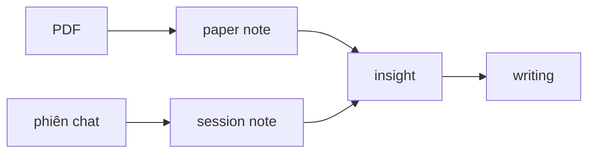
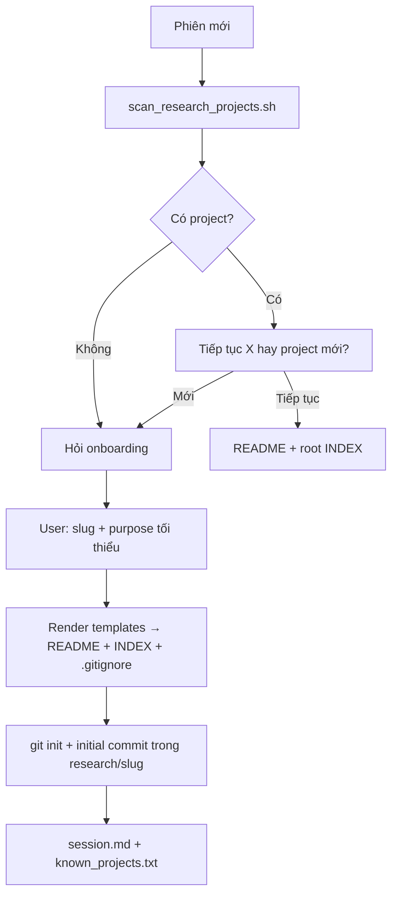
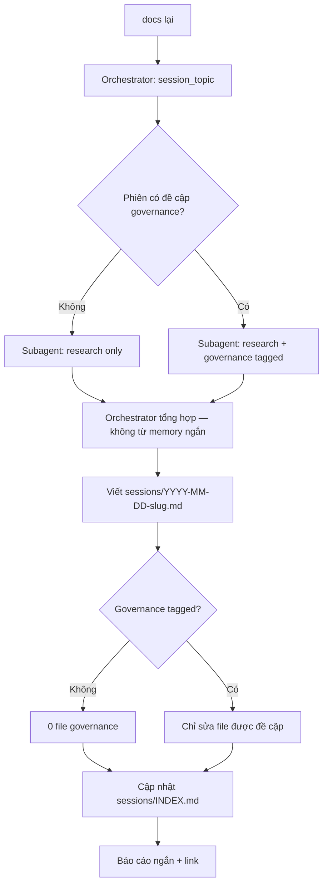
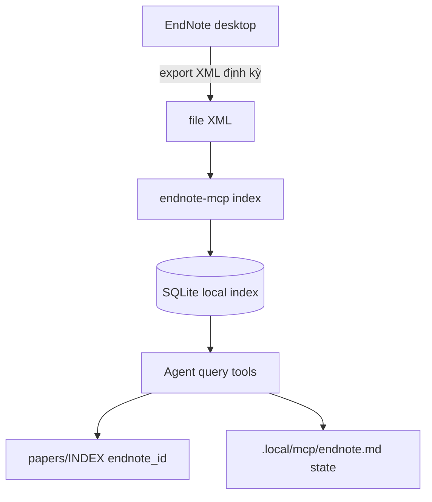

# Bản duyệt — research-helper (CLAUDE.md + AGENTS.md + cấu trúc research/)

> **Trạng thái**: Chờ human duyệt — chưa ghi `CLAUDE.md` / `AGENTS.md` vào root repo.  
> **Ngày**: 2026-07-03  
> **Tham chiếu brainstorm**: `research-helper.md` (MCP + endnote tools), `2026-07-03-claude-agents-design-synthesis.md` (lịch sử thảo luận).

---

## 1. Mục tiêu

**research-helper** = assistant chat-driven giúp làm nghiên cứu với Claude, mô hình tương tự `clinical-ocr-helper`:

- **Orchestrator** (model chính): reasoning, quyết định, ghi file, điều phối MCP.
- **Subagent** (model nhanh): delegate task lạnh (trích chat khi "docs lại") — **không** tự ghi file.
- **2 MCP**: MarkItDown (paper mới) + endnote-mcp (thư viện EndNote).
- **Markpad** mở `.md` local — **không** Obsidian.
- **Ngôn ngữ**: EN hoặc VI theo phiên chat.

---

## 2. Hai lớp file

| Lớp | Vị trí | Nội dung |
|-----|--------|----------|
| **Governance** | Root repo `research-helper/` | `AGENTS.md`, `CLAUDE.md`, `.context/`, `docs/` |
| **Nghiên cứu** | `research-helper/research/` | Dữ liệu từng project — tạo **sau** onboarding |

`.local/` (gitignored): `ENVIRONMENT.md`, `session.md`, `known_projects.txt`, `claude-agent-summary.md`, `scripts/`.

---

## 3. Cấu trúc thư mục — CHỐT ĐỀ XUẤT

```
research-helper/
├── AGENTS.md
├── CLAUDE.md
├── .context/
├── docs/
│   ├── raws/
│   ├── decisions/
│   ├── workflows/
│   ├── guides/
│   │   └── research/              ← 1 file giới thiệu / thư mục (§3.5)
│   └── templates/                 ← form sinh project (§3.4)
│   ├── ideations/
│   └── templates/
├── .local/
│   ├── ENVIRONMENT.md
│   ├── session.md
│   ├── known_projects.txt
│   ├── claude-agent-summary.md
│   └── scripts/
│       └── scan_research_projects.sh
└── research/
    └── {project-slug}/              ← user đặt tên; KHÔNG auto project-YYYYMMDD
        ├── README.md                ← identity: purpose, topic, scope, …
        ├── INDEX.md                 ← router mỏng (link sub-index, count)
        ├── papers/
        │   ├── INDEX.md             ← catalog PDF + paper note .md
        │   ├── {slug}.pdf
        │   ├── {slug}.md            ← paper note (cùng slug với PDF)
        │   └── {slug}.raw.md        ← optional: MarkItDown raw
        ├── sessions/
        │   ├── INDEX.md
        │   └── YYYY-MM-DD-{topic-slug}.md
        ├── insights/                ← mental model người nghiên cứu (nhiều paper)
        │   ├── INDEX.md
        │   └── {topic-slug}.md
        └── writing/                 ← prose / section / bản viết
            ├── INDEX.md
            └── {slug}.md
```

### 3.1 Bốn loại artifact — tên gọi dễ nhớ

| Tên gọi | Chỗ | Gắn với | Một câu |
|---------|-----|---------|---------|
| **Paper note** | `papers/{slug}.md` | 1 PDF | *Bài này nói gì?* |
| **Session note** | `sessions/YYYY-MM-DD-….md` | 1 phiên chat | *Hôm nay trao đổi gì?* |
| **Insight** | `insights/{topic-slug}.md` | Nhiều paper + tư duy researcher | *Mình hiểu / mental model thế nào?* |
| **Writing** | `writing/{slug}.md` | Bản viết (section, lit review…) | *Mình viết ra sao?* |

**Insight** = nơi lưu **mental model** của người nghiên cứu: khung khái niệm, quan hệ giữa các paper, giả thuyết, gap, góc lập luận — **không** phải tóm tắt từng bài (paper note) cũng **không** phải log chat (session).



### 3.2 Nguyên tắc đặt file

| Artifact | Đúng chỗ | Sai (đã bỏ) |
|----------|----------|-------------|
| Paper note | `papers/{slug}.md` cạnh `{slug}.pdf` | ~~`notes/literature/`~~ |
| Session note | `sessions/` | ~~`notes/sessions/`~~ |
| Insight (mental model) | `insights/` | ~~`synthesis/`~~, không gộp vào `papers/` |
| Writing (prose) | `writing/` | ~~`drafts/`~~, ~~`takeaway/`~~ |
| Purpose + topic | `README.md` | ~~INDEX header~~ |

### 3.3 Git local — per project (CHỐT)

Mỗi `research/{slug}/` là **một Git repo riêng** (local, offline). Agent **tự commit** sau khi ghi file — không hỏi user (giống pattern clinical-ocr study repo).

#### Repo governance (root `research-helper/`)

```gitignore
# .gitignore root
research/
.local/
```

Toàn bộ `research/` **không** commit vào repo governance — tránh lẫn với `.git` con và PDF. Governance chỉ chứa `docs/`, `AGENTS.md`, `CLAUDE.md`, …

#### Repo project (`research/{slug}/`)

Tạo **ngay sau** render template (Hướng B):

```bash
git -C research/{slug} init
# .gitignore từ project-.gitignore.tpl
git -C research/{slug} add README.md INDEX.md papers/ sessions/ insights/ writing/ .gitignore
git -C research/{slug} commit -m "Init project {slug}"
```

**`research/{slug}/.gitignore`** (từ template):

```gitignore
papers/*.pdf
papers/*.raw.md
.DS_Store
```

| Commit | Không commit |
|--------|--------------|
| README, mọi INDEX, paper note `.md`, sessions, insights, writing | `papers/*.pdf`, `papers/*.raw.md` (sinh lại bằng MarkItDown) |

#### Agent tự túc — khi nào commit

Sau mỗi lượt ghi file có nghĩa (không hỏi user):

- Tạo project (initial commit)
- Paper note / cập nhật `papers/INDEX.md`
- Session note ("docs lại") + `sessions/INDEX.md`
- Insight / writing + INDEX tương ứng

```bash
git -C research/{slug} add <paths>
git -C research/{slug} commit -m "<mô tả ngắn EN hoặc VI>"
```

- Dùng `git -C research/{slug}/` — **không** `git add` ở root governance repo.
- Lỗi git kỹ thuật: xử lý im lặng hoặc retry; báo user **chỉ** nếu blocker thật (không bắt user hiểu git).

#### Phản biện đã áp dụng

| Cách | Vấn đề |
|------|--------|
| Chỉ gitignore PDF trong monorepo root | PDF vẫn có thể lọt commit; history project lẫn governance |
| Không git | Agent không rollback/diff; mất audit |
| **Per-project `.git` + `research/` ignored ở root** | Tách rõ; agent tự túc; PDF local only ✓ |

### 3.4 Tạo project — Hướng B (CHỐT): form → sinh khi user đặt tên

**Không** scaffold sẵn `research/_template/` trong repo. **Không** lazy-create INDEX khi có file đầu tiên.

**Có**: form trong `docs/templates/` → orchestrator **render một lần** sau onboarding (slug + purpose tối thiểu).

```
docs/templates/
├── project-README.md.tpl
├── project-INDEX-root.md.tpl
├── project-INDEX-papers.md.tpl
├── project-INDEX-sessions.md.tpl
├── project-INDEX-insights.md.tpl
├── project-INDEX-writing.md.tpl
└── project-.gitignore.tpl          ← gồm papers/*.pdf + papers/*.raw.md
        ↓ user đặt tên + trả lời onboarding
research/{slug}/
├── .git/                    ← git init + initial commit
├── .gitignore               ← papers/*.pdf
├── README.md, INDEX.md
├── papers/INDEX.md, sessions/INDEX.md, insights/INDEX.md, writing/INDEX.md
└── papers/, sessions/, insights/, writing/  (rỗng)
```

| Placeholder tpl | Nguồn |
|-----------------|-------|
| `{slug}`, `{date}` | onboarding |
| `{purpose}`, `{topic}`, … | README từ câu trả lời user |

Mỗi INDEX tpl: link guide `docs/guides/research/{area}.md` + bảng cột đã chốt (0 dòng) + 2–3 dòng hướng dẫn agent.

### 3.5 Governance — giới thiệu từng thư mục (`docs/guides/research/`)

Mỗi thư mục / khái niệm trong `research/{slug}/` có **một file giới thiệu** trong governance. Agent đọc khi làm việc trong scope đó; có thể trích để tạo hướng dẫn end-user (Markpad).

| File governance | Mô tả thư mục / file research |
|-----------------|-------------------------------|
| `00-overview.md` | Tổng quan `research/`, luồng paper → session → insight → writing, **git local per project** |
| `readme.md` | `research/{slug}/README.md` — purpose, topic, onboarding |
| `index-routing.md` | Root `INDEX.md` + sub-INDEX, quy tắc load token |
| `papers.md` | `papers/` — PDF, paper note, MarkItDown, endnote |
| `sessions.md` | `sessions/` — session note, trigger "docs lại", subagent |
| `insights.md` | `insights/` — mental model, khác paper note |
| `writing.md` | `writing/` — prose từ insight, citation |

**Quy tắc agent:**

1. Trước task trong một area → đọc `docs/guides/research/{area}.md` (hoặc `00-overview` nếu phiên mới).
2. File guide = **source of truth** cho cách dùng; không suy diễn từ memory.
3. User hỏi "hướng dẫn / cách dùng" → orchestrator trích từ guide + ví dụ từ project hiện tại; có thể sinh `docs/guides/huong-dan-su-dung.md` (tổng hợp) từ các file trên khi đủ nội dung.

**Khi viết governance lần đầu**: tạo skeleton 7 file + nội dung từ `APPROVAL-DRAFT` / chat đã duyệt.

```mermaid
flowchart TD
    G[docs/guides/research/*.md] --> A[Agent đọc theo task]
    A --> R[research/{slug}/ thư mục tương ứng]
    G --> H[Trích → hướng dẫn user nếu cần]
```

---

## 4. README.md — identity project

Tạo khi onboarding xong. **Single source of truth** cho bối cảnh.

```markdown
# {project-slug}

**Created**: YYYY-MM-DD
**Language**: EN | VI

## Research purpose
(bắt buộc — mục đích nghiên cứu)

## Research topic
(chủ đề học thuật — đề xuất hỏi)

## Deliverable
## Citation style
## Scope
## Setup notes
(EndNote XML, MCP, …)
```

---

## 5. INDEX phân tầng — tránh token

**Vấn đề**: một INDEX chứa hết → phình, tốn token mỗi lần load.  
**Giải pháp**: router mỏng ở root + sub-INDEX theo thư mục.

### 5.1 Root `INDEX.md` — chỉ router (~20–40 dòng)

```markdown
# Project index — {project-slug}

**Context**: [README.md](README.md)
**Updated**: YYYY-MM-DD

| Area | Index | Count |
|------|-------|-------|
| Papers | [papers/INDEX.md](papers/INDEX.md) | N |
| Sessions | [sessions/INDEX.md](sessions/INDEX.md) | M |
| Insights | [insights/INDEX.md](insights/INDEX.md) | K |
| Writing | [writing/INDEX.md](writing/INDEX.md) | W |

**Agent**: Đọc README cho context. Đọc `docs/guides/research/{area}.md` khớp task. Load **một** sub-INDEX — không load mọi note.
```

Không bảng paper/session chi tiết ở root.

### 5.2 `papers/INDEX.md`

| # | Title | PDF | Paper note (.md) | Sections | Tags | Status | Source | Notes |
|---|-------|-----|------------------|----------|------|--------|--------|-------|

- `Sections` = phần paper (Methods, Results…)
- `Tags` = nhãn nhanh (`#lora`) — khác Sections
- `Status`: `new` / `processed` / `in-endnote` / `linked-insight`
- `Source`: `markitdown` / `endnote-mcp`
- Đường dẫn **relative**

### 5.3 `sessions/INDEX.md`

| Date | Topic | File | Tags | Status |

### 5.4 `insights/INDEX.md`

| Title | File | Related papers | Tags | Status |

Catalog **mental model** cross-paper. Link ngược tới `papers/` (paper note) khi cần.

### 5.5 Insight note — nội dung gợi ý

```markdown
---
type: insight
project: {slug}
title: ...
related_papers: [papers/foo.md, papers/bar.md]
date: YYYY-MM-DD
---

# {title}

## Mental model
(khung khái niệm, quan hệ nhân–quả, taxonomy do researcher đặt)

## Evidence from papers
- Paper A: …
- Paper B: …

## My position / critique

## Open questions

## Diagrams
```mermaid
...
```

### 5.6 Quy tắc load (CLAUDE.md)

| Task | Load |
|------|------|
| Orientation / phiên mới | `README.md` → root `INDEX.md` |
| Paper ingest / đọc paper | `papers/INDEX.md` (+ 1 paper note nếu cần) |
| docs lại | `sessions/INDEX.md` |
| Mental model / gộp nhiều bài | `insights/INDEX.md` + `docs/guides/research/insights.md` |
| Soạn section / prose | `writing/INDEX.md` + `docs/guides/research/writing.md` |
| Hướng dẫn user | `docs/guides/research/00-overview.md` hoặc trích nhiều guide |

**Cấm**: load đồng thời mọi sub-INDEX + mọi `.md`.

---

## 6. Phiên chat đầu tiên — onboarding

**Không** tự tạo `research/{slug}/` trước khi user trả lời.



### Câu hỏi

**Bắt buộc** (trước `mkdir`):

1. **Project slug** — tên thư mục?
2. **Research purpose** — nghiên cứu để làm gì?

**Đề xuất** (có thể bỏ qua nếu user vội):

3. Research topic  
4. Ngôn ngữ EN/VI  
5. Deliverable  
6. Citation style  
7. EndNote đã setup?  
8. Scope in/out  
9. Bắt đầu từ PDF hay search library?

→ Ghi vào **README.md**.

### `.local/scripts/scan_research_projects.sh`

Adapt `clinical-ocr-helper/.local/scripts/scan_studies.sh`:

- `data/` → `research/`
- `study` → `project`
- **Không** tự tạo folder — chỉ `ACTION: Hỏi user`

---

## 7. Workflow "docs lại" / "tổng kết"

### Trigger

`docs lại`, `tổng kết`, `viết docs`, `ghi vào docs`, …

### Luồng



**Mặc định**: 1 session note + cập nhật `sessions/INDEX.md` — **không** sửa `CLAUDE.md`/`AGENTS.md` nếu phiên không bàn.

### Subagent prompt (khung)

- Trích verbatim: decisions, rationale, open questions
- Trích nguyên văn mọi ` ```mermaid ` block
- Tag: `[research]` hoặc `[governance:path/to/file]`
- Không ghi file; không tóm tắt quá tay

### Session note template

- Frontmatter: type, project, session_topic, date, language, status
- Sections: Context, Key points, Decisions, **Diagrams (mermaid)**, Extracts, Open questions, Related

---

## 8. Mermaid — bắt buộc (CLAUDE.md)

1. Mọi diagram trong session/workflow doc → **chỉ Mermaid**
2. Subagent trích block từ chat; orchestrator không thay ASCII
3. Nếu chỉ có mô tả bằng lời → orchestrator vẽ Mermaid trước khi ghi
4. PNG trong `docs/raws/.assets/` không thay Mermaid logic

---

## 9. MCP routing (tóm tắt)

| Tình huống | Tool |
|------------|------|
| PDF mới | MarkItDown → paper note → đánh giá → EndNote? |
| Tra library | endnote-mcp `search_library` (ưu tiên) |
| Đọc sâu PDF trong library | `read_pdf_section` |
| Citation / bibliography | `get_citation`, `get_bibliography` |
| Paper mới + so sánh library | Cả hai MCP |

Chi tiết 12 tools: `research-helper.md`.

---

## 10. CLAUDE.md — outline chờ duyệt

| Phần | Nội dung |
|------|----------|
| A | Quick workflow: MCP + `research/` + README + INDEX phân tầng |
| B | MCP routing table |
| C | Templates: README, paper note, session, insight, writing |
| J | `docs/guides/research/` — load map theo thư mục (§3.5) |
| D | Docs protocol + governance-only-when-mentioned |
| E | Subagent rules |
| F | `.local/` cache summary + **memory promote** vào `.context/` / `docs/` (không `AGENT_SHARED`) |
| G | First-run onboarding (§6) |
| H | Response style: phản biện, EN/VI |
| I | Mermaid mandatory |

## 11. AGENTS.md — outline chờ duyệt

| § | Nội dung |
|---|----------|
| 0 | Milestone 0.0.1 Bootstrap |
| 1 | Startup: GLOBAL → MILESTONES → TENSIONS → modules |
| 2 | Invariants: chat≠storage; load sub-INDEX; MCP; docs protocol; mermaid; governance rule; **per-project git, agent auto-commit** |
| 3 | Tension format |
| 4 | CODE_NOW / ASK_ARCHITECTURE / EXPLAIN |
| 5 | Self-check |
| 6 | ideations → decisions promote |

---

## 12. Quyết định vận hành (CHỐT)

| # | Quyết định |
|---|------------|
| 1 | PDF + `.raw.md` gitignore trong project; root ignore `research/` |
| 2 | Hướng B — templates sinh project |
| 3 | **Semi-tech**: nói thẳng subagent / MCP / orchestrator trong chat |
| 4 | Markpad: ghi path Mac + WSL trong `.local/ENVIRONMENT.md` (default) |
| 5 | **`context-mapping init.py`**: chạy **một lần** trên máy dev (WSL) lần đầu viết governance — **không** chạy lại trên Mac/máy khác; ghi flag trong `.local/ENVIRONMENT.md` |
| 6 | Thuật ngữ AI/y khoa ưu tiên EN; mơ hồ → hỏi user (§10) |
| 7 | `huong-dan-su-dung.md` — **chưa viết** |
| 8 | Sau auto-commit: **một dòng** *"Đã lưu tự động."* |

## 12b. EndNote MCP — thảo luận (mở, chi tiết §12c)

Workflow thêm paper vào EndNote: **chat sau**. Hiện tại agent phải **nắm 12 tools**, lưu config/state `.local/`, persist dữ liệu liên quan.

## 12c. Đề xuất EndNote MCP + `.local/` (chờ chat sau chốt workflow)

### Hai lớp tài liệu MCP

| Lớp | Vị trí | Vai trò |
|-----|--------|---------|
| **Canonical** (commit) | `docs/guides/mcp/endnote-mcp-tools.md` | 12 tools, khi nào dùng, prompt mẫu |
| **Canonical** | `docs/guides/mcp/markitdown-mcp.md` | convert PDF, giới hạn |
| **Machine state** (gitignore) | `.local/mcp/endnote.md` | XML path, SQLite/index path, `last_indexed`, semantic on/off |
| **Machine state** | `.local/mcp/markitdown.md` | path/server config nếu cần |

Agent: đọc canonical trước task MCP; đọc `.local/mcp/*.md` cho path máy hiện tại; **cập nhật** `.local` sau mỗi lần `index` / `rebuild_index`.

### 12 tools — map nhanh (canonical sẽ đầy đủ)

| Nhóm | Tools | Agent dùng khi |
|------|-------|----------------|
| Search | `search_library` ★, `search_references`, `search_fulltext`, `search_semantic` | Tra cứu — **ưu tiên `search_library`** |
| Read | `read_pdf_section`, `get_reference_details` | Đọc sâu 1 paper trong library |
| Cite | `get_citation`, `get_bibliography`, `get_bibtex` | Viết `writing/` |
| Discover | `find_related`, `list_references_by_topic` | Gợi ý paper, landscape |
| Maintain | `rebuild_index` | Sau khi user cập nhật EndNote library |

### Dữ liệu persist — đề xuất



| Dữ liệu | Lưu đâu | Ai cập nhật |
|---------|---------|-------------|
| PDF gốc (library) | EndNote attachment path | User |
| XML export | Path trong `.local/mcp/endnote.md` | User export; agent ghi path |
| Fulltext index | SQLite (endnote-mcp default path → ghi trong `.local`) | Agent chạy `index` / `rebuild_index` |
| `endnote_id` / link paper | `papers/INDEX.md` + paper note | Agent sau khi match |
| MarkItDown raw | `papers/*.raw.md` (gitignore) | Agent; có thể xóa/regen |

### Câu hỏi cho chat sau (EndNote workflow)

1. XML export: thủ công mỗi tuần hay sau mỗi paper mới?  
2. Semantic (`embed`): bật ngay hay BM25 trước?  
3. Paper mới: luồng **MarkItDown → paper note → user add EndNote → agent rebuild_index** — ai nhắc bước nào?  
4. Có cần audit log `.local/mcp/endnote-operations.log` không?

**Tạm thời**: agent **read-heavy** (search + read + cite); **write vào EndNote** vẫn qua user + re-index.

---

## 13. Sau khi duyệt

Human trả lời: **duyệt** / **sửa …** / **viết**

→ Spawn subagent rà chat → ghi `CLAUDE.md`, `AGENTS.md`, `docs/guides/research/*.md`, `.local/scripts/scan_research_projects.sh`, `.gitignore`, `docs/templates/`.

---

## Checklist duyệt nhanh

- [ ] Cấu trúc `research/{slug}/` (§3)
- [ ] Bốn loại: paper / session / insight / **writing** (§3.1)
- [ ] Hướng B: `docs/templates/` → sinh project (§3.4)
- [ ] `docs/guides/research/` — 1 guide / thư mục (§3.5)
- [ ] README = purpose/topic; INDEX phân tầng (§4–5)
- [ ] Git local per project + agent auto-commit (§3.3)
- [ ] Onboarding hỏi slug trước mkdir (§6)
- [ ] docs lại → sessions/; governance chỉ khi đề cập (§7)
- [ ] Subagent + Mermaid bắt buộc (§7–8)
- [ ] Outline CLAUDE + AGENTS (§10–11)

---

**Chốt tên (lượt 8)**: `insights/` — mental model.  
**Chốt tên (lượt 9)**: `writing/` thay `drafts/`.  
**Chốt (lượt 10)**: `docs/guides/research/*.md` — giới thiệu từng thư mục.  
**Chốt (lượt 11)**: **Hướng B** — templates sinh project.  
**Chốt (lượt 12)**: Git local per project.  
**Chốt (lượt 14)**: Memory promote theo skvn — **không** `AGENT_SHARED`; quy tắc trong `CLAUDE.md` → ghi đúng file dự án.  
**Plan (chưa code)**: `tools/pack-share.sh` — zip governance / research project, bỏ `.local` & PDF — xem `docs/raws/pack-share-script-plan.md`.  
**Chốt (lượt 13)**: `.raw.md` gitignore; context-mapping **1 lần WSL**; EN thuật ngữ; auto-commit một dòng; EndNote MCP → §12c (chat sau).

---

*Bản trình duyệt — research-helper, 2026-07-03.*