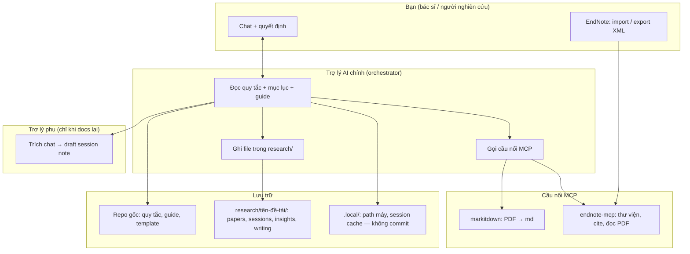
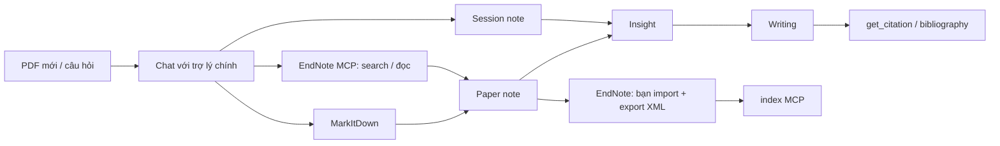
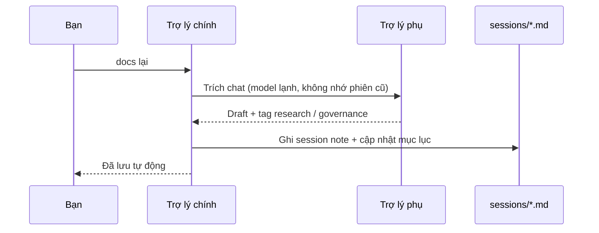
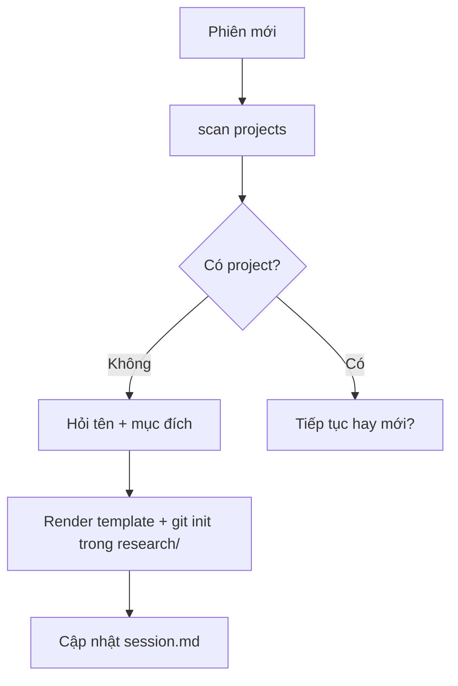
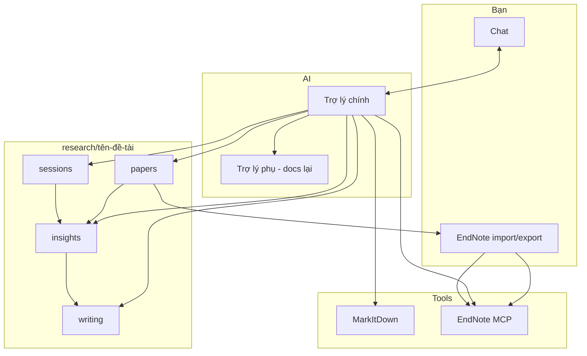

# research-helper — Giới thiệu & Workflow

> Tài liệu đọc một lần để nắm **dự án là gì**, **ai làm gì**, **luồng công việc** từ PDF đến bài viết.  
> Không thay `README.md` hay `CLAUDE.md` — chỉ tổng hợp từ governance đã promote + hành trình tư duy (`2026-07-03-SUMMARY.md`).

---

## 1. Dự án là gì?

**research-helper** là bộ khung (framework) giúp **nghiên cứu bằng chat AI** mà không mất dấu tư liệu giữa các phiên.

Hình dung như thế này: bạn vừa đọc 3 bài về statin cho bệnh nhân suy thận, vừa trao đổi với AI trong chat về ý nghĩa lâm sàng — nhưng **chat không phải tủ hồ sơ**. Nếu không ghi ra file, tuần sau mở lại sẽ quên đã kết luận gì, trích từ bài nào. research-helper bắt mọi thứ quan trọng phải **nằm trong thư mục dự án**, còn chat chỉ điều phối: đọc PDF, tìm trong EndNote, soạn đoạn văn, ghi session.

**Ví dụ đời thường:** giống như bạn không chỉ nhớ trong đầu mà còn ghi vào sổ tay journal club — ai đọc sau cũng theo được.

Ba trụ cột:

| Trụ | Ý nghĩa | Ví dụ y khoa |
|-----|---------|--------------|
| **Chat điều phối** | AI trong chat gợi ý bước tiếp; bạn quyết định import EndNote, chọn bài đọc sâu | "Tóm abstract bài NEJM này" → AI làm; "Thêm vào EndNote" → bạn bấm import |
| **Ghi chép có chỗ** | Mỗi loại tài liệu một thư mục: bài đã đọc, buổi làm việc, cách hiểu gộp, đoạn đang viết | Paper note = phiếu đọc bài; session note = biên bản buổi journal club |
| **EndNote = thư viện gốc** | Trích dẫn, PDF đầy đủ, tìm kiếm thư viện qua cầu nối AI–EndNote (MCP) | Giống PubMed + tủ PDF trên máy — AI hỏi thư viện thay vì bạn lục tay |

**Một câu:** Chat giúp nghĩ và làm nhanh; thư mục dự án giữ kết quả; EndNote giữ thư viện trích dẫn chuẩn.

---

## 2. Vấn đề giải quyết

| Vấn đề | Cách research-helper xử lý | Ví dụ |
|--------|---------------------------|-------|
| Chat quên giữa các phiên | Quyết định, insight, paper note **ghi vào file** | Thứ Hai kết luận "ưu tiên RCT" → ghi session; Thứ Sáu AI đọc lại file, không hỏi lại từ đầu |
| PDF không đọc được trong chat | **MarkItDown** (cầu nối MCP) chuyển PDF → markdown | Bài scan 40 trang → file `.raw.md` để AI đọc từng phần |
| Trích dẫn lệch thư viện | **EndNote** + export XML định kỳ + lệnh `index` | Sau khi import 5 bài mới → export XML → AI cập nhật chỉ mục |
| Một phiên load quá nhiều | Chỉ mở **một mục lục con** (papers *hoặc* sessions *hoặc* insights *hoặc* writing) | Đang soạn introduction thì chỉ mở `writing/`, không kéo cả 20 paper note |
| Governance (quy tắc chung) vs nội dung nghiên cứu | Repo gốc = sổ tay vận hành; `research/{tên-đề-tài}/` = dữ liệu từng đề tài, git riêng | Repo gốc không chứa bài của bạn; mỗi đề tài một folder riêng |

---

## 3. Thành phần chính

| Thành phần | Vai trò | Ví dụ |
|------------|---------|-------|
| **Trợ lý AI chính** | Model trong chat: đọc quy tắc, chọn guide, gọi MCP, ghi file | Bạn nói "đọc PDF này" → AI gọi MarkItDown, tạo paper note |
| **Trợ lý phụ** | Chỉ khi **docs lại**: trích chat thành draft; **không** ghi file, **không** gọi MCP | Cuối buổi journal club: AI phụ tóm 2 giờ chat → AI chính ghi `sessions/` |
| **Repo gốc** | `CLAUDE.md`, `AGENTS.md`, `docs/guides/`, `docs/decisions/`, template | Sổ tay "phần mềm chạy thế nào" — dùng chung mọi đề tài |
| **`research/{tên-đề-tài}/`** | Một đề tài nghiên cứu; git riêng; 4 nhóm thư mục + mục lục | `nghien-cuu-suy-than/` chứa paper, session, insight, writing của riêng đề tài đó |
| **`.local/`** | Cache máy: OS, path EndNote, project đang mở | WSL hay Windows — path PDF EndNote khác nhau, ghi ở đây |
| **MCP** | Cầu nối chuẩn để AI gọi tool ngoài (đọc PDF, hỏi EndNote) | Không cần copy-paste cả PDF vào chat |

**Thuật ngữ nhanh:** *Orchestrator* = trợ lý chính trong chat; *subagent* = trợ lý phụ tóm chat; *governance* = quy tắc chung trong repo gốc; *artifact* = loại ghi chép (paper note, session note, …).

---

## 4. Cấu trúc thư mục (tóm tắt)

### Repo gốc (framework)

| Đường dẫn | Nội dung |
|-----------|----------|
| `CLAUDE.md` / `AGENTS.md` | Playbook trợ lý chính + invariant (quy tắc bất biến) |
| `.context/` | GLOBAL, milestone, tensions, module |
| `docs/guides/research/` | Hướng dẫn theo việc: papers, sessions, insights, writing |
| `docs/decisions/` | Quyết định đã chốt (vd. EndNote workflow) |
| `docs/templates/` | Template tạo project mới |
| `docs/raws/` | Brainstorm, hành trình tư duy — **không** load mặc định mỗi phiên |
| `tools/` | Script scan project, v.v. |

### Mỗi project: `research/{tên-đề-tài}/`

| Thư mục | Artifact | Ví dụ y khoa |
|---------|----------|--------------|
| `papers/` | Paper note + `.raw.md` | Phiếu đọc bài JAMA + bản text trích từ PDF |
| `sessions/` | Session note | Biên bản buổi thảo luận guideline + quyết định nhóm |
| `insights/` | Insight | "Ba RCT này cùng endpoint nhưng khác population — chưa gộp được kết luận" |
| `writing/` | Prose + placeholder `[@endnote_id]` | Đoạn discussion đang soạn, chưa chốt trích dẫn |

Mỗi project có `INDEX.md` (mục lục gốc) + bốn mục lục con. Trợ lý chính chỉ mở **một** mục lục con cho task hiện tại — tránh "ngộp" như mở cùng lúc cả tủ bệnh án + tủ xét nghiệm + tủ thuốc.

---

## 5. Luồng tổng quan (end-to-end)

**Đọc từ trái sang phải:** tư liệu vào → ghi chép có cấu trúc → hiểu gộp → viết → trích dẫn từ EndNote.

**Ví dụ một vòng:** PDF guideline mới → AI tóm → paper note → bạn thêm EndNote → export XML → AI tìm bài liên quan trong thư viện → ghi insight → soạn đoạn cho bài báo → lấy citation chuẩn từ EndNote.

---

## 6. Workflow chi tiết

### A. Phiên mới (startup)

1. Trợ lý đọc (nếu có): `.local/ENVIRONMENT.md` → `.context/GLOBAL.md` → milestone → tensions → `.local/session.md`
2. Chạy `scan_research_projects.sh` — biết đã có project nào
3. **Chưa có project** → onboarding: hỏi **tên đề tài** + **mục đích nghiên cứu** (bắt buộc); có thể hỏi thêm topic, ngôn ngữ, EndNote, v.v.
4. **Đã có project** → hỏi tiếp tục hay mở đề tài mới
5. Vào task → đọc `research/{tên-đề-tài}/README.md` → mục lục gốc → **một** mục lục con + guide tương ứng

*Ví dụ:* Sáng thứ Hai mở chat — AI đọc session cache, biết đang làm đề tài "review statin CKD", không hỏi lại từ đầu.

---

### B. Paper mới (PDF chưa trong EndNote)

| Bước | Ai làm | Đầu ra |
|------|--------|--------|
| 1 | Trợ lý chính: MarkItDown | `papers/{tên-bài}.raw.md` |
| 2 | Trợ lý chính | Paper note `papers/{tên-bài}.md` (tóm tắt, câu hỏi, link raw) |
| 3 | **Bạn** | Quyết định có import EndNote không |
| 4 | Nếu có: trợ lý soạn `.ris` → **bạn** import EndNote, gắn PDF | Thư viện EndNote cập nhật |
| 5 | **Bạn** export XML (theo quy ước trong `docs/decisions/endnote-workflow.md`) | File XML mới |
| 6 | Trợ lý chính: `index` (endnote-mcp) | Chỉ mục AI đồng bộ với thư viện |

*Ví dụ:* Bài RCT mới từ email đồng nghiệp — AI đọc PDF, lập phiếu đọc; bạn import EndNote để sau này cite một phát ra đúng Vancouver.

**Lưu ý:** Bước import/export XML là **bạn làm tay** — giống ký duyệt trước khi đưa vào hồ sơ chính thức; AI không tự sửa thư viện EndNote.

---

### C. Tra cứu & đọc sâu (đã có trong EndNote)

| Nhu cầu | Tool MCP (ưu tiên) | Ví dụ |
|---------|-------------------|-------|
| Tìm trong thư viện | `search_library` ★ | "Bài nào về SGLT2 và albuminuria?" |
| Metadata đầy đủ | `get_reference_details` | Lấy authors, year, journal trước khi cite |
| Đọc PDF trong library | `read_pdf_section` | Đọc phần Methods, không cần mở file tay |
| Bài liên quan | `find_related`, `list_references_by_topic` | Journal club: gợi ý 3 bài cùng chủ đề |
| Tìm ngữ nghĩa (nếu bật) | `search_semantic` | Câu hỏi mơ hồ → tìm theo nghĩa, không chỉ từ khóa |

Trước khi dùng: trợ lý đọc `.local/mcp/endnote.md` (path XML/PDF trên máy bạn).

---

### D. Docs lại (tổng kết phiên)

**Kích hoạt:** "docs lại", "tổng kết", "ghi vào docs", …

- Mặc định: **một** file `sessions/YYYY-MM-DD-{chủ-đề}.md`
- Trợ lý phụ **không** ghi file, **không** gọi MCP
- Chỉ sửa quy tắc chung (`CLAUDE.md`, `docs/decisions/`, …) khi phiên **thật sự bàn** và có tag `[governance:path]`

*Ví dụ:* Sau 2 giờ thảo luận case lâm sàng + 4 bài literature — "docs lại" → biên bản nằm trong `sessions/`, tuần sau đọc lại biết nhóm đã chốt gì.

---

### E. Insight & viết (writing)

1. **Insight** (`insights/`): cách hiểu gộp từ nhiều paper + session — không thay paper note.  
   *Ví dụ:* "Hai meta-analysis khác nhau vì inclusion criteria khác — chưa đủ để đổi phác đồ."
2. **Writing** (`writing/`): đoạn prose; citation tạm `[@endnote_id]`
3. **Chốt bài:** `get_citation` / `get_bibliography` (và `get_bibtex` nếu giao LaTeX)

---

### F. EndNote MCP — lần đầu trên máy

Khi cần EndNote mà chưa có `setup_method` trong `.local/mcp/endnote.md`, bạn chọn một trong hai (chi tiết trong `docs/decisions/endnote-workflow.md`):

| Cách | Tóm tắt | Giống trong đời thực |
|------|---------|----------------------|
| **1. Tự setup (wizard)** | Terminal: `endnote-mcp setup` — tool tự tìm path | Tự cài máy xét nghiệm lần đầu — đọc hướng dẫn nhà sản xuất, một lần xong |
| **2. Nhờ AI trong chat** | Bạn gửi path XML/PDF → AI ghi config + chạy `index` | Nhờ IT cấu hình — tiện nhưng cần đưa đúng đường dẫn |

Sau khi chọn: ghi `setup_method: native | agent` — không hỏi lại.

---

### G. Onboarding project mới

**Không** tạo folder `research/...` trước khi có **tên đề tài** + **mục đích**.

*Ví dụ:* Đề tài mới "so sánh hai scheme điều trị HTN ở CKD" → AI tạo folder, mục lục, README — sẵn sàng ghi paper và session.

---

## 7. Quy tắc vận hành (invariant — tóm tắt)

| # | Quy tắc | Ví dụ |
|---|---------|-------|
| 1 | Chat ≠ kho lưu | Kết luận quan trọng phải có trong file |
| 2 | Một mục lục con mỗi task | Soạn writing không load hết papers |
| 3 | Chỉ trợ lý chính gọi MCP | Trợ lý phụ không đụng EndNote |
| 4 | Docs lại → session; sửa quy tắc chung chỉ khi phiên bàn governance | Tránh AI tự ý đổi playbook |
| 5 | Sơ đồ trong file = Mermaid | Thống nhất, dễ sửa |
| 6 | Git từng project | `research/{tên-đề-tài}/` commit riêng; repo gốc không track nội dung nghiên cứu |
| 7 | Ghi file có nghĩa → commit + báo "Đã lưu tự động" | Giống autosave trong EMR |
| 8 | Insight bền → promote đúng chỗ | Quyết định chốt → `docs/decisions/`; path máy → `.local/` |

---

## 8. Milestone hiện tại

**0.0.1 Bootstrap** — governance + template + guide + EndNote decision đã có; khoảng trống không chặn milestone ghi trong `deferred-gaps-nonblocking.md` (vd. `huong-dan-su-dung.md` cho bác sĩ đọc trực tiếp — làm sau khi guide ổn).

---

## 9. Cast — Ai làm gì?

| Vai trò | Việc | Không làm |
|---------|------|-----------|
| **Bạn** | Mục tiêu nghiên cứu, import/export EndNote, duyệt ghi chép | Gọi MCP trực tiếp (để trợ lý chính) |
| **Trợ lý chính** | Startup, chọn guide, MCP, ghi `research/` | Tự ý sửa quy tắc chung khi phiên không bàn |
| **Trợ lý phụ** | Trích chat khi docs lại | Ghi file, MCP |
| **EndNote (bạn)** | Thư viện, PDF, export XML | Thay thế paper note — hai lớp bổ sung nhau |
| **MarkItDown** | PDF lạ → markdown | Thay EndNote cho bài đã có trong thư viện |

---

## 10. Đọc thêm (theo nhu cầu)

| Nhu cầu | File |
|---------|------|
| Tại sao thiết kế như vậy | `docs/raws/2026-07-03-SUMMARY.md` |
| Spec kỹ thuật đã duyệt | `docs/raws/2026-07-03-APPROVAL-DRAFT.md` |
| Playbook trợ lý chính | `CLAUDE.md` |
| Invariant ngắn | `AGENTS.md` |
| EndNote canonical | `docs/decisions/endnote-workflow.md` |
| Tool MCP EndNote | `docs/guides/mcp/endnote-mcp-tools.md` |
| Hướng dẫn theo việc | `docs/guides/research/00-overview.md` → `papers.md`, `sessions.md`, … |

---

## 11. Sơ đồ một trang (in / share nội bộ)

---

*Tài liệu tổng hợp: 2026-07-03. Nguồn: governance đã promote + `2026-07-03-SUMMARY.md`. Cập nhật khi milestone hoặc workflow đổi.*