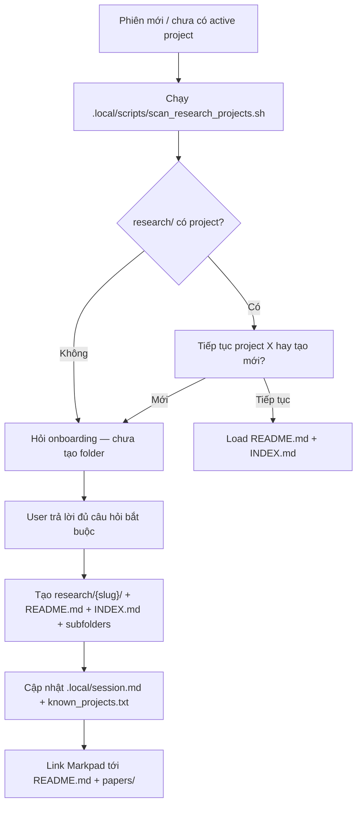
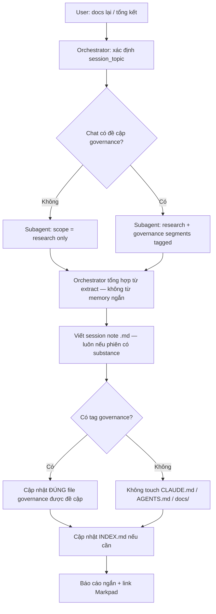
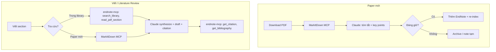

# Tổng hợp thiết kế CLAUDE.md + AGENTS.md — research-helper

> **Mục đích file**: Gom toàn bộ cuộc trao đổi thiết kế governance (2026-07-03) thành một nguồn ngữ cảnh duy nhất.  
> **Trạng thái**: Brainstorm / chưa duyệt — **chưa** ghi `CLAUDE.md` hay `AGENTS.md` vào root repo.  
> **Liên quan**: `research-helper.md` (nội dung MCP + note-taking gốc từ brainstorm trước).

---

## 1. Mục tiêu dự án

**research-helper** giúp người dùng làm nghiên cứu qua Claude — theo mô hình **chat-driven** tương tự `clinical-ocr-helper`, nhưng domain là **literature review / viết bài**, với 2 MCP:

| MCP | Vai trò | Khi nào |
|-----|---------|---------|
| **MarkItDown** | PDF mới → Markdown sạch, token-efficient | Paper tải về lần đầu |
| **endnote-mcp** | Thư viện đã curate: search, đọc PDF, citation, bibliography | Paper trong EndNote; Related Work; format citation |

Claude = **orchestrator** giữa user ↔ hai MCP ↔ file persistent.

Chi tiết 12 tools endnote-mcp, prompt mẫu, luồng ingest → xem `research-helper.md` (cùng thư mục `docs/raws/`).

---

## 2. Repo tham chiếu — lấy gì, bỏ gì

### Từ `clinical-ocr-helper`

| Lấy | Bỏ / không áp dụng |
|-----|---------------------|
| `AGENTS.md` = source of truth protocol | Obsidian (user bỏ) |
| `CLAUDE.md` = overlay Claude-specific + quick workflow | Haiku OCR / CSV / SPSS pipeline |
| Living **INDEX.md** — đọc trước, báo cáo ngắn + link | `data/` → đổi thành `research/` |
| Quyết định sống trong **file**, không trong chat memory | End-user abstraction tuyệt đối (chưa chốt — xem §13) |
| Tổng hợp **trước** khi ghi file | Per-study git riêng (chưa chốt) |
| Layered loading + `.local/claude-agent-summary.md` | |
| `docs/ideations/` vs `docs/plans/` vs `docs/decisions/` | |
| Markpad mở `.md` local | |

### Từ `hybrid-engine`

| Lấy | Ghi chú |
|-----|---------|
| **Docs Writing Protocol** — spawn **subagent** rà chat verbatim → tổng hợp → viết → verify | Áp dụng khi "docs lại" |
| User style: dev ~8 năm, chat ngắn, phản biện thẳng | |
| Brainstorm → `docs/ideations/`, plans = đã chốt | |
| Tension → `.context/TENSIONS_OPEN.md` | |
| Cấu trúc `AGENTS.md` (milestone, startup, routing, self-check) | |

---

## 3. Quyết định đã chốt qua các lượt chat

| # | Quyết định |
|---|------------|
| 1 | **Bỏ Obsidian** — chỉ dùng **Markpad** (nhẹ, mở file `.md` local) |
| 2 | **Ngôn ngữ song ngữ EN/VI** — theo ngôn ngữ user đang dùng trong phiên chat |
| 3 | **Tách 2 lớp file**: governance (repo dự án) vs dữ liệu nghiên cứu (`research/`) |
| 4 | Thư mục nghiên cứu: **`research-helper/research/`** (trong repo), **không** dùng tên `data/` |
| 5 | Mỗi phiên chat ≈ **một chủ đề**; "docs lại" → orchestrator xác định chủ đề → **subagent** gom chat + đồ thị → **1 session note** |
| 6 | **Mermaid bắt buộc** cho mọi diagram trong note/docs (quy định cứng trong `CLAUDE.md`) |
| 7 | **Governance chỉ cập nhật khi được đề cập** trong phiên; nếu không → bỏ qua, tập trung dữ liệu nghiên cứu |
| 8 | `docs/raws/` giữ brainstorm; quyết định chốt promote sang `docs/decisions/`, `docs/workflows/` |
| 9 | **Không tự tạo** cấu trúc `research/{slug}/` — phiên đầu **hỏi user** đặt tên project (slug) trước |
| 10 | Phiên đầu hỏi **mục đích + topic** + onboarding (§4.1) → ghi vào **`README.md`** của project (không INDEX) |
| 13 | **`research/{slug}/README.md`** = identity project: purpose, topic, scope, metadata; **`INDEX.md`** = catalog paper/session |
| 11 | Script tiện ích trong **`.local/scripts/`** (gitignored) — adapt từ clinical-ocr, **chỉ đổi tên/path** (`research/` thay `data/`, project thay study) |
| 12 | Thuật ngữ: model chính = **orchestrator**; model phụ delegate = **subagent** (không dùng "agent nhẹ") |

---

## 4. Hai lớp file — cấu trúc đề xuất

```
research-helper/                    ← GOVERNANCE (commit)
├── AGENTS.md                       ← (chưa viết — chờ duyệt)
├── CLAUDE.md                       ← (chưa viết — chờ duyệt)
├── .context/                       ← GLOBAL, MILESTONES, TENSIONS, modules
├── docs/
│   ├── raws/                       ← brainstorm + file tổng hợp này
│   ├── decisions/
│   ├── workflows/
│   ├── ideations/
│   └── templates/
├── .local/                         ← gitignored
│   ├── ENVIRONMENT.md
│   ├── session.md                  ← active_project, ngôn ngữ, …
│   ├── known_projects.txt
│   ├── claude-agent-summary.md
│   └── scripts/                    ← scan_research_projects.sh, … (adapt clinical-ocr)
└── research/                       ← DỮ LIỆU NGHIÊN CỨU — tạo SAU KHI user đặt tên
    └── {project-slug}/
        ├── README.md               ← purpose, topic, scope, metadata (onboarding)
        ├── INDEX.md                ← catalog paper + session (entry point thao tác)
        ├── papers/                 ← PDF inbound (nên gitignore *.pdf)
        ├── notes/
        │   ├── literature/         ← note từng paper (đề xuất)
        │   ├── permanent/          ← synthesis (đề xuất)
        │   └── sessions/           ← session note sau "docs lại"
        └── drafts/                 ← optional
```

**Lưu ý git**: PDF có thể nặng / license — đề xuất `.gitignore` `research/**/papers/*.pdf`, commit `INDEX.md` + `notes/**/*.md`.  
**Lưu ý tạo thư mục**: `research/` root có thể tồn tại sẵn (rỗng); **`research/{project-slug}/` chỉ tạo sau onboarding** — không auto `project-YYYYMMDD`.

### 4.1 Phiên chat đầu tiên — onboarding (bắt buộc)

**Khác clinical-ocr**: không tự sinh `study-YYYYMMDD`. Luôn **hỏi user** trước khi `mkdir`.



#### Câu hỏi bắt buộc (trước khi tạo folder)

| # | Câu hỏi | Lưu vào |
|---|---------|---------|
| 1 | **Tên project (slug)** — bạn muốn đặt tên thư mục nghiên cứu thế nào? (vd `efficient-finetuning-llms`) | path + `README.md` title |
| 2 | **Mục đích nghiên cứu** — bạn đang nghiên cứu để làm gì? (1–3 câu) | `README.md` → `## Research purpose` |

#### Câu hỏi đề xuất thêm (nên hỏi, có thể bỏ qua nếu user vội)

| # | Câu hỏi | Lưu vào |
|---|---------|---------|
| 3 | **Research topic** (chủ đề kỹ thuật/học thuật ngắn) — khác purpose: topic = "cái gì", purpose = "để làm gì" | `README.md` → `## Research topic` |
| 4 | **Ngôn ngữ ưu tiên** phiên này: EN hay VI? | `README.md` + `.local/session.md` |
| 5 | **Deliverable**: literature review / paper section / thesis chapter / khác? | `README.md` |
| 6 | **Citation style**: APA 7, IEEE, Vancouver, Harvard…? | `README.md` (dùng với endnote-mcp) |
| 7 | **EndNote library** đã export XML + index chưa? | `README.md` → `## Setup notes` |
| 8 | **Phạm vi**: keyword/chủ đề trong vs ngoài phạm vi? | `README.md` → `## Scope` |
| 9 | **Paper sẵn có**: đã có PDF trong đầu hay bắt đầu từ search library? | `README.md` hoặc ghi chú phiên đầu |

Sau khi user trả lời (ít nhất #1 + #2): orchestrator tạo cấu trúc + seed **`README.md`** (identity) + **`INDEX.md`** (catalog rỗng/mẫu).

#### README.md vs INDEX.md

| File | Vai trò | Agent đọc khi |
|------|---------|---------------|
| **README.md** | Bối cảnh project: purpose, topic, scope, deliverable, citation style, setup | Phiên mới / cần hiểu "đang nghiên cứu gì" |
| **INDEX.md** | Catalog động: paper, session notes, status | Mọi lượt thao tác paper/session |

**Không** lặp purpose/topic trong INDEX header — INDEX chỉ tham chiếu: `Project: [README.md](README.md)`.

#### `.local/scripts/` (adapt clinical-ocr — chỉ đổi tên)

| clinical-ocr-helper | research-helper |
|---------------------|-----------------|
| `.local/scripts/scan_studies.sh` | `.local/scripts/scan_research_projects.sh` |
| `data/` | `research/` |
| `known_studies.txt` | `known_projects.txt` |
| `active_study:` trong `session.md` | `active_project:` |
| `study-xxx` | `{project-slug}` do user đặt |

Script **không** tự tạo project — chỉ scan + báo `ACTION: Hỏi user tên project`. Orchestrator tạo folder sau onboarding.

---

## 5. README.md — identity project (onboarding)

```markdown
# {project-slug}

**Created**: YYYY-MM-DD
**Language**: EN | VI

## Research purpose
(Mục đích — bắt buộc từ onboarding)

## Research topic
(Chủ đề học thuật — đề xuất hỏi)

## Deliverable
(literature review / paper section / …)

## Citation style
(APA 7 / IEEE / …)

## Scope
(trong phạm vi / ngoài phạm vi)

## Setup notes
(EndNote XML, MCP, …)
```

Purpose + topic **chỉ** ở đây — single source of truth cho bối cảnh project.

---

## 6. INDEX.md — catalog (thiết kế sau phản biện)

### Header (gọn — không lặp purpose/topic)

```markdown
# Research Index — {project-slug}

**Updated**: YYYY-MM-DD
**Project context**: [README.md](README.md)
```

**Phản biện đã áp dụng**: purpose/topic ở README; INDEX chỉ catalog — tránh redundant + drift giữa hai file.

### Bảng Papers & Notes

| Cột | Ý nghĩa |
|-----|---------|
| `#` | STT |
| `Title` | Tên bài báo |
| `PDF file` | Tên file PDF (relative, vd `papers/smith-2024.pdf`) |
| `Note (.md)` | Đường dẫn note (relative, vd `notes/literature/smith-2024.md`) |
| `Sections covered` | Phần paper đã đọc/ghi: Intro, Methods, Results… |
| `Tags` | Góc synthesis: `#lora`, `#benchmark` — **khác** sections |
| `Status` | `new` / `processed` / `in-endnote` / `synthesized` |
| `Source` | `markitdown` / `endnote-mcp` |
| `Notes` | Ghi chú ngắn: lỗi convert, "đọc lại trang 12" |

**Tách semantics**: `Sections` = phần của **paper**; `Tags` = chủ đề **synthesis** — không gộp "chủ đề file" mơ hồ.

**INDEX ≠ nội dung note** — summary/contribution nằm trong file `.md` từng paper, không nhét vào bảng.

### Section Session notes (bảng riêng)

| Date | Topic | Note | Tags | Status |
|------|-------|------|------|--------|
| 2026-07-03 | MCP routing design | `notes/sessions/2026-07-03-mcp-routing.md` | mcp, workflow | final |

Session note **không** trộn vào bảng paper.

### Link Markpad

Dùng **relative markdown links** thay `[[wiki-link]]` Obsidian:  
`[session](notes/sessions/2026-07-03-mcp-routing.md)`

---

## 7. Workflow "docs lại" / "tổng kết"

### Trigger

`docs lại`, `viết docs`, `tổng kết`, `ghi vào docs`, `cập nhật docs`, `viết lại docs`…

### Luồng



### Vai trò

| Bước | Ai |
|------|-----|
| Xác định chủ đề + có governance không | Model hiện tại (orchestrator) |
| Gom verbatim + mermaid blocks | **Subagent** (fast model) — cold, self-contained prompt, **không** tự ghi file |
| Tổng hợp + ghi file | Orchestrator |

### Routing output

| Loại | Đường dẫn | Khi nào |
|------|-----------|---------|
| Session note (**mặc định**) | `research/{project}/notes/sessions/YYYY-MM-DD-{slug}.md` | Hầu hết "docs lại" |
| INDEX.md | `research/{project}/INDEX.md` | Session/paper/status mới |
| Literature note | `research/{project}/notes/literature/...` | Phiên bàn paper cụ thể |
| Governance | `CLAUDE.md`, `AGENTS.md`, `docs/decisions/`… | **Chỉ** khi phiên đề cập rõ |

**Quy tắc cứng**: Không "tiện tay" sửa governance nếu phiên không bàn — case bình thường = **0 file governance**, **1 session note**.

### Prompt khung subagent

```
Topic scope: "{session_topic}"

TASK:
1. Extract segments related to topic — verbatim (decisions, rationale, open questions).
2. Extract ALL ```mermaid ... ``` blocks exactly.
3. Tag each extract: [research] or [governance:path/to/file]
4. Governance tag ONLY if chat explicitly discussed those files.
5. Do NOT summarize aggressively. Do NOT write files.

OUTPUT: ## Extracts | ## Mermaid blocks | ## Files/papers mentioned
```

### Self-check sau "docs lại"

- [ ] Session note đã ghi (nếu có substance)
- [ ] Có ≥1 block Mermaid (trích chat hoặc orchestrator vẽ lại từ mô tả bằng lời)
- [ ] Governance: **0 file** nếu không được đề cập
- [ ] Không cập nhật `CLAUDE.md` "phòng hờ"

---

## 8. Mermaid — quy định bắt buộc (CLAUDE.md)

1. Mọi diagram trong session note / workflow doc → **chỉ Mermaid**.
2. Subagent trích nguyên văn block mermaid từ chat; orchestrator không thay bằng ASCII.
3. Nếu phiên chỉ mô tả bằng lời → orchestrator **vẽ lại** Mermaid trước khi ghi.
4. Ảnh PNG trong `docs/raws/.assets/` chỉ tham chiếu — logic flow vẫn là Mermaid trong note.

---

## 9. Template session note (đề xuất)

```markdown
---
type: session-note
project: {project-slug}
session_topic: ...
date: YYYY-MM-DD
language: en | vi
status: draft | final
---

# {Session topic}

## Context

## Key points

## Decisions & rationale

| Decision | Rationale | Open? |
|----------|-----------|-------|

## Diagrams


## Verbatim extracts (selected)

## Open questions

## Related
- INDEX / papers: ...
- Prior session: [slug](notes/sessions/...)
```

---

## 10. Ngôn ngữ song ngữ

| Thành phần | Quy tắc |
|------------|---------|
| Chat với user | Theo ngôn ngữ user đang dùng |
| Session note | Theo ngôn ngữ dominant phiên (chưa chốt: hỏi khi "docs lại" nếu lẫn EN/VI) |
| Citation / BibTeX | Giữ chuẩn học thuật (thường EN), không dịch title paper |
| Governance docs | Tiếng Việt ưu tiên (theo hybrid-engine) hoặc song nguyên — **chưa chốt** |

---

## 11. MCP workflow tóm tắt (từ research-helper.md)



**endnote-mcp** — tool khuyến nghị hàng ngày: `search_library`. Semantic (`search_semantic`, `find_related`) tùy chọn. Index incremental sau khi thêm reference.

**MarkItDown** ưu tiên giai đoạn đầu (nhiều paper mới); thư viện lớn dần → endnote-mcp chiếm tỷ lệ cao hơn.

---

## 12. Đề xuất nội dung CLAUDE.md + AGENTS.md (chưa viết — chờ duyệt)

### AGENTS.md (ngắn, cứng)

- §0 Milestone (bootstrap 0.0.1)
- §1 Startup: GLOBAL → MILESTONES → TENSIONS → modules
- §2 Invariants: chat ≠ storage; tổng hợp trước khi ghi; MCP routing; docs protocol; Mermaid; governance-only-when-mentioned
- §3 Tension format
- §4 Routing: CODE_NOW / ASK_ARCHITECTURE / EXPLAIN
- §5 Self-check
- §6 Ideation promote path

### CLAUDE.md (dài, practical)

- **Phần A**: Quick Workflow (MCP + research folder + README + INDEX)
- **Phần B**: MCP routing table (12 tools)
- **Phần C**: Note templates (literature, permanent, session)
- **Phần D**: Docs Writing Protocol + governance routing (§7 file này)
- **Phần E**: Subagent rules (chat extractor = fast model; thuật ngữ **subagent**)
- **Phần F**: Memory efficiency + `.local/claude-agent-summary.md` + `.local/scripts/`
- **Phần G**: First-run onboarding (§4.1 — hỏi slug + purpose, **không** auto-tạo folder)
- **Phần H**: Response style (phản biện, EN/VI)
- **Phần I**: Mermaid mandatory (§8)

---

## 13. Câu hỏi còn mở

| # | Câu hỏi | Ưu tiên |
|---|---------|---------|
| 1 | `research/**/papers/*.pdf` gitignore? | Cao |
| 2 | ~~Multi-project đầu phiên~~ → **đã chốt**: scan script + hỏi tiếp tục hay tạo mới; tạo mới = onboarding §4.1 | — |
| 3 | Ngôn ngữ session note khi phiên lẫn EN/VI | Trung bình |
| 4 | End-user: chỉ dev (semi-tech) hay cũng non-tech → che MCP/sub-agent? | Trung bình |
| 5 | Markpad: Mac-only hay cần WSL path? | Trung bình |
| 6 | Context-mapping `init.py` scaffold `.context/` khi viết file lần đầu? | Trung bình |
| 7 | MarkItDown raw `.md` riêng trong `papers/` hay chỉ note đã xử lý? | Thấp |
| 8 | Thêm EndNote: human thủ công + agent `rebuild_index`? | Thấp |
| 9 | Milestone 0.0.1 scope: chỉ governance files hay kèm workflow MCP doc? | Thấp |

---

## 14. Trạng thái & bước tiếp theo

| Hạng mục | Trạng thái |
|----------|------------|
| `docs/raws/research-helper.md` | Có — MCP + note-taking gốc |
| File tổng hợp này | **Đã tạo** — ngữ cảnh thiết kế governance |
| `CLAUDE.md` / `AGENTS.md` root | **Chưa** — chờ user duyệt outline |
| `.context/` scaffold | **Chưa** |
| `research/` folder + INDEX mẫu | **Chưa** |

**Khi user sẵn sàng**: duyệt §12 → nói "viết" → áp dụng Docs Writing Protocol (spawn subagent rà chat) rồi ghi `CLAUDE.md` + `AGENTS.md` + `.local/scripts/scan_research_projects.sh`.

---

## 15. Timeline cuộc trao đổi (để không mất dòng)

1. **Lượt 1**: Đọc hybrid-engine + clinical-ocr-helper + `docs/raws`; tổng hợp trong chat; **chưa ghi** governance files; nhắc case spawn subagent khi "docs lại".
2. **Lượt 2**: Bỏ Obsidian → Markpad; EN/VI; tách governance vs research; đề xuất INDEX + **phản biện** (topic ở header, sections vs tags, status/source).
3. **Lượt 3**: `research/` trong repo (không `data/`); workflow session note; **Mermaid bắt buộc**.
4. **Lượt 4**: Governance **chỉ** cập nhật khi phiên đề cập — mặc định chỉ research data.
5. **Lượt 5**: Gom chat vào `docs/raws/2026-07-03-claude-agents-design-synthesis.md`.
6. **Lượt 6**: Project slug — hỏi user phiên đầu; onboarding; `.local/scripts/`; thuật ngữ **subagent**.
7. **Lượt 7**: **Research purpose + topic** lưu trong **`research/{slug}/README.md`**, không INDEX header.

---

*Cập nhật: 2026-07-03 — tổng hợp thiết kế CLAUDE.md / AGENTS.md cho research-helper.*