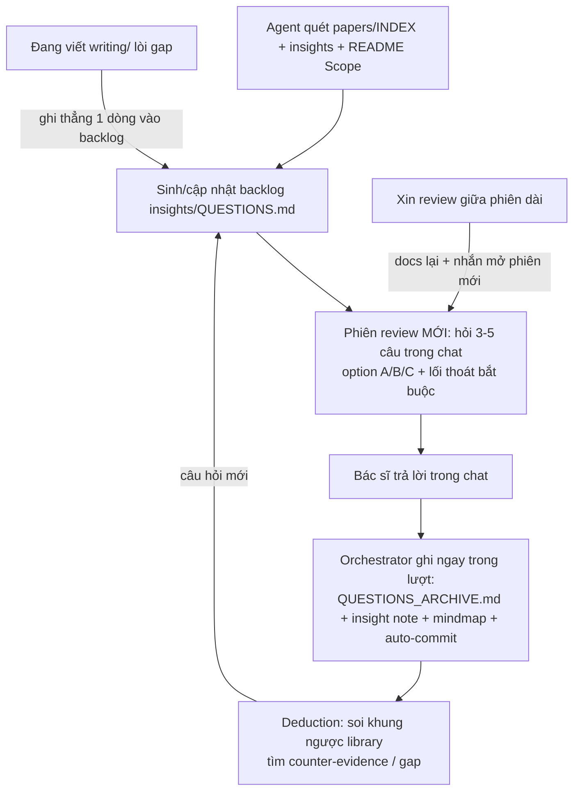
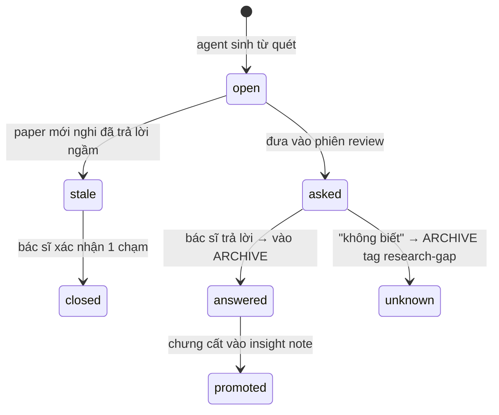

# Tổng quát hóa & Review workflow — thiết kế vòng hội tụ

> **Trạng thái**: Brainstorm đã qua 3 vòng phản biện — **chưa promote** vào APPROVAL-DRAFT / governance.
> **Ngày**: 2026-07-03
> **Tham chiếu**: `2026-07-03-APPROVAL-DRAFT.md` (§3 bốn artifact, §7 docs lại), `research-helper.md` (MCP), `endnote-workflow-open-questions.md` (pattern hỏi–đáp gốc).

---

## 1. Vấn đề

Workflow hiện tại chỉ có **nửa phân kỳ**: PDF → paper note → session note → insight → writing. Dữ liệu chảy vào và phình ra. `insights/` được thiết kế cho tổng quát hóa nhưng **thụ động** — chỉ viết khi user chủ động yêu cầu; bác sĩ bận thì library phình mà mental model không lớn theo.

Thiếu **nửa hội tụ**: cơ chế để agent chủ động sinh dữ liệu hệ thống → đặt câu hỏi ngược cho người nghiên cứu → ép chu trình phân kỳ → hội tụ xảy ra đều đặn.

**Nhận xét nền**: pattern này đã tồn tại trong repo mà chưa được nhận diện là feature — chính file `endnote-workflow-open-questions.md` (agent quét context → sinh câu hỏi → human trả lời → promote). Ta đang dùng nó cho governance (dev); thiết kế này tổng quát hóa nó cho research data (bác sĩ).

---

## 2. Nguyên tắc cốt lõi (rút từ phản biện)

### 2.1 Người đặt khung, máy đổ evidence

Bài học từ thất bại mindmap của NotebookLM: lỗi không phải "thiếu human touch" mà là **máy tự chọn trục phân loại** — sinh taxonomy từ tần suất từ ngữ, ra cây hợp lý về ngôn ngữ nhưng vô nghĩa với câu hỏi nghiên cứu. Sửa bằng cách thêm human touch vào map máy sinh là sửa ngọn.

**Đảo vai**: người đặt khung (các nhánh gốc = trục researcher quan tâm), máy đổ evidence vào khung và chỉ ra chỗ dữ liệu không khớp khung. **Máy không bao giờ quyết định cấu trúc bức tranh tổng thể.**

### 2.2 Ba kiểu suy luận — gọi đúng tên để guide viết đúng động tác

| Kiểu | Chiều | Agent làm gì |
|------|-------|--------------|
| **Induction** | Nhiều paper → quy luật | Gom evidence cùng tag/chủ đề → sinh câu hỏi "N paper cùng thấy X — anh/chị rút ra gì?" |
| **Abduction** | Mâu thuẫn → giả thuyết giải thích | Phát hiện paper A ≠ paper B → hỏi "giả thuyết nào giải thích được cả hai?" |
| **Deduction** | Khung → dự đoán → kiểm định | Có mental model rồi: suy dự đoán từ khung → check ngược library tìm counter-evidence / gap |

Deduction chỉ vào cuộc **sau khi** mental model tồn tại — nó là chiều kiểm định, không phải chiều sinh. Đây là thứ NotebookLM không làm được (không có model để kiểm định nên không biết mình sai ở đâu).

### 2.3 Mindmap — map của hiểu biết, không phải của tài liệu

- Bức tranh tổng thể của *tài liệu* ≠ bức tranh tổng thể của *hiểu biết*. Map vẽ **concepts/claims trong mental model**, mỗi node link về insight/paper note làm evidence — không map papers (không scale quá ~30–50 node, và map nhầm đối tượng).
- Kỹ thuật: Mermaid `mindmap` — khớp luật "Mermaid bắt buộc", Markpad render được.
- Vị trí: section trong insight note (không file riêng).
- **Rule cứng**: agent thêm node evidence thì được; **đổi nhánh gốc / tái cấu trúc phải đi qua một câu hỏi được bác sĩ duyệt** — không bao giờ tự sửa khung.

---

## 3. Vòng lặp hội tụ — cơ chế

### 3.1 Ba loại câu hỏi review

| Loại | Nguồn | Ví dụ | Yêu cầu evidence |
|------|-------|-------|------------------|
| **Mâu thuẫn** (abduction) | 2 paper kết quả ngược nhau | "A nói X, B nói ngược — anh/chị nghiêng về đâu, vì sao?" | **Bắt buộc** quote nguyên văn + số trang (qua `read_pdf_section`, không tin paper note suông) |
| **Gom quy luật** (induction) | ≥N paper cùng tag chưa có insight nối | "5 paper này cùng chạm X — có quy luật gì?" | Link paper notes |
| **Coverage check** (chống buồng vang) | `README § Scope` vs library | "Scope khai có mảng X, library chưa có paper nào — chủ đích bỏ hay chưa tìm?" | Đối chiếu scope |

Nguồn phụ: paper `processed` lâu không đụng tới (giữ hay loại?), gap lòi ra khi viết `writing/`.

### 3.2 Hai file — tách theo chính sách load (token)

| File | Chứa | Load khi |
|------|------|----------|
| `insights/QUESTIONS.md` | Backlog câu **đang mở** (`open` / `asked` / `stale`) — giữ nhỏ | Mỗi phiên review |
| `insights/QUESTIONS_ARCHIVE.md` | Câu hỏi → trả lời (1–3 câu, verbatim nếu ngắn) → ngày → link session note → link insight (nếu promote) | Chỉ khi tra lịch sử |

Lý do tách = **chính sách load**: QUESTIONS.md load mỗi phiên review nên phải kích thước cố định; archive lớn vô hạn, không load mặc định. Đúng triết lý INDEX phân tầng.

**Archive là sử liệu, insight là tư duy hiện tại** — hai vai khác nhau, không phải duplicate. Bác sĩ đổi ý → sửa insight; archive giữ nguyên "lúc đó tôi trả lời thế" (provenance). **Không sửa archive cho khớp insight.**

Vòng đời một câu hỏi:

- **`unknown` là câu trả lời hợp lệ**, không phải câu chưa trả lời: gap được chuyên gia xác nhận = nguyên liệu Future Work + danh sách search paper mới. Agent query được "liệt kê gap đã xác nhận".
- **Chống backlog mục ruỗng**: mỗi lần quét sinh câu mới, rà backlog cũ đối chiếu paper mới → nghi đã giải thì đánh `stale` kèm link, phiên sau xác nhận một chạm.

Root `INDEX.md`: dòng Insights thêm count "câu hỏi đang mở: N".

### 3.3 Cùng pattern với TENSIONS — không gộp

`QUESTIONS.md` cùng pattern với `.context/TENSIONS_OPEN.md` (sổ mục chưa giải quyết, có vòng đời, có promote) — mượn **kỷ luật vòng đời** (status, ngày, đường resolve) cho format quen. Nhưng **hai instance riêng**: TENSIONS = governance (mâu thuẫn thiết kế, dev đọc, `.context/`); QUESTIONS = dữ liệu nghiên cứu (câu học thuật, bác sĩ trả lời, `insights/`). Gộp = vi phạm ranh giới hai-lớp-file.

---

## 4. Phiên review — quy tắc vận hành

### 4.1 Review = phiên mới (thay cho "compact")

Câu hỏi review sinh từ **file** (INDEX, notes, scope), không từ trí nhớ chat — đó là lý do tồn tại của kiến trúc file-first. Nên:

- **Mặc định**: phiên review là phiên chat mới, context sạch, agent load INDEX + notes.
- **Xin review giữa phiên dài**: chạy "docs lại" trước → nhắn: *"Mọi thứ đã lưu — anh/chị mở phiên mới, nói 'review' là mình bắt đầu."*
- **Không viết rule "compact nếu được"**: agent trong Claude chat không tự compact và không đo được context còn bao nhiêu — nhánh đó không bao giờ chạy được, rule thành rác.

### 4.2 Giao diện chat (bác sĩ không điền Markpad)

File form (kiểu `endnote-workflow-open-questions.md`) đúng cho **dev**; với **bác sĩ**, giao diện là chat, file chỉ là backlog + biên bản phía sau:

- Mỗi lượt chỉ hỏi **3–5 câu** ưu tiên cao nhất (mâu thuẫn trước, gap sau) — không xả cả backlog.
- Option A/B/C để bác sĩ gõ một chữ cũng trả lời được, **nhưng bắt buộc có lối thoát**: "cả hai đều chưa đúng / tôi nghĩ khác — nói tự do" (chống anchoring).
- Mỗi phiên review **kết bằng một câu mở hoàn toàn**: "có gì anh/chị thấy mà mấy câu trên chưa chạm tới?" — chính là câu "tôi có điểm gì mù".
- Option chuẩn "**câu hỏi sai đề**" — được archive lại vì là tín hiệu paper note nguồn cần viết lại.

### 4.3 Ghi ngay trong lượt — không spawn thừa

- Phiên review (mới, ngắn, có cấu trúc): **orchestrator tự ghi ngay** sau mỗi batch trả lời — không cần subagent, rẻ hơn, không rủi ro cold-start.
- Spawn haiku trích chat chỉ là **fallback** cho case câu trả lời lạc giữa phiên làm việc dài (xử lý qua "docs lại" cuối phiên).
- Giữ rule 7.1 (endnote file): subagent chỉ **trích**, orchestrator mới **ghi**.

### 4.4 Menu đầu phiên — theo state, không theo template

- "Slash command" (`/review`…) trong Claude chat là **từ khóa quy ước** CLAUDE.md dạy agent nhận diện — cùng họ "docs lại", không phải command thật. Chuẩn hóa thành **một bảng từ khóa kích hoạt** duy nhất: `review`, `docs lại`, `paper mới`, `viết`…
- Menu **không hiện tĩnh mỗi phiên** (noise). Sinh từ state: `.local/session.md` pending actions, backlog count, XML stale — ví dụ *"Có 4 câu hỏi review đang chờ, 1 paper chưa add EndNote — xử lý cái nào trước?"*
- Chỉ hiện khi lời mở đầu mơ hồ ("chào", "hôm nay làm gì") hoặc có pending thật; user vào thẳng việc thì im. Tối đa 3–4 lựa chọn.

### 4.5 Ngưỡng — 2 knob, config bằng lời

| Knob | Mặc định (dev chốt trong governance) | Runtime |
|------|--------------------------------------|---------|
| Ngưỡng paper tối thiểu để agent *tự* gợi ý review | ~N paper `processed` chưa nối insight (TBD) | `.local` |
| Số phiên im lặng sau khi bị từ chối | M phiên (TBD) | `.local` |

- Bác sĩ đổi ngưỡng **bằng lời trong chat** ("đừng gợi ý review nữa") → agent ghi `.local` và tuân theo. Không bắt bác sĩ mở file config.
- Bác sĩ chủ động gọi "review" → luôn chạy, bỏ qua ngưỡng.
- Kỷ luật: bắt đầu đúng 2 knob — mỗi knob thêm là một dòng guide + một case test.

---

## 5. Provenance của note — mảnh ghép chống "rác đầu vào"

Câu hỏi review sinh từ paper note *do agent viết* — note hời hợt → mâu thuẫn ảo → bác sĩ trả lời câu sai tiền đề → insight nhiễm độc (mà trông thuyết phục vì "có evidence").

| Cơ chế | Chi tiết |
|--------|----------|
| Frontmatter thô | `author: agent` + `reviewed_by_user: no \| YYYY-MM-DD` — **không** làm provenance mức dòng (quá nặng, sẽ chết) |
| Phát hiện miễn phí qua git | Agent auto-commit mọi thứ → đầu phiên `git status` thấy file **chưa commit** = bác sĩ đã sửa tay qua Markpad → cập nhật provenance + hỏi xác nhận |
| Nối vào review | Câu hỏi từ note `reviewed: no` **bắt buộc** kèm quote nguyên văn từ PDF; note đã duyệt được tin cao hơn |
| Duyệt phải rẻ | Agent hỏi 1 câu trong chat "note X tôi tóm vậy đúng chưa?" — gật là flip flag; ưu tiên duyệt note đang nuôi insight, không bắt duyệt tất cả |

---

## 6. Rủi ro & đối sách

Ba rủi ro nhận thức (làm sai thì hệ thống **có hại** hơn vô dụng), ba lỗ cơ khí (thiếu thì rỉ dần):

| # | Rủi ro | Đối sách (đã nhúng vào thiết kế) |
|---|--------|----------------------------------|
| R1 | **Anchoring** — agent sinh câu hỏi = kiểm soát không gian suy nghĩ; A/B/C ép bác sĩ chọn trong khung máy | Lối thoát bắt buộc mỗi câu option; câu mở cuối phiên; agent không tự tái cấu trúc mindmap (§2.3, §4.2) |
| R2 | **Mâu thuẫn ảo** — note nông → câu hỏi sai tiền đề → insight nhiễm độc | Quote nguyên văn + số trang bắt buộc cho câu loại mâu thuẫn; option "câu hỏi sai đề"; provenance §5 |
| R3 | **Buồng vang thư viện** — vòng lặp khép kín trong corpus đã nhiễm selection bias, càng chạy càng tự tin sai | Coverage check đối chiếu `README § Scope` — câu hỏi duy nhất mở vòng lặp ra ngoài (§3.1) |
| R4 | **`writing/` là điểm cụt** — gap lòi ra lúc viết không có đường về backlog | Rule trong guide writing: gap/mâu thuẫn khi viết → ghi 1 dòng vào QUESTIONS.md ngay lượt đó, viết tiếp. **Không** làm dump gitignored + subagent (chỗ "xử lý sau" là nghĩa địa; orchestrator đang ở ngay đó, write thẳng) |
| R5 | **Backlog mục ruỗng** — hỏi bác sĩ điều paper trong library đã trả lời → mất uy tín | Status `stale` + rà backlog mỗi lần quét (§3.2) |
| R6 | **Nagging / cold start** — gợi ý review khi 5 paper = câu hỏi vụn; gợi ý mỗi phiên = Clippy | 2 knob ngưỡng §4.5 |

---

## 7. Quyết định chốt (phiên 2026-07-03, sau 3 vòng phản biện)

| # | Quyết định | Thay cho phương án bị loại |
|---|------------|---------------------------|
| 1 | Tên gọi: **"câu hỏi review"** (review questions) | ~~"Elicitation"~~ — jargon, khó hiểu với researcher ngoài khoa học thần kinh |
| 2 | Mindmap = view của mental model trong insight note, khung do user đặt, Mermaid `mindmap` | ~~Mindmap toàn library kiểu NotebookLM~~ |
| 3 | Giao diện = **chat** (hỏi 3–5 câu/batch, option + lối thoát); file = backlog + biên bản do agent ghi | ~~Form Markpad cho bác sĩ điền~~ (chỉ đúng cho dev) |
| 4 | Review mặc định = **phiên mới**; giữa phiên dài → docs lại + nhắn mở phiên mới | ~~Rule "compact trước khi hỏi"~~ (agent không tự compact / không đo được context) |
| 5 | `insights/QUESTIONS.md` (backlog, load mỗi review) + `insights/QUESTIONS_ARCHIVE.md` (sử liệu, không load mặc định) | ~~Thư mục `questions/` file theo ngày~~ (hợp form-fill, không hợp backlog); ~~1 file chung~~ (phình token) |
| 6 | Orchestrator ghi ngay trong lượt; spawn haiku chỉ fallback cho phiên dài lẫn lộn | ~~"Giải quyết bằng spawn haiku" mặc định~~ (spawn thừa, tốn) |
| 7 | Provenance frontmatter thô + phát hiện user-edit qua git status | ~~Provenance mức dòng~~ |
| 8 | `unknown` = status hợp lệ, tag `research-gap`, query được cho Future Work | ~~Coi là câu chưa trả lời~~ |
| 9 | QUESTIONS cùng pattern TENSIONS nhưng **hai instance riêng** (research vs governance) | ~~Gộp chung~~ |
| 10 | Menu đầu phiên theo state, chỉ hiện khi mơ hồ/có pending; từ khóa là quy ước CLAUDE.md | ~~Menu tĩnh mỗi phiên~~; ~~gọi là slash command~~ |
| 11 | 2 knob ngưỡng, default governance, runtime `.local`, đổi bằng lời trong chat | ~~Bác sĩ sửa file config~~; ~~nhiều knob~~ |
| 12 | Gap khi viết → write thẳng backlog | ~~Dump gitignored + subagent xử lý sau~~ |

---

## 8. Câu hỏi mở

| # | Câu hỏi | Ưu tiên |
|---|---------|---------|
| 1 | Giá trị cụ thể 2 knob (N paper, M phiên)? | Trung bình — chốt khi viết guide, chỉnh sau khi dùng thật |
| 2 | Template `QUESTIONS.md` / `QUESTIONS_ARCHIVE.md` chi tiết (cột, frontmatter)? | Cao — cần trước khi viết `docs/templates/` |
| 3 | Mermaid `mindmap` render tốt trong Markpad không? (verify thực tế) | Trung bình |
| 4 | Câu hỏi review có đi vào `sessions/INDEX.md` như session thường, hay đánh dấu type `review`? | Thấp |
| 5 | Deduction pass (soi khung ngược library) chạy lúc nào — cuối mỗi phiên review hay phiên riêng? | Trung bình |

---

## 9. Chỗ nối vào APPROVAL-DRAFT khi promote

1. **§3**: thêm `insights/QUESTIONS.md` + `QUESTIONS_ARCHIVE.md` vào cây thư mục; artifact "câu hỏi review" vào bảng loại artifact + diagram luồng.
2. **Bảng trigger (§7)**: thêm từ khóa `review` / `tổng quát hóa` cạnh `docs lại`; chuẩn hóa bảng từ khóa kích hoạt.
3. **§5.6 quy tắc load**: thêm dòng "Phiên review → QUESTIONS.md + insights/INDEX.md; không load ARCHIVE mặc định".
4. **5.3 status flow (endnote file)**: `linked-insight` có đường sinh tự nhiên qua review, không chỉ chờ user tự viết insight.
5. **Guide mới khi viết governance**: `docs/guides/research/insights.md` gánh phần review loop + rủi ro R1–R6; `writing.md` thêm rule R4.
6. **CLAUDE.md outline**: phần G (onboarding) thêm menu-theo-state; phần mới cho provenance + 2 knob.

---

## 10. Timeline cuộc trao đổi

1. **Lượt 1**: Phát hiện thiếu nửa hội tụ; đề xuất "Elicitation" + `insights/questions/` theo ngày.
2. **Lượt 2**: User loại tên "Elicitation"; nêu mindmap (kèm bài học NotebookLM) + deduction. Claude phản biện: mindmap là view không phải cơ chế, lỗi NotebookLM là máy chọn trục; cần đủ induction/abduction/deduction; map hiểu biết không map tài liệu.
3. **Lượt 3**: User phản biện giao diện (bác sĩ không dùng Markpad → hỏi trong chat; compact trước khi hỏi; hỏi vị trí thư mục). Claude: đảo vai file thành biên bản; review = phiên mới thay compact; 1 file backlog thay thư mục.
4. **Lượt 4**: User xác nhận spawn haiku là cơ chế ghi + đề xuất ARCHIVE. Claude chỉnh: ghi ngay trong lượt, haiku chỉ fallback; đồng ý tách ARCHIVE với lý do token + sử-liệu-vs-tư-duy.
5. **Lượt 5**: "Còn gì tôi đang mù?" → 6 điểm: anchoring, mâu thuẫn ảo, buồng vang, writing điểm cụt, backlog ruỗng, nagging/cold-start + "không biết là insight".
6. **Lượt 6**: User trả lời 6 điểm (menu từ khóa, provenance note, đồng ý coverage, dump+subagent, liên hệ TENSIONS, knob user-set, unknown lưu để search). Claude phản biện lần cuối: menu theo state, provenance qua git, loại dump gitignored, không gộp TENSIONS, config bằng lời, tag research-gap.
7. **Lượt 7**: User duyệt ghi file này.

---

*Brainstorm tổng quát hóa & review — research-helper, 2026-07-03. Promote vào APPROVAL-DRAFT khi user nói "promote".*
