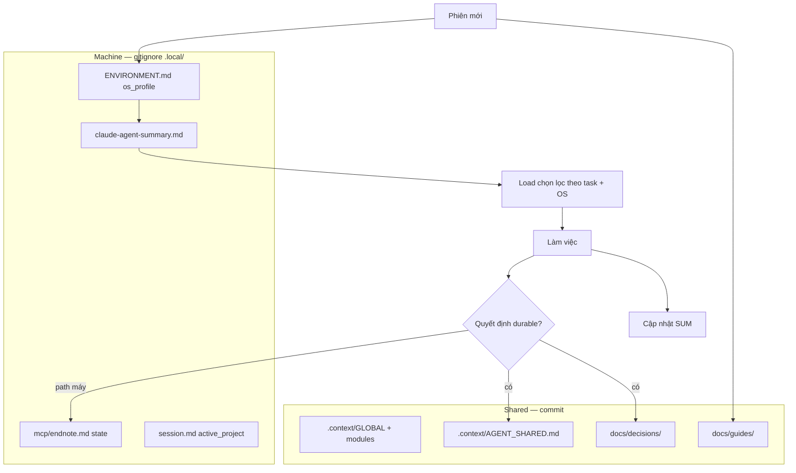

# Agent memory & selective load — phản biện + draft luật (CLAUDE.md)

> Trả lời / chỉnh sửa trên file này. Sau khi chốt → promote vào `CLAUDE.md` + `.context/`.  
> Liên quan ý user: memory riêng Claude + load chọn lọc (OS…) + **chia sẻ** vào context dự án.

**Trạng thái**: Draft — chờ human  
**Ngày**: 2026-07-03

---

## 0. Đã quyết định trong `../skvn-marine` (context-mapping mature)

| Quyết định skvn-marine | research-helper nên adopt? |
|------------------------|----------------------------|
| `.context/` = AI memory **commit** (milestones, tensions, modules) | **Có** — đây là “share context dự án” |
| `docs/` = human memory (decisions, workflows, standards) | **Có** — đã có trong APPROVAL |
| `.local/ENVIRONMENT.md` = machine-only, gitignore | **Có** |
| Startup: GLOBAL → MILESTONES → TENSIONS_OPEN → TENSIONS_ACTIVE → module | **Có** — AGENTS outline |
| **Không** load mặc định: planning*, proposals, *HISTORY | **Có** |
| Load có điều kiện theo task (`AGENTS_ARCH` / `ENV` / `MODULES`…) | **Có** — map sang `docs/guides/research/{area}.md` |
| Promote: ideations → `docs/decisions/` + update `.context/modules` + GLOBAL | **Có** |
| `context-gen check-consistency` sau đổi context | **Có** — 1 lần WSL (bạn đã chốt) |
| Tension 3 file OPEN / ACTIVE / HISTORY | **Có** |
| `docs/ideations/` scratchpad gitignored | **Có** — `docs/ideations/` |
| `.buffer/context.md` = **tool-generated** snapshot (context-gen), gitignore | **Không dùng** — chỉ `claude-agent-summary` + promote `.context/` / `docs/` |
| **Không có** `.local/claude-agent-summary.md` | skvn dùng `.context/` commit thay vì summary Claude tự viết |
| **Không có** `AGENT_SHARED.md` riêng | Share qua `.context/` + `docs/decisions/` |

**Kết luận skvn**: Ý “Claude lưu lại → share context” **đã được cover** bằng **promote vào `.context/` + `docs/`**, không bằng file summary gitignore. `claude-agent-summary` (clinical-ocr) là **cache máy**, không thay `.context/`.

---

## 1. Bạn đã cover ở đâu chưa? (research-helper)

| Ý tưởng | Đã có? | Ở đâu | Thiếu gì |
|---------|--------|-------|----------|
| Memory nhanh cho Claude | **Một phần** | clinical-ocr `CLAUDE.md` → `.local/claude-agent-summary.md` | research-helper APPROVAL chỉ **nhắc tên**, chưa có protocol chi tiết |
| Load theo tầng (index trước, doc sau) | **Có** | clinical-ocr "Layered loading"; APPROVAL INDEX phân tầng | Chưa map **theo OS** |
| Path / OS riêng máy | **Có** | `.local/ENVIRONMENT.md`, `session.md` | Chưa **profile** Mac vs Win vs WSL rõ trong research-helper |
| Context dự án dùng chung | **Có** | `.context/GLOBAL.md`, `docs/guides/` | Chưa luật **promote** từ memory Claude → `.context/` |
| Quyết định sống trong file | **Có** | APPROVAL, hybrid-engine | Không áp dụng cho `.local/claude-agent-summary` (đang gitignore) |

**Kết luận**: Ý tưởng **~60%** đã có ở clinical-ocr; research-helper **chưa chốt**. Điểm mới của bạn — **share memory vào context dự án** — **chưa cover** (clinical-ocr cố ý giữ summary trong `.local` only).

---

## 2. Phản biện

### 2.1 Tự tổng hợp memory — nên làm

- Giảm đọc lại toàn bộ `CLAUDE.md` + guides mỗi phiên.
- Agent chọn load theo task (papers vs sessions vs MCP) — khớp INDEX phân tầng đã chốt.

### 2.2 Rủi ro nếu chỉ lưu `.local/` (gitignored)

| Rủi ro | Hậu quả |
|--------|---------|
| Summary chỉ trên 1 máy | Mac khác / agent khác **không thấy** |
| Drift | Summary khác `docs/guides/` → agent làm sai |
| "Share context dự án" không đạt | `.local` không commit |

→ Cần **hai tầng memory** (§3), không một file gitignore duy nhất.

### 2.3 Load theo OS — đúng nhưng đừng hard-code trong governance

- End-user (bác sĩ) thường **Mac**; dev có thể **Windows/WSL** — bạn đã ghi trong `endnote-workflow-open-questions.md`.
- **Đúng**: default doc ví dụ Mac; runtime path trong `.local/ENVIRONMENT.md` + `os_profile`.
- **Sai**: nhét `~/Documents/...` cố định vào `CLAUDE.md` commit.

### 2.4 "Claude lưu gì cũng share context" — cần lọc

Không phải mọi thứ trong summary đều nên commit:

| Loại | Ví dụ | Lưu đâu |
|------|-------|---------|
| **Machine-only** | XML path, WSL path, `last_indexed` | `.local/mcp/endnote.md` |
| **Session-only** | "hôm nay đang thử prompt X" | session note / không promote |
| **Durable project** | "ưu tiên search_library", "Mac default EndNote" | `.context/` hoặc `docs/decisions/` |
| **Durable workflow** | "sau add EndNote → rebuild_index" | `docs/guides/mcp/` sau khi chốt endnote file |

**Luật promote** (§3.3) tránh nhiễm `.context/` bằng path máy.

---

## 3. Đề xuất kiến trúc memory (CHỜ DUYỆT)



### 3.1 Tầng A — Shared (context dự án) — theo skvn-marine

| File | Ai ghi | Nội dung |
|------|--------|----------|
| `.context/GLOBAL.md` | Human + agent promote | Invariants, module index, active docs |
| `.context/modules/*.md` | Promote theo module | Quyết định theo papers/sessions/MCP… |
| `.context/TENSIONS_ACTIVE.md` | Sau resolve human | Decisions đang hiệu lực |
| `docs/decisions/`, `docs/guides/` | Promote chính thức | Audit + hướng dẫn dài hạn |

**CHỐT (lượt 14)**: **Không** tạo `AGENT_SHARED.md`. Quy tắc ghi thẳng trong **`CLAUDE.md`**: khi cập nhật agent memory → ghi vào **file dự án tương ứng** theo promote rules (skvn), không file summary share riêng.

### 3.2 Tầng B — Machine (`.local/`)

| File | Nội dung |
|------|----------|
| `ENVIRONMENT.md` | `os_profile`, paths Markpad, WSL, EndNote XML, flags `context_mapping_initialized` |
| `claude-agent-summary.md` | Snapshot nhanh: active project, load map, link guides đã dùng, **pointer** tới AGENT_SHARED |
| `mcp/endnote.md` | State MCP |
| `session.md` | `active_project`, ngôn ngữ phiên |

### 3.3 Luật cập nhật memory → dự án (bắt buộc trong CLAUDE.md)

Khi agent refresh `.local/claude-agent-summary.md` **hoặc** học được điều gì durable từ phiên — **không** giữ chỉ trong summary. Promote vào đúng file theo quy tắc dự án (theo `skvn-marine/docs/workflows/context-map-workflow.md`):

| Loại nội dung | Ghi vào |
|---------------|---------|
| Path máy, OS, MCP state, active project | Chỉ `.local/` (`ENVIRONMENT.md`, `mcp/*.md`, `session.md`) |
| Invariant / module behavior | `.context/modules/<module>.md` |
| Quyết định đã chốt | `docs/decisions/<topic>.md` |
| Workflow lặp lại | `docs/workflows/` hoặc `docs/guides/research/` |
| Milestone acceptance đổi | `.context/MILESTONES.md` |
| Index active docs | `.context/GLOBAL.md` |
| Conflict chưa resolve | `.context/TENSIONS_OPEN.md` |
| Đã resolve trong milestone | `.context/TENSIONS_ACTIVE.md` |
| Brainstorm chưa chốt | `docs/ideations/` |

**Cấm**: tạo `AGENT_SHARED.md` hoặc file “share” trung gian — summary `.local` chỉ là **cache đọc nhanh**, pointer tới file canonical đã promote.

**Invariant đổi** → tension OPEN trước, không ghi im lặng vào module.

### 3.4 Protocol phiên mới (tổng hợp memory)

```
1. AGENTS.md startup → GLOBAL → TENSIONS_OPEN
2. Đọc .local/ENVIRONMENT.md → os_profile
3. Nếu thiếu / stale summary HOẶC governance vừa đổi:
   a. scan_research_projects.sh
   b. Đọc .context/AGENT_SHARED.md + indexes ngắn (guides/research/00-overview)
   c. Tổng hợp → cập nhật .local/claude-agent-summary.md
4. Load chọn lọc (§3.5) — không đọc hết repo
```

**Stale**: không có summary; hoặc `AGENT_SHARED.md` mtime > summary; hoặc user nói "refresh".

### 3.5 Bảng load chọn lọc (draft)

| os_profile | Đọc thêm |
|------------|----------|
| `mac` | `docs/guides/platform/mac.md` (tạo sau) — Markpad `file://` |
| `wsl` | path `PROJECT_ROOT_WSL`, bash scripts |
| `windows` | path native, gọi WSL script nếu cần |

| Task | Load |
|------|------|
| Orientation | SHARED + summary + README project |
| papers | `docs/guides/research/papers.md` + `papers/INDEX` |
| docs lại | `sessions.md` guide |
| MCP endnote | `docs/guides/mcp/endnote-mcp-tools.md` + `.local/mcp/endnote.md` |
| Governance edit | AGENTS + file được đề cập |

---

## 4. So với clinical-ocr-helper

| | clinical-ocr | Đề xuất research-helper |
|--|--------------|-------------------------|
| Summary | `.local` only | `.local` + **promote** → `.context/AGENT_SHARED.md` |
| Share team | Không (by design) | **Có** — bạn yêu cầu |
| OS | Mac + WSL note trong ENVIRONMENT | `os_profile` + platform guide |

---

## 5. Câu hỏi — điền trả lời

| # | Câu hỏi | Trả lời |
|---|---------|---------|
| M1 | ~~AGENT_SHARED~~ → **CHỐT**: promote thẳng file dự án; quy tắc trong `CLAUDE.md` | ✓ |
| M2 | Agent được **tự ghi** AGENT_SHARED hay phải hỏi trước mỗi lần promote? | |
| M3 | Refresh summary: mỗi phiên mới hay chỉ khi stale? | |
| M4 | Tạo `docs/guides/platform/{mac,wsl,windows}.md` hay gộp một file? | |
| M5 | `AGENT_SHARED.md` tiếng Việt, EN, hay song ngữ? | |

---

## 6. Ghi chú tự do

```
(điền)
```

---

**CLAUDE.md wording (draft):**

> **Agent memory rule**: `.local/claude-agent-summary.md` is a fast cache only. Any durable learning from a session must be written to the correct project file (`.context/`, `docs/decisions/`, `docs/guides/`, `docs/workflows/`, `docs/ideations/`) per promote table — never a separate share file.

---

*Sau khi chốt: merge vào `2026-07-03-APPROVAL-DRAFT.md` + `CLAUDE.md` Phần F (memory).*