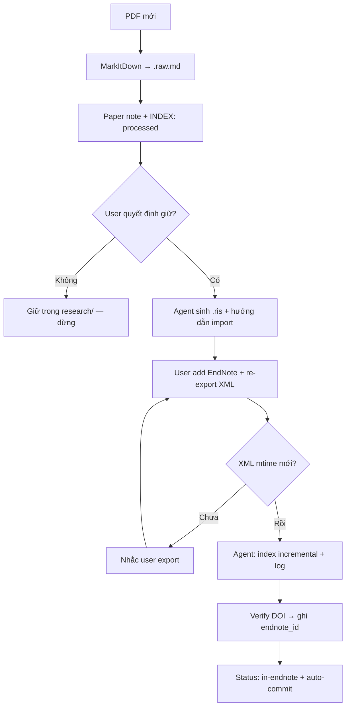

# EndNote workflow — điểm còn thiếu (trả lời trên file này)

> Mở bằng Markpad, điền cột **Trả lời / quyết định** hoặc ghi `[x]` checklist.
> Chat sau dùng file này làm input chốt `docs/decisions/endnote-workflow.md` + `docs/guides/mcp/endnote-mcp-tools.md`.
> Tham chiếu: `research-helper.md` (12 tools), `2026-07-03-APPROVAL-DRAFT.md` §12c.

**Ngày tạo**: 2026-07-03
**Trạng thái**: Human đã điền §1–§2 → **Claude đã phản biện + điền phần kỹ thuật (2026-07-03)** → chờ human duyệt lượt 2
**Lưu ý**: *Trả lời / quyết định* = dev viết. *Claude phản biện* = Claude phản biện câu trả lời của dev. Các ô dev bỏ trống → Claude điền, đánh dấu **[Claude đề xuất]** — coi là draft, dev sửa/duyệt trực tiếp.

---

## Hướng dẫn điền nhanh

- **Trả lời**: 1–3 câu hoặc bullet; có thể VI/EN.
- **Chưa biết**: ghi `TBD` — không bỏ trống nếu muốn nhắc lại sau.
- Ưu tiên điền **§2 (paper mới)** và **§1 (setup)** trước.
- **Lượt 2**: chỗ nào ghi **[Claude đề xuất]** mà bạn đồng ý → giữ nguyên hoặc ghi `OK`; không đồng ý → sửa thẳng.

---

## 1. Setup ban đầu

| # | Câu hỏi | Trả lời / quyết định | Claude phản biện | Người dùng quyết định |
|---|---------|----------------------|------------------|----------------------|
| 1.1 | EndNote chạy OS nào? Agent/WSL path tới XML & PDF attachments? | Mac (ưu tiên) > windows ( bác sĩ thường ít dùng linux)| Đồng ý — Mac là mẫu số chung của end-user (bác sĩ). Chỉ lưu ý: **máy end-user ≠ máy dev** (dev đang build trên Windows), nên đừng hard-code path Mac vào **governance** (commit, dùng chung). Path runtime thuộc về từng máy bác sĩ → ghi trong `.local/ENVIRONMENT.md`, hỗ trợ **đa OS profile** (Mac: `~/Documents/...`, Win: `C:\Users\...`) để agent tự detect lúc startup. "Mac ưu tiên" đúng ở tầng *default/tài liệu*, không phải hard-code ở tầng code. | Đồng ý |
| 1.2 | Export XML: tần suất? đường dẫn cố định? ai export? | cái này thay vì phụ thuộc vào bác sĩ, hãy hỏi họ mỗi phiên ngắn gọn - đề xuất thử | **Hỏi mỗi phiên sẽ gây friction** — bác sĩ sẽ chán sau ~5 phiên. Phản đề xuất: agent **so `mtime` của file XML với `last_indexed`** trong `.local/mcp/endnote.md`; chỉ hỏi khi (a) XML stale hơn X ngày, hoặc (b) phiên có task cần library. Không stale → im lặng. Đường dẫn XML nên **cố định 1 chỗ** (ghi trong `.local`) để check tự động được — hỏi mỗi phiên thì không automate nổi. | workflow lưu lại để agent thực hiện|
| 1.3 | Lần đầu: lệnh `index` hay `rebuild_index`? ghi chú thời gian chạy? | nên có 1 cái log.txt lưu lại, không commit nhưng để debug | Đồng ý log. Cụ thể hóa: `.local/mcp/endnote-index.log`, mỗi dòng `timestamp \| lệnh (index/rebuild) \| số ref \| thời gian chạy \| kết quả`. **Trả lời phần dev bỏ trống**: lần đầu dùng `index` là đủ (nó build từ đầu khi chưa có DB); `rebuild_index` chỉ dành cho lúc index hỏng/đổi XML. Log này cũng gộp luôn vai trò audit-log của §7.2 — không cần 2 file log. | Đồng ý |
| 1.4 | Nội dung bắt buộc `.local/mcp/endnote.md` (path, last_indexed, …)? | **[Claude đề xuất]** Dùng schema §7.4 + thêm 2 field: `xml_mtime_at_index` (để check stale tự động — xem 1.2) và `index_log_path`. Bắt buộc tối thiểu: `xml_export_path`, `last_indexed`, `semantic_enabled`. | — | Đồng ý |
| 1.5 | Ghi gì vào project `README.md` § Setup notes về EndNote? | **[Claude đề xuất]** Chỉ ghi **fact ổn định theo project**: tên library, citation style, semantic on/off, ghi chú "machine state xem `.local/mcp/endnote.md`". **Không** ghi path tuyệt đối vào README (README commit + có thể mở trên máy khác — path là chuyện của `.local`). | — | Đồng ý |
| 1.6 | Semantic (`embed`): bật ngay hay BM25 trước? tiêu chí bật semantic? | **[Claude đề xuất]** **BM25 trước.** Lý do: semantic cần cài thêm `endnote-mcp[semantic]` + chạy `embed` (tốn setup trên máy bác sĩ), trong khi `search_library` (BM25 metadata+fulltext) đã đủ cho library nhỏ. Tiêu chí bật: (a) library > ~100 ref, hoặc (b) ≥3 lần trong 1 tuần `search_library` không tìm ra paper mà user biết chắc là có (tìm theo khái niệm, không nhớ từ khóa). Ghi counter vào `.local/mcp/endnote.md` → agent tự đề xuất bật khi chạm ngưỡng. | — | Đồng ý |
| 1.7 | MCP server cấu hình ở đâu (Claude Desktop path, env)? | chưa biết, đang nghiên cứu| **Trả lời kỹ thuật**: Claude Desktop đọc `claude_desktop_config.json` — Mac: `~/Library/Application Support/Claude/`, Windows: `%APPDATA%\Claude\`. Claude Code đọc `.mcp.json` ở root repo (commit được → cả team dùng chung) hoặc user-scope config. Đề xuất: **`.mcp.json` trong repo** cho phần command chung, còn path XML/library đưa vào env var hoặc `.local` vì khác nhau từng máy. Verify lại cú pháp entry khi setup thật. | Đồng ý (verify khi setup) |

### Claude phản biện chung — §1

Setup đang thiên về "hỏi user khi cần" (1.2), nhưng persona đã chốt là **bác sĩ semi-tech**: mỗi câu hỏi kỹ thuật lặp lại là một điểm rơi. Nguyên tắc nên là: **mọi thứ check được bằng file/mtime thì agent tự check, chỉ hỏi khi cần hành động phía user** (export XML, add reference). `.local/mcp/endnote.md` chính là chỗ biến "hỏi mỗi phiên" thành "check mỗi phiên".

**Trả lời chung:** Đồng ý với phân tích của Claude
---

## 2. Paper mới (MarkItDown ↔ EndNote)

| # | Câu hỏi | Trả lời / quyết định | Claude phản biện | Người dùng quyết định |
|---|---------|----------------------|------------------|----------------------|
| 2.1 | Luồng từng bước: PDF → MarkItDown → `.raw.md` → paper note → vào library? | xem note rồi người nghiên cứu mới quyết định chứ, chưa làm gì thì dữ liệu vẫn ở trong research có quyết định thì mới hướng dẫn người dùng add vào endnote, sinh các thông tin liên quan nhanh, kiểu như bibtex của latex nhưng dành cho endnote| Đồng ý human-in-the-loop. Một chỉnh kỹ thuật: "bibtex cho EndNote" = **file `.ris`** (hoặc `.enw`) — EndNote import RIS chuẩn nhất, BibTeX import vào EndNote hay lỗi field. Agent sinh sẵn `papers/{slug}.ris` từ metadata đã extract → user chỉ File→Import. Lưu ý: `.ris` nên gitignore cùng nhóm `.raw.md` (sinh lại được). | Đồng ý |
| 2.2 | Ai thêm reference vào EndNote desktop? Agent gợi ý metadata thế nào? | research thử| **Chốt luôn được, không cần research thêm**: endnote-mcp là **read-only** (12 tools không có tool write) → chỉ user add được, qua EndNote desktop. Agent hỗ trợ tối đa = sinh `.ris` (xem 2.1) + khối metadata (title/authors/year/DOI/journal) trong paper note để user đối chiếu. Đây là hệ quả cấu trúc của MCP, không phải lựa chọn thiết kế. | Đồng ý |
| 2.3 | Sau user add: agent **tự** `rebuild_index` hay hỏi trước? | hỏi trước| Hợp lý, nhưng lưu ý **hỏi trước sẽ thành 2 câu**: "đã export XML lại chưa?" rồi "chạy index nhé?" — vì index đọc từ XML, user add vào EndNote xong mà chưa re-export thì index vô nghĩa. Gộp thành **1 câu**: "Bạn export XML lại rồi thì xác nhận, mình chạy index luôn." Kèm check `mtime` XML: nếu XML chưa đổi sau thời điểm user nói đã add → cảnh báo trước khi chạy. | Đồng ý |
| 2.4 | Cần export XML lại hay chỉ `endnote-mcp index` incremental? | gợi ý| **Điểm kỹ thuật quan trọng**: XML là **snapshot tĩnh** — EndNote không tự cập nhật file export. Add reference mới ⇒ **bắt buộc re-export XML**, sau đó `index` incremental (nhanh, chỉ diff). Vậy quy tắc: *mọi thay đổi library = re-export XML + `index`*; `rebuild_index` chỉ khi index hỏng/đổi path. Đây là bước dễ quên nhất của user → chính là chỗ cần check mtime ở 1.2/2.3. | Đồng ý |
| 2.5 | Khi nào ghi `endnote_id` vào `papers/INDEX.md`? field nào? | gợi ý thử| **[Claude đề xuất]** Ghi **sau khi verify match**: sau re-index, agent chạy `search_references` theo DOI (fallback: title+year), lấy id từ kết quả → ghi vào (a) frontmatter paper note (`endnote_id:`) và (b) cột `Notes` hoặc cột riêng `EndNote ID` trong `papers/INDEX.md`, đồng thời đổi Status → `in-endnote`. Không ghi trước khi verify — tránh id ma. | Đồng ý |
| 2.6 | Paper đã có trong EndNote, chưa có file trong `papers/` — luồng? | hướng dẫn người dùng add những thứ cần thiết, bài báo pdf, insight của họ (ghi chép hay gì đó)| **Phản biện: có thể không cần copy PDF vào `papers/`.** `read_pdf_section` đọc được PDF attachment ngay trong library → duplicate PDF chỉ tốn dung lượng + tạo 2 nguồn lệch nhau. Đề xuất luồng nhẹ hơn: tạo **paper note** `papers/{slug}.md` với `endnote_id` + `source: endnote-mcp`, cột PDF ghi `(in EndNote)`. Chỉ yêu cầu user đưa PDF vào `papers/` khi cần MarkItDown convert (paper chưa index fulltext được). Insight của user thì đúng — hướng dẫn họ ghi, nhưng ghi vào `insights/`, không phải `papers/`. | Đồng ý |
| 2.7 | Trùng title/DOI: xử lý dedup? | báo cho người dùng để họ quyết định| Đồng ý user quyết. Bổ sung thứ tự check kỹ thuật: **DOI trước** (chính xác tuyệt đối), title+year sau (fuzzy — preprint vs published, title dịch có thể khác nhau). Báo user kèm chi tiết 2 bản (year, journal, source) để họ quyết nhanh, đừng chỉ nói "trùng". Case hay gặp: arXiv preprint đã trong library, bản published mới tải về — về logic là *cùng công trình* nhưng citation khác nhau. | Đồng ý |

**Luồng bạn muốn (vẽ hoặc bullet tự do):**

```
[Claude đề xuất — dev sửa nếu khác ý]

1. User đưa PDF mới → agent lưu papers/{slug}.pdf
2. MarkItDown convert → papers/{slug}.raw.md (gitignore)
3. Agent viết paper note papers/{slug}.md + cập nhật papers/INDEX.md (Status: processed)
4. User đọc note, QUYẾT ĐỊNH giữ hay không
   ├─ Không → giữ nguyên trong research/, Status: processed. DỪNG.
   └─ Có  → agent sinh papers/{slug}.ris + hướng dẫn import vào EndNote
5. User add vào EndNote desktop → re-export XML (agent nhắc, check mtime)
6. User xác nhận → agent chạy `index` (incremental) + ghi log
7. Agent verify bằng search_references (DOI) → ghi endnote_id vào paper note + INDEX
8. Status: processed → in-endnote. Auto-commit "Đã lưu tự động."
```



### Claude phản biện chung — §2

Các câu trả lời §2 nhất quán một triết lý đúng: **agent read-heavy, mọi write vào EndNote qua tay user** — khớp §12c APPROVAL-DRAFT và khớp giới hạn thật của MCP (read-only). Rủi ro lớn nhất của luồng này không phải kỹ thuật mà là **bước 5 (re-export XML) bị quên** → index lệch library mà không ai biết. Toàn bộ cơ chế mtime-check (1.2, 2.3, 2.4, 6.5) tồn tại để đỡ đúng một điểm rơi đó — nên coi nó là invariant khi viết `docs/guides/mcp/endnote-mcp-tools.md`.

---

## 3. Tra cứu & đọc (12 tools)

| # | Câu hỏi | Trả lời / quyết định | Người dùng quyết định |
|---|---------|----------------------|----------------------|
| 3.1 | Khi nào `search_library` vs `search_semantic` vs `find_related`? | **[Claude điền theo yêu cầu]** Mặc định **`search_library`** (BM25 metadata+fulltext — mạnh nhất, không cần semantic). **`search_semantic`** chỉ khi (a) đã bật semantic (§1.6) và (b) tìm theo *khái niệm* không nhớ từ khóa ("paper nào nói về việc model nhỏ bắt chước model lớn?"). **`find_related`** khi đã có 1 paper neo và muốn mở rộng ("tìm bài tương tự bài này") — dùng lúc viết insight/Related Work. Thứ tự fallback: search_library → semantic → hỏi user thêm từ khóa. | Đồng ý |
| 3.2 | `read_pdf_section` >30 trang: chiến lược đọc Methods/Results? | **[Claude đề xuất]** Không bao giờ đọc cả PDF. Bước 1: `get_reference_details` lấy abstract + page count. Bước 2: đọc **có mục tiêu** theo task — cần Methods thì đọc ~trang 3–10, cần Results/Tables thì nửa sau; paper thường ≤ 15 trang nên 1 call đủ. Paper dài (survey, thesis): chia 2–3 call theo range, mỗi call ghi ngay điểm chính vào paper note (cột `Sections covered` trong INDEX cập nhật theo) — tránh đọc lại. | Đồng ý |
| 3.3 | Paper chỉ trong `papers/`, chưa EndNote — chỉ MarkItDown? | **[Claude đề xuất]** Đúng — endnote-mcp không thấy paper ngoài library. Nguồn đọc: `{slug}.raw.md` (đã convert) hoặc paper note. Status giữ `processed`; nếu paper được cite trong `writing/` mà vẫn chưa vào EndNote → agent cảnh báo "citation này chưa format được qua endnote-mcp" thay vì chế citation tay. | Đồng ý |
| 3.4 | Kết quả search: ghi vào paper note hay chỉ chat? | **[Claude đề xuất]** Theo invariant **chat ≠ storage**: kết quả *có giá trị tái sử dụng* (list paper liên quan cho 1 chủ đề, kết quả so sánh) → ghi vào file: mục `## Connections` của paper note liên quan, hoặc `insights/` nếu là landscape cross-paper. Kết quả tra cứu vặt (check 1 citation, xem year) → chat là đủ, không ghi. Tiêu chí: *phiên sau có cần lại không?* | Đồng ý |
| 3.5 | `list_references_by_topic` dùng lúc nào (onboarding, insight)? | **[Claude đề xuất]** 2 thời điểm: (a) **onboarding** project mới có sẵn library — cho user thấy landscape "trong library đang có gì về topic X" để chốt scope; (b) **khởi tạo insight mới** — liệt kê ứng viên trước khi đọc sâu. Không dùng cho tra cứu hằng ngày (search_library nhanh hơn, đúng hơn). | Đồng ý |

---

## 4. Citation & writing

| # | Câu hỏi | Trả lời / quyết định | Người dùng quyết định |
|---|---------|----------------------|----------------------|
| 4.1 | Citation style mặc định — lấy từ README hay hỏi mỗi lần? | **[Claude đề xuất]** Lấy từ `README.md § Citation style` (đã là câu hỏi onboarding #6 — single source of truth). Chỉ hỏi khi README thiếu, và khi user trả lời thì **ghi ngay vào README** để không hỏi lại. Không hỏi mỗi lần. | Đồng ý |
| 4.2 | `writing/`: inline citation vs bibliography cuối — workflow? | **[Claude đề xuất]** Lúc draft: chèn **placeholder ổn định** `[@{endnote_id}]` (hoặc `[@{slug}]` nếu chưa có id) — không format sớm vì đoạn văn còn bị sửa/xóa. Lúc hoàn thiện: quét placeholder → `get_citation` cho inline + `get_bibliography` cho danh sách cuối, theo style từ README. Placeholder nào không resolve được (paper chưa vào EndNote) → liệt kê cho user xử lý. | Đồng ý |
| 4.3 | `get_bibtex` vs `get_citation` — khi nào dùng? | **[Claude đề xuất]** `get_citation`/`get_bibliography` cho output đọc-được (Word, Markdown — mặc định của persona bác sĩ). `get_bibtex` **chỉ** khi deliverable là LaTeX/Overleaf (README § Deliverable cho biết) — xuất `writing/{slug}.bib`. Không dùng song song 2 đường cho cùng 1 bản viết. | Đồng ý |
| 4.4 | Cần audit “dòng nào cite paper nào” không? format? | **[Claude đề xuất]** Có, nhưng **rẻ thôi**: chính placeholder `[@id]` trong text đã là audit trail — grep được. Thêm 1 bảng `## Citation map` cuối file writing (`Claim/đoạn → endnote_id → paper note`) chỉ khi user yêu cầu kiểm tra chéo (vd trước khi nộp). Không maintain bảng này realtime — sẽ drift với text. | Đồng ý |

---

## 5. Liên kết insight / session

| # | Câu hỏi | Trả lời / quyết định | Người dùng quyết định |
|---|---------|----------------------|----------------------|
| 5.1 | Insight “Evidence”: bắt buộc `endnote_id` hay link `papers/foo.md`? | **[Claude đề xuất]** Bắt buộc **link `papers/foo.md`** (paper note luôn tồn tại trong repo, click được từ Markpad); `endnote_id` không bắt buộc — nó đã nằm trong frontmatter paper note, lặp lại ở insight là duplicate dễ drift. Insight → paper note → endnote_id: một chiều tra cứu duy nhất. | Đồng ý |
| 5.2 | Session quyết định “thêm EndNote” — ai follow-up re-index? | **[Claude đề xuất]** Agent follow-up. Cơ chế: session note ghi action `- [ ] add to EndNote: {slug}` + mirror vào `.local/session.md` (mục `pending_actions`). Phiên sau, startup đọc `session.md` thấy pending → hỏi user “đã add {slug} vào EndNote chưa?” → nếu rồi thì chạy luồng 2.3–2.5. User không phải nhớ. | Đồng ý |
| 5.3 | Rule chuyển `papers/INDEX` status: `processed` → `in-endnote` → `linked-insight`? | **[Claude đề xuất]** `new` (PDF vào, chưa note) → `processed` (có paper note) → `in-endnote` (verify được `endnote_id`, xem 2.5) → `linked-insight` (được ≥1 insight reference). Chuyển status là **tự động theo sự kiện**, không phải cột user tự sửa. Lưu ý: paper có thể nhảy `processed → linked-insight` mà không qua `in-endnote` (user quyết không add) — status là **giai đoạn cao nhất đạt được**, không phải pipeline bắt buộc tuần tự. Cân nhắc tách 2 chiều (endnote: yes/no riêng cột) nếu case này nhiều. | Đồng ý |

---

## 6. Bảo trì & đồng bộ

| # | Câu hỏi | Trả lời / quyết định | Người dùng quyết định |
|---|---------|----------------------|----------------------|
| 6.1 | Re-index: trigger (thủ công / định kỳ / sau N paper)? | **[Claude đề xuất]** **Event-driven, không định kỳ**: trigger = sau khi user xác nhận add paper (luồng §2) hoặc khi mtime XML mới hơn `last_indexed` (phát hiện lúc startup/trước task EndNote). Không cron — máy bác sĩ không nên có job nền, và index không có gì mới thì chạy vô ích. | Đồng ý |
| 6.2 | User sửa/xóa ref trong EndNote — agent biết bằng cách nào? | **[Claude đề xuất]** **Không tự biết được** — đây là hạn chế cấu trúc: agent chỉ thấy XML export, không thấy library sống. Con đường duy nhất: user re-export → mtime đổi → agent index lại → diff số ref (log 1.3 có count) → nếu giảm thì báo "N ref biến mất khỏi index, bạn xóa hay export thiếu?". Chấp nhận độ trễ; đừng hứa realtime sync trong docs. |có cách nào tự động hóa việc này không?|
| 6.3 | `rebuild_index` vs incremental `index` — quy tắc? | **[Claude đề xuất]** Mặc định `index` (incremental, nhanh). `rebuild_index` chỉ khi: (a) đổi `xml_export_path`, (b) kết quả search sai/thiếu bất thường (nghi index hỏng), (c) xóa nhiều ref (incremental có thể sót bản ghi cũ — verify hành vi thực tế khi test), (d) nâng version endnote-mcp đổi schema. Ghi lý do rebuild vào log. | Đồng ý |
| 6.4 | Đổi PDF attachment trong EndNote — cần rebuild không? | **[Claude đề xuất]** Cần re-export + re-index (fulltext được extract từ PDF lúc index — PDF đổi mà không index lại thì fulltext cũ vẫn nằm trong SQLite). Incremental `index` *có thể* không nhận ra nếu metadata XML không đổi → case này thuộc nhóm (b)/(c) của 6.3: nghi ngờ thì `rebuild_index`. Cần test thực tế 1 lần rồi ghi kết luận vào guide. | Đồng ý |
| 6.5 | Nhắc user export XML nếu quên — có không? message? | **[Claude đề xuất]** Có — nhưng **chỉ khi phiên có task đụng library** và `last_xml_export` cũ hơn ngưỡng (đề xuất 7 ngày, config trong `.local`). Message 1 dòng, ngôn ngữ thường: *"Thư viện EndNote mình đang thấy là bản export ngày X — nếu bạn có thêm bài mới từ đó, export lại XML rồi báo mình nhé."* Không nhắc ở phiên không dùng EndNote. | Đồng ý |

---

## 7. Agent & `.local` persist

| # | Câu hỏi | Trả lời / quyết định | Người dùng quyết định |
|---|---------|----------------------|----------------------|
| 7.1 | Subagent có được gọi endnote MCP không hay chỉ orchestrator? | **[Claude đề xuất]** **Chỉ orchestrator.** Nhất quán với APPROVAL-DRAFT: subagent = model nhanh, cold, cho task trích chat — không có context `.local` state, không nên đụng index/log. Mọi MCP call (và side effect như `index`) đi qua orchestrator để log tập trung 1 chỗ. Nếu sau này cần subagent đọc-only (vd search hàng loạt) thì mở riêng bằng 1 decision mới — mặc định đóng. | Đồng ý |
| 7.2 | Cần `.local/mcp/endnote-operations.log` (audit tool calls)? | **[Claude đề xuất]** **Không cần file riêng** — gộp vào `endnote-index.log` của §1.3. Log mọi tool call thì quá noise (search vặt cũng ghi?); chỉ log **operation có side effect hoặc tốn thời gian**: `index`, `rebuild_index`, `embed`, và lỗi MCP. Search/read/cite không log. | Đồng ý |
| 7.3 | MCP lỗi / XML stale: báo user thế nào? fallback? | **[Claude đề xuất]** Báo **1 dòng ngôn ngữ thường**, không stack trace (persona bác sĩ): *"Mình chưa kết nối được thư viện EndNote — tạm thời mình dùng các note đã có trong project."* Fallback: đọc `papers/*.md` + `.raw.md` local (vẫn làm việc được, chỉ mất search library + citation). Citation lúc fallback → placeholder `[@slug]`, resolve sau khi MCP sống lại. Chi tiết lỗi kỹ thuật ghi vào log, không đổ ra chat. | Đồng ý |
| 7.4 | Schema cố định cho `.local/mcp/endnote.md` — đồng ý draft bên dưới? | **[Claude đề xuất]** Đồng ý draft + bổ sung 3 field (đã sửa trực tiếp bên dưới): `xml_mtime_at_index`, `index_log_path`, `semantic_miss_count` (phục vụ tiêu chí bật semantic §1.6). | Đồng ý |

**Draft schema `.local/mcp/endnote.md` (Claude đã bổ sung — sửa nếu cần):**

```markdown
# endnote-mcp — machine state

xml_export_path:
sqlite_index_path:
library_name:
last_xml_export:
last_indexed:
xml_mtime_at_index:        # mtime của XML tại lần index gần nhất — so sánh phát hiện stale
index_log_path: .local/mcp/endnote-index.log
semantic_enabled: false
semantic_miss_count: 0     # đếm lần search_library thất bại — chạm ngưỡng thì đề xuất bật semantic
default_citation_style:    # mirror từ README project đang active
notes:
```

---

## 8. Git & privacy

| # | Câu hỏi | Trả lời / quyết định | Người dùng quyết định |
|---|---------|----------------------|----------------------|
| 8.1 | XML export / SQLite — chỉ `.local`, không commit? | **[Claude đề xuất]** Đúng — không commit. XML chứa toàn bộ metadata library (có thể cả abstract, path cá nhân), SQLite chứa fulltext PDF → cả hai là dữ liệu private + sinh lại được. Root `.gitignore` đã ignore `.local/`; nếu XML/SQLite nằm ngoài `.local` (path mặc định của endnote-mcp) thì chỉ cần **path ghi trong `.local`**, bản thân file không nằm trong repo là được. | Đồng ý |
| 8.2 | Máy mới: copy/migrate index thế nào? | **[Claude đề xuất]** **Không migrate — rebuild.** Index là derived data: máy mới chỉ cần XML export mới + chạy `index` (vài phút). Copy SQLite giữa máy rước rủi ro path/version lệch để tiết kiệm được rất ít. Checklist máy mới: cài endnote-mcp → export XML → `index` → tạo `.local/mcp/endnote.md` mới (đừng copy file cũ — path khác). | Đồng ý |
| 8.3 | PDF trong EndNote vs `papers/*.pdf` — đồng bộ hay độc lập? | **[Claude đề xuất]** **Độc lập, không sync 2 chiều** — sync là nguồn bug vô tận. Quy ước: paper vào library rồi thì EndNote attachment là bản chính (`read_pdf_section` đọc từ đó); `papers/*.pdf` chỉ là inbound cho paper mới chưa vào library (xem phản biện 2.6). Sau khi paper `in-endnote`, PDF trong `papers/` xóa được (gitignore sẵn rồi, note + `.ris` sinh lại được) — hoặc giữ, tùy user, nhưng docs phải nói rõ **bản nào là bản chính**. | Đồng ý |

---

## 9. Checklist promote sang governance (agent làm sau khi bạn điền xong)

- [ ] `docs/decisions/endnote-workflow.md`
- [ ] `docs/guides/mcp/endnote-mcp-tools.md`
- [ ] Cập nhật `docs/guides/research/papers.md`
- [ ] Cập nhật `CLAUDE.md` MCP quick workflow
- [ ] Cập nhật `2026-07-03-APPROVAL-DRAFT.md` §12c

### Claude phản biện chung — điểm cần dev chốt trước khi promote

1. **OS thực tế** (1.1): dev đang trên Windows, persona Mac — chốt cơ chế 2 profile trong `.local/ENVIRONMENT.md` trước khi viết guide.
2. **"Hỏi mỗi phiên" (1.2) vs mtime-check**: hai hướng ngược nhau, chọn một — Claude khuyến nghị mtime-check, hỏi chỉ khi stale.
3. **PDF duplicate (2.6, 8.3)**: chốt "EndNote attachment là bản chính sau khi in-endnote" — ảnh hưởng template `papers/INDEX.md`.
4. **`.ris` thay "bibtex cho EndNote" (2.1)**: xác nhận format import.
5. Các ô **[Claude đề xuất]** ở §3–§8: dev quét 1 lượt, ghi `OK` hoặc sửa — sau đó mới promote sang `docs/decisions/`.

---

## 10. Ghi chú tự do

```
(điền ý kiến, case thực tế, ví dụ library hiện tại, …)
```

---

*Sau khi điền: nhắn agent "đọc endnote-workflow-open-questions.md" để chốt workflow.*
