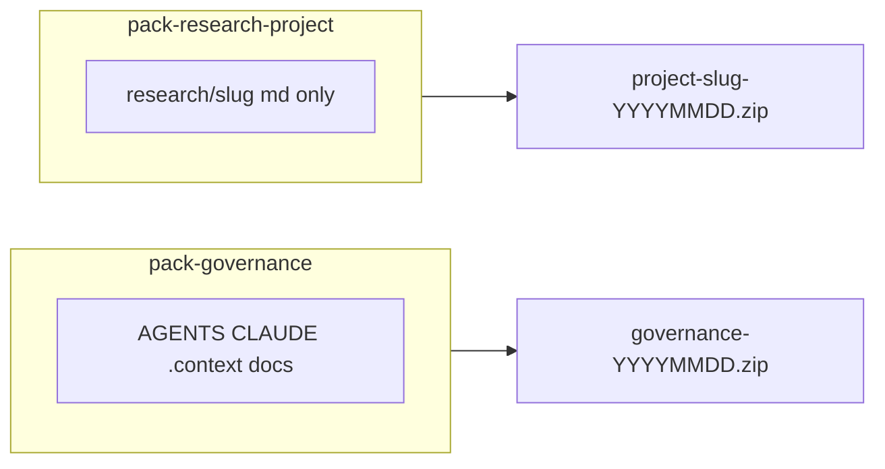

# Plan: script tạo thư mục / zip `share` (chưa lên git)

> **Trạng thái**: **CHỐT P1–P5** — chờ duyệt spec `unpack` chi tiết rồi code.  
> **Bối cảnh**: Repo governance chưa remote git; `research/` gitignore ở root; `.local/` machine-only; cần **chuyển máy / backup / gửi gói** không lẫn path máy.

---

## 1. Phản biện — có nên làm không?

### Điểm hợp lý

| Lý do | Giải thích |
|-------|------------|
| Chưa có git remote | Zip = cách chuyển **governance + templates + guides** sang Mac/WSL nhanh |
| Tách machine vs portable | `.local/`, PDF, `.raw.md` không nên lọt gói share |
| Bổ sung per-project git | `research/{slug}/.git` đã có history markdown — zip governance là **lớp khác** |
| Air-gap / USB | Một số máy bác sĩ không dùng GitHub |

### Rủi ro / tránh

| Rủi ro | Phản biện |
|--------|-----------|
| Zip thay git hàng ngày | **Không** — script = bootstrap / backup định kỳ, không thay `git commit` trong `research/{slug}/` |
| Lọt credential | Phải **denylist cứng** `.local/`, `*.env`, EndNote XML path files |
| Drift hai chiều | Zip one-way: máy A pack → máy B unpack — **không merge tự động**; cần README trong gói |
| Trùng `research/` | Root ignore `research/` — pack governance **không** gồm research trừ khi flag `--project` |
| Quá to | Không gồm PDF, `docs/raws/`, `docs/raws/.assets` |

**Kết luận**: **Nên làm** — 1 script nhỏ, 2 mode, output vào thư mục gitignore `share/out/`.

---

## 2. Hai “gói” khác nhau (đừng gộp một zip)



| Mode | Mục đích | Ai dùng |
|------|----------|---------|
| **`governance`** | Bootstrap repo helper trên máy mới | Dev — chưa clone git |
| **`research`** | Chuyển **một** project nghiên cứu (notes, INDEX) không PDF | Dev / backup |
| **`all`** (tùy chọn) | governance + 1 project | Hiếm — chỉ khi `--project` |

**Khuyến nghị**: default **`governance`**; `research` cần `--project slug`.

---

## 3. Include / Exclude (CHỐT ĐỀ XUẤT)

### 3.1 Mode `governance`

**Include:**

```
AGENTS.md
CLAUDE.md
.context/
docs/
  guides/
  templates/
  decisions/
  workflows/
  ideations/          # nếu có file committed; scratch gitignored thì skip
  # KHÔNG docs/raws/  — brainstorm only (CHỐT P2)
tools/                # pack-share.sh, unpack-share.sh
.gitignore            # root
README.md             # khi có
```

**Exclude:**

```
.local/
research/
share/out/
docs/raws/            # CHỐT P2 — không pack brainstorm
*.zip
.git/                 # root repo chưa git — không có hoặc exclude
node_modules/
__pycache__/
*.pdf
.env
*.log
```

**Không** có flag `--with-raws` (brainstorm không đi share).

### 3.2 Mode `research` (một project)

**Include** (`research/{slug}/`):

```
README.md
INDEX.md
papers/INDEX.md
papers/*.md           # paper notes only
sessions/
insights/
writing/
.git/                 # CHỐT P3 — mặc định GỒM git history
.gitignore            # project
```

**Exclude:**

```
papers/*.pdf
papers/*.raw.md
.local/               # không tồn tại trong project
```

**Flag `--no-git`**: chỉ khi cần gói markdown “sạch” không history (collaborator không cần git).

**Manifest** (bắt buộc trong zip): `SHARE_MANIFEST.json` — slug, date, mode, file count, excluded patterns.

---

## 4. Script — vị trí & tên

| Đề xuất | Lý do |
|---------|-------|
| `.local/scripts/pack-share.sh` | Cùng `scan_research_projects.sh`; machine có thể chỉnh path output |
| Hoặc `tools/pack-share.sh` **commit** | Script portable trong governance zip — **khuyến nghị commit `tools/`** |

**CHỐT P1**: **`tools/pack-share.sh`** + **`tools/unpack-share.sh`** (commit). `.local/scripts/` chỉ scan.

Output:

```
share/out/                          # gitignore
  research-helper-governance-2026-07-03.zip
  my-project-slug-2026-07-03.zip
  SHARE_README.txt                  # hướng dẫn unpack
```

Thêm root `.gitignore` entry: `share/out/`

---

## 5. Hành vi script (spec)

```bash
tools/pack-share.sh governance
tools/pack-share.sh research --project <slug>           # default: includes .git/
tools/pack-share.sh research --project <slug> --no-git  # markdown only
tools/pack-share.sh list-projects

tools/unpack-share.sh <zip> --target <dir> [--dry-run]
tools/unpack-share.sh <zip> --merge-into <repo-root>   # governance vào repo có sẵn
```

**Bước nội bộ:**

1. `REPO_ROOT` = parent của `tools/`
2. Tạo staging `share/out/.staging-<timestamp>/`
3. `rsync` hoặc `cp` theo include/exclude (rsync `--exclude-from` dễ audit)
4. Ghi `SHARE_MANIFEST.json` + `SHARE_README.txt`
5. `zip -r` vào `share/out/<name>.zip`
6. Xóa staging
7. In đường dẫn zip + kích thước

---

## 5b. `tools/unpack-share.sh` (CHỐT P4 — cần companion)

**Vì sao cần** (phản biện tích cực): giảm lỗi giải nén tay, đọc `SHARE_MANIFEST.json`, từ chối đè nguy hiểm.

**Hành vi đề xuất:**

| Mode unpack | Hành động |
|-------------|-----------|
| `--target <empty-or-new-dir>` | Governance: tạo cây `research-helper/`; research: `research/<slug>/` |
| `--merge-into <repo-root>` | Chỉ governance — merge file; **không** đè `.local/` nếu đã tồn tại |
| Conflict | `research/<slug>` đã tồn tại → **dừng** trừ `--force` (có confirm message) |

**Sau unpack research (có `.git`)**: nhắc `git -C research/<slug> status` — history nguyên.

**`--dry-run`**: in sẽ copy/merge file nào, không ghi.

**Không** tự tạo `.local/` — máy đích tạo `ENVIRONMENT.md` khi onboarding.

---

## 6. Quan hệ với git (sau này)

| Giai đoạn | Workflow |
|-----------|----------|
| **Hiện tại** (chưa remote) | `pack-share.sh governance` → `unpack-share.sh` máy mới |
| **Research project** | Zip **mặc định có `.git/`** — portable repo; `--no-git` khi gửi chỉ nội dung |
| **Sau** có `git remote` | Governance push/pull; zip vẫn backup / air-gap |

---

## 7. Phản biện thêm

| Ý tưởng | Đánh giá |
|---------|----------|
| Một thư mục `share/` **commit** chứa zip | **Không** — zip trong repo phình; chỉ `share/out/` gitignore |
| Script Python | Bash đủ — giống clinical-ocr scan; WSL + Mac |
| Mã hóa zip password | Tùy chọn `--password` sau; MVP không cần |
| Pack cả endnote SQLite | **Không** mặc định — machine index; máy khác re-index từ XML |

---

## 8. Checklist triển khai (sau duyệt)

- [ ] Human duyệt include/exclude §3
- [ ] Thêm `share/out/` vào root `.gitignore`
- [ ] Viết `tools/pack-share.sh`
- [ ] `docs/guides/tool-pack-share.md` ngắn (hoặc mục trong `00-overview.md`)
- [ ] Một dòng trong `CLAUDE.md`: khi chuyển máy chưa git → chạy `tools/pack-share.sh governance`
- [ ] Test: governance zip unpack trên path sạch → đủ AGENTS/docs/templates

---

## 9. Quyết định human (CHỐT)

| # | Quyết định |
|---|------------|
| P1 | **`tools/`** |
| P2 | **Không** pack `docs/raws/` — brainstorm only |
| P3 | Research zip **mặc định có `.git/`**; **`--no-git`** là tùy chọn |
| P4 | **`share/out/`** + cần **`tools/unpack-share.sh`** |
| P5 | (gộp P4) Companion unpack — **có** |

---

## 10. Phản biện các lựa chọn đã chốt

### P2 — Không pack raws

**Đồng ý.** `docs/raws/` = scratch + lịch sử chat; portable truth nằm ở `APPROVAL-DRAFT`, `decisions/`, `guides/` sau promote. Tránh zip phình và lộ brainstorm chưa duyệt.

### P3 — Mặc định **có** `.git/` (đảo so với draft cũ)

| Ưu | Nhược |
|----|-------|
| Giữ history commit agent trên project | Zip lớn hơn (thường vẫn nhỏ — chỉ `.md`) |
| Máy B = `git log` ngay | Unpack đè `research/slug` có `.git` khác → **nguy hiểm** → unpack phải conflict-check |
| Khớp “agent tự túc git local” | Người nhận không biết git vẫn dùng được file — chỉ không cần `git` command |

**Điều kiện**: `unpack-share.sh` **bắt buộc** khi default có git — tránh `unzip` đè nhầm.

`--no-git` hợp lý khi: gửi collaborator chỉ đọc markdown, hoặc import vào hệ thống khác.

### P1 — `tools/`

**Đồng ý.** Nằm trong governance zip → máy mới pack/unpack được ngay.

### P4 — `unpack-share.sh`

**Đồng ý**, thêm ràng buộc MVP:

1. Đọc `SHARE_MANIFEST.json` — sai mode → exit 1  
2. Không tạo/sửa `.local/`  
3. `--merge-into` governance: không xóa `research/` đích  
4. `--force` in danh sách file sẽ đè — human confirm qua flag (không interactive nếu không tty)

**Phản biện nhẹ**: hai script = thêm bảo trì — đổi lại giảm support “giải nén sai chỗ”.

### P4 — `share/out/` (implicit ok)

Giữ gitignore — zip không commit.

---

## 11. Checklist triển khai (cập nhật)

- [x] P1–P5 human chốt
- [ ] `share/out/` trong `.gitignore`
- [ ] `tools/pack-share.sh`
- [ ] `tools/unpack-share.sh`
- [ ] Test round-trip: research project có 1 commit → zip → unpack → `git log` ok
- [ ] Test governance round-trip vào empty dir

---

*Plan — research-helper pack/share, 2026-07-03 — cập nhật sau phản biện P1–P5.*