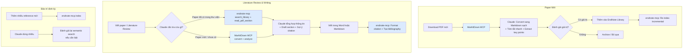
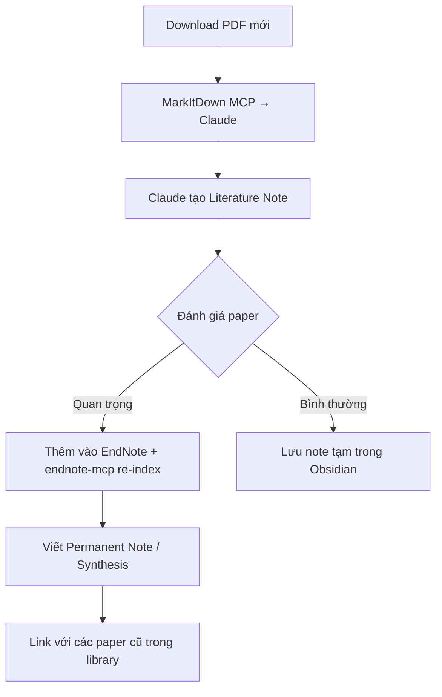

# Tài liệu brainstorm research-helper

## **✅ Kết hợp luồng endnote-mcp + MarkItDown MCP tối ưu**

Dưới đây là **luồng làm việc kết hợp** thực tế và hiệu quả nhất mà nhiều người đang áp dụng (2026).

### Nguyên tắc kết hợp

- **MarkItDown MCP**: Dùng cho **paper mới** (tải về lần đầu). Ưu điểm là convert PDF → Markdown sạch, token-efficient, Claude đọc hiểu tốt.
- **endnote-mcp**: Dùng cho **thư viện reference đã curate**. Ưu điểm là tìm kiếm mạnh, format citation, quản lý lâu dài.
- **Claude** đóng vai trò trung tâm điều phối giữa hai MCP server.

---

### Mermaid Diagram – Luồng kết hợp




### Giải thích luồng chi tiết

| Giai đoạn | Công cụ chính | Mô tả | Khi nào dùng |
|-----------|---------------|-------|--------------|
| **1. Ingest Paper Mới** | **MarkItDown MCP** | Convert PDF → Markdown sạch → Claude phân tích | Tải paper mới về |
| **2. Quyết định giữ lại** | Claude + EndNote | Đánh giá paper có đáng thêm vào thư viện không | Sau khi Claude tóm tắt |
| **3. Thêm vào hệ thống** | endnote-mcp | Thêm vào EndNote → Re-index | Paper có giá trị cao |
| **4. Nghiên cứu & Viết** | **Cả hai MCP** | endnote-mcp cho paper cũ + MarkItDown cho paper mới | Trong quá trình viết |
| **5. Citation & Bibliography** | **endnote-mcp** | Format citation + tạo bibliography | Giai đoạn hoàn thiện bản thảo |
| **6. Bảo trì** | endnote-mcp | Index incremental định kỳ | Hàng tuần hoặc sau khi thêm nhiều paper |

### Ví dụ prompt Claude khi dùng cả hai

**Prompt cho paper mới (dùng MarkItDown trước):**
```
Dùng MarkItDown MCP convert file PDF này sang Markdown. 
Sau đó tóm tắt ngắn gọn contribution chính, method, và kết quả quan trọng. 
Paper này có đáng thêm vào EndNote library của tôi không? Lý do?
```

**Prompt cho literature review (kết hợp cả hai):**
```
Sử dụng cả endnote-mcp và MarkItDown MCP.

1. Tìm trong EndNote library các paper liên quan đến "efficient fine-tuning of small LLMs".
2. Với 2-3 paper mới tôi vừa tải về (convert bằng MarkItDown), hãy so sánh contribution với các paper đã có trong library.
3. Gợi ý cấu trúc section Related Work + citation phù hợp.
```

### Khuyến nghị thực tế

- **Giai đoạn đầu**: Ưu tiên **MarkItDown MCP** nhiều hơn (vì hay có paper mới).
- **Sau khi thư viện lớn dần**: endnote-mcp sẽ chiếm tỷ lệ cao hơn.
- **Setup**: Cả hai MCP server đều chạy song song trong Claude Desktop (không xung đột).

Bạn muốn mình chỉnh lại diagram theo hướng nào không?

Ví dụ:
- Thêm nhánh **viết trực tiếp trong Markdown + Pandoc**?
- Thêm bước **tự động extract citation từ paper mới**?
- Hay vẽ theo kiểu **sequence diagram** chi tiết hơn?

Cứ nói mình sẽ vẽ lại ngay.

## **endnote-mcp expose những gì?**

Nó expose **12 tools** (hàm) cho Claude thông qua Model Context Protocol. Claude có thể gọi trực tiếp các tool này trong cuộc trò chuyện để tương tác với thư viện EndNote của bạn.

Dưới đây là danh sách đầy đủ và rõ ràng nhất (cập nhật theo phiên bản hiện tại):

### Danh sách 12 tools mà endnote-mcp expose

| # | Tool Name                  | Mô tả ngắn gọn                                                                 | Use case thực tế |
|---|---------------------------|----------------------------------------------------------------------------------|------------------|
| 1 | `search_references`       | Tìm kiếm theo metadata (tác giả, tiêu đề, năm, từ khóa, abstract) dùng BM25     | Tìm paper nhanh theo thông tin cơ bản |
| 2 | `search_fulltext`         | Tìm kiếm **toàn văn** bên trong nội dung PDF đính kèm                             | Tìm concept, method, quote, kết quả trong PDF |
| 3 | `search_library`          | Kết hợp tìm metadata + fulltext trong 1 lệnh                                     | Tìm kiếm mạnh nhất (khuyến nghị dùng cái này trước) |
| 4 | `search_semantic`         | Tìm theo **ý nghĩa** (semantic search) dùng embedding                            | Tìm paper liên quan về mặt khái niệm (cần bật semantic) |
| 5 | `get_reference_details`   | Lấy **toàn bộ metadata** chi tiết của 1 reference (abstract, keywords, DOI...)   | Xem chi tiết một paper cụ thể |
| 6 | `get_citation`            | Format citation theo style (APA 7th, Harvard, Vancouver, Chicago, IEEE)          | Format citation nhanh đúng chuẩn |
| 7 | `get_bibtex`              | Xuất reference dưới dạng **BibTeX**                                              | Dùng cho Overleaf / LaTeX |
| 8 | `get_bibliography`        | Tạo bibliography hoàn chỉnh cho nhiều reference                                  | Tạo danh sách tài liệu tham khảo |
| 9 | `find_related`            | Tìm các reference **liên quan** (dùng embedding)                                 | Gợi ý paper tương tự |
|10 | `read_pdf_section`        | Đọc **các trang cụ thể** trong file PDF                                          | Đọc sâu phần Method, Result, Discussion (giới hạn max 30 trang/lần) |
|11 | `list_references_by_topic`| Liệt kê reference theo chủ đề rộng                                               | Duyệt nhanh theo topic |
|12 | `rebuild_index`           | Re-index lại toàn bộ thư viện                                                    | Dùng sau khi thêm nhiều reference mới |

### Cách hoạt động (tóm tắt)

1. Bạn export thư viện EndNote ra file **XML**.
2. `endnote-mcp` đọc XML + trích xuất text từ các file PDF đính kèm.
3. Dữ liệu được index vào **SQLite local** (dùng FTS5 cho fulltext search).
4. Nếu bật semantic → nó tạo thêm embedding (all-MiniLM-L6-v2).
5. Các tool trên được expose qua MCP → Claude Desktop / Claude Code có thể gọi trực tiếp.

**Tất cả đều chạy local**, không gửi dữ liệu lên cloud.

### Những điểm quan trọng cần biết

- **Semantic search** (`search_semantic` + `find_related`) là **tùy chọn**. Muốn dùng phải cài thêm:
  ```bash
  uv pip install "endnote-mcp[semantic]"
  endnote-mcp embed
  ```
- `read_pdf_section` có giới hạn số trang (mặc định 30 trang/lần) để tránh quá tải.
- Indexing là **incremental** — khi bạn thêm reference mới, chỉ cần chạy `endnote-mcp index` là đủ (không cần index lại từ đầu).
- Tool mạnh nhất trong thực tế thường là **`search_library`** (kết hợp metadata + fulltext).

### Claude có thể làm gì nhờ những tool này?

Nhờ 12 tool trên, Claude có thể:

- Tìm paper theo ý bạn nói (dù là từ khóa hay ý nghĩa)
- Đọc sâu nội dung PDF
- Format citation và tạo bibliography đúng chuẩn ngay trong chat
- Tìm paper liên quan
- Giúp bạn audit citation trong paper (kết hợp với tính năng trước đó về "dòng nào dùng tài liệu nào")
- Xuất BibTeX cho Overleaf

---

**Tóm lại**:  
endnote-mcp expose khá đầy đủ các khả năng cần thiết cho research workflow: **tìm kiếm mạnh (keyword + semantic)**, **đọc PDF sâu**, **format citation/bibliography**, và **quản lý reference**. Đây là một trong những MCP server thực tế và hữu ích nhất hiện nay cho người dùng EndNote.

Bạn muốn mình phân tích sâu hơn tool nào không? Ví dụ:
- Cách dùng `search_library` + `read_pdf_section` hiệu quả nhất?
- So sánh `search_fulltext` vs `search_semantic`?
- Hay cách kết hợp với tính năng "Edit & Manage Citation" trong Word?

Cứ nói rõ nhu cầu, mình sẽ đưa ví dụ prompt cụ thể luôn.

## **✅ Quy tắc note-taking khi kết hợp endnote-mcp + MarkItDown MCP**

Dưới đây là hệ thống **note-taking thực chiến**, tối ưu cho workflow bạn đang dùng (Claude + 2 MCP server). Đây là cách nhiều người làm research nặng đang áp dụng năm 2026.

### 1. Nguyên tắc cốt lõi (Core Rules)

| Nguyên tắc | Giải thích | Lý do |
|-----------|------------|-------|
| **Obsidian làm trung tâm** | Tất cả note quan trọng đều nằm trong Obsidian (hoặc Logseq/Notion) | Dễ link, backlink, search, version control |
| **EndNote chỉ là nguồn tham chiếu** | EndNote giữ metadata + PDF gốc. Không note dài trong EndNote | EndNote không tốt cho thinking & linking |
| **Claude là công cụ xử lý, không phải kho lưu trữ** | Dùng Claude để tóm tắt, phân tích, draft → sau đó chuyển vào Obsidian | Tránh mất thông tin khi chat dài |
| **Atomic + Linked Notes** | Một note = một ý chính + link đến note/paper khác | Dễ tổng hợp sau này |
| **Phân biệt rõ 2 loại note** | **Literature Note** (về 1 paper) và **Permanent Note** (ý tưởng, synthesis) | Tránh lẫn lộn |

### 2. Quy trình Note-taking khi có Paper Mới



**Các bước chi tiết:**

1. **Tải paper mới** → Dùng **MarkItDown MCP** convert sang Markdown.
2. **Yêu cầu Claude tạo note** (dùng template bên dưới).
3. **Review note** do Claude tạo → chỉnh sửa, thêm ý kiến cá nhân.
4. **Quyết định**:
   - Paper quan trọng → Thêm vào EndNote + re-index endnote-mcp.
   - Paper bình thường → Giữ note trong Obsidian (có thể link sau).
5. **Viết Permanent Note** (nếu cần tổng hợp).

### 3. Template Note (Khuyến nghị dùng trong Obsidian)

#### Template 1: Literature Note (cho 1 paper)

```markdown
---
title: 
authors: 
year: 
tags: 
endnote_id:          # Nếu đã thêm vào EndNote
doi: 
status: #new / #processed / #synthesized
---

## Summary
(Claude tóm tắt ngắn 4-6 câu)

## Key Contributions
- 

## Methods & Findings
- 

## Limitations & Critiques
- 

## Connections
- Liên quan đến paper nào trong EndNote? (dùng endnote-mcp để tìm)
- Ý tưởng này có thể dùng cho research của mình ở đâu?

## Quotes & Data
> 

## Action Items
- [ ] Thêm vào EndNote
- [ ] Đọc sâu trang XX
- [ ] So sánh với paper [Tên]
```

#### Template 2: Permanent Note / Synthesis (ý tưởng lớn)

```markdown
---
title: 
tags: 
related_papers:      # Link đến các Literature Note
---

## Core Idea

## Evidence from Literature
- Paper A: ...
- Paper B: ... (dùng endnote-mcp để lấy citation)

## My Thinking / Critique

## Open Questions

## Related Notes
- [[Note khác]]
```

### 4. Quy tắc thực tế khi làm việc

| Tình huống | Nên làm gì | Tool chính |
|------------|------------|------------|
| Paper mới tải về | Dùng MarkItDown MCP + Claude tạo Literature Note ngay | MarkItDown + Claude |
| Muốn tìm paper liên quan trong thư viện | Gọi `search_library` hoặc `find_related` qua endnote-mcp | endnote-mcp |
| Viết section Related Work | Dùng cả hai MCP để tổng hợp + format citation | Cả hai |
| Muốn note nhanh ý tưởng trong lúc chat với Claude | Copy phần quan trọng vào Obsidian ngay sau chat | Obsidian |
| Paper rất quan trọng | Thêm vào EndNote + viết Permanent Note | EndNote + Obsidian |
| Muốn giảm token khi đọc PDF | Luôn convert qua MarkItDown trước khi đưa cho Claude | MarkItDown |

### 5. Best Practices nâng cao

- **Luôn ghi nguồn rõ ràng**: Trong note có field `endnote_id` hoặc link đến EndNote reference.
- **Dùng tag thông minh**:
  - `#new` → paper mới chưa xử lý
  - `#synthesized` → đã viết permanent note
  - `#method/xxx`, `#domain/xxx`
- **Review định kỳ** (1 lần/tuần): Quét các note có tag `#new` và quyết định có thêm vào EndNote không.
- **Không note dài trong Claude chat**: Chat với Claude chỉ để xử lý → kết quả cuối cùng phải vào Obsidian.
- **Version control note**: Dùng Obsidian + Git (hoặc Syncthing) nếu muốn backup và xem lịch sử.

---

**Bạn muốn mình làm gì tiếp theo?**

1. Viết chi tiết hơn **template Literature Note** (phiên bản đầy đủ).
2. Hướng dẫn setup folder structure trong Obsidian cho workflow này.
3. Tạo **prompt mẫu** cho Claude để tự động tạo note theo template.
4. Vẽ thêm diagram cho quy trình review note định kỳ.

Bạn đang nghiêng về hướng nào?