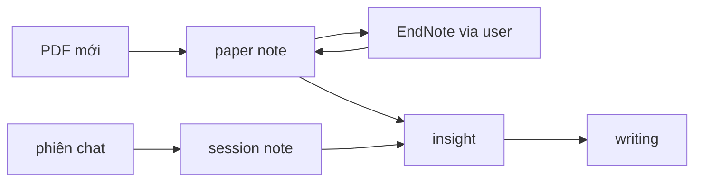

# research-helper

> **English**: [README.md](../../README.md) (canonical)

**research-helper** là chat-driven research assistant: agent (orchestrator) điều phối workflow nghiên cứu qua chat, ghi kết quả vào file Markdown trong `research/{slug}/`, và gọi hai MCP — **MarkItDown** (PDF mới) và **endnote-mcp** (thư viện EndNote đã curate). Governance (`AGENTS.md`, `CLAUDE.md`, `docs/`) mô tả cách agent hoạt động; dữ liệu nghiên cứu tách riêng per-project.

## Bắt đầu

1. Clone/mở repo này.
2. Dùng **agent coding tool** (Claude Code, Grok CLI, Cursor, …) **hoặc** CLI thuần (`claude`, `grok`, …) — trong thư mục repo, nói **"bắt đầu"**.
3. Agent đọc `AGENTS.md` / `CLAUDE.md` → chạy onboarding (slug + purpose) → tạo `research/{slug}/` nếu chưa có project.

**Không có gì phức tạp.** Coding tool/IDE chỉ giúp nhìn file, diff, tree rõ hơn — bản chất vẫn là agent đọc các file `.md` đã commit. Dùng thuần CLI, không mở IDE, **vẫn chạy y hệt**; không phụ thuộc tool cụ thể.

> `huong-dan-su-dung.md` (hướng dẫn distill cho end-user) — chưa viết, defer sau khi guide đủ nội dung.

## Workflow (sơ lược)

Chi tiết artifact, INDEX, git per-project → [00-overview.md](../guides/research/00-overview.md).

## Công cụ & vai trò

| Công cụ | Vai trò trong research-helper |
|---------|-------------------------------|
| **MarkItDown MCP** | Convert PDF mới → Markdown token-efficient cho agent đọc (paper chưa vào EndNote) |
| **endnote-mcp** | Đọc thư viện EndNote đã curate — search, đọc PDF sâu, format citation/bibliography. Read-only (write qua EndNote desktop) |
| **whyschools** ([research-helper.md](../raws/research-helper.md)) | Blog nguồn cảm hứng ban đầu cho ý tưởng kết hợp MarkItDown + endnote-mcp — **không phải dependency chạy**, chỉ tham khảo thiết kế |
| **context-mapping pattern** ([agent-memory-and-load-protocol.md](../raws/agent-memory-and-load-protocol.md) §0, từ skvn-marine) | Kiến trúc `.context/` (GLOBAL/MILESTONES/TENSIONS/modules) — convention quản lý AI memory, **không phải tool cài đặt** |
| **Markpad** | App mở file `.md` local cho user xem note — không phải MCP, chỉ viewer |

## Link nhanh

| File | Mục đích |
|------|----------|
| [AGENTS.md](../../AGENTS.md) | Invariants, startup order |
| [CLAUDE.md](../../CLAUDE.md) | Orchestrator playbook |
| [00-overview.md](../guides/research/00-overview.md) | Chi tiết workflow `research/` |
| [endnote-workflow.md](../decisions/endnote-workflow.md) | EndNote workflow (canonical) |