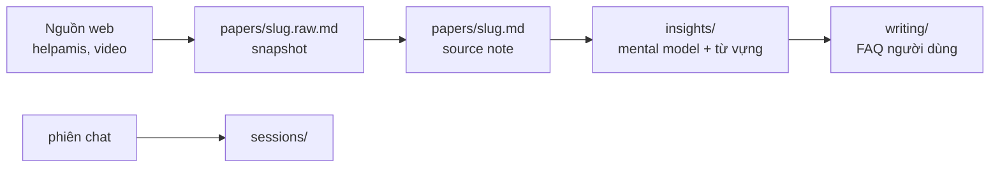

# Study case — MISA AMIS Sản xuất (knowledge translation)

**Date**: 2026-07-03  
**Status**: `project-created`  
**Project**: `research/amis-docs-digest/`  
**Phiên**: Grok + user — edge case

---

## 1. Bối cảnh

User muốn thư mục nghiên cứu tổng hợp **cách sử dụng MISA AMIS Sản xuất** — không phải tìm insight học thuật mới, mà **nghiên cứu cách truyền đạt** để người **không chuyên công nghệ** có thể tự tìm kiếm và trả lời được câu hỏi nghiệp vụ hằng ngày.

Đây là **knowledge translation / enablement**, không phải academic literature review.

---

## 2. Phát hiện (sau search)

### 2.1 Sản phẩm

**AMIS Sản xuất** — module ERP cloud của MISA cho quản trị sản xuất:

- Kế hoạch sản xuất (tổng thể, chi tiết)
- Lệnh sản xuất, công đoạn, quy trình
- Kho nguyên vật liệu, định mức, giá thành
- Kiểm soát chất lượng, tiến độ realtime
- Tích hợp **Mua hàng**, **Kho hàng** trong hệ AMIS

Landing: [amis.misa.vn/amis-san-xuat](https://amis.misa.vn/amis-san-xuat/)

### 2.2 Nguồn kiến thức chính (web, không phải PDF)

| Nguồn | URL mẫu | Vai trò |
|-------|---------|---------|
| Help AMIS — KB Sản xuất | [helpamis.misa.vn/amis-san-xuat](https://helpamis.misa.vn/amis-san-xuat/) | Hướng dẫn từng thao tác, theo menu phần mềm |
| Blog / tin tức MISA | [amis.misa.vn/tin-tuc/quan-tri-san-xuat](https://amis.misa.vn/tin-tuc/quan-tri-san-xuat/) | Bối cảnh nghiệp vụ, case ngành |
| Video / Academy | [helpamis.misa.vn/amis-san-xuat/video](https://helpamis.misa.vn/amis-san-xuat/video/), [academy.misa.vn](https://academy.misa.vn/) | Demo thực tế |
| Cộng đồng hỗ trợ | misa.vn/cong-dong | Q&A thực tế, edge case triển khai |

**Ví dụ bài KB có cấu trúc:**

- [Tổng quan AMIS Sản xuất](https://helpamis.misa.vn/amis-san-xuat/kb/tong-quan-ve-san-pham-amis-san-xuat/)
- [Quy trình sản xuất](https://helpamis.misa.vn/amis-san-xuat/kb/quy-trinh-san-xuat/)
- [Lập lệnh sản xuất](https://helpamis.misa.vn/amis-san-xuat/kb/lap-lenh-san-xuat/)
- [Công đoạn sản xuất](https://helpamis.misa.vn/amis-san-xuat/kb/cong-doan-san-xuat/)
- [Lập kế hoạch sản xuất tổng thể](https://helpamis.misa.vn/amis-san-xuat/kb/lap-ke-hoach-san-xuat-tong-the/)

### 2.3 Gap giữa tài liệu gốc và đối tượng đọc

| Vấn đề | Hệ quả |
|--------|--------|
| Tài liệu help viết theo **tên menu / thuật ngữ ERP** | Người xưởng không biết hỏi "lệnh sản xuất" hay "làm sao biết chậm tiến độ" |
| Nhiều module liên kết (SX + Mua hàng + Kho) | Một câu hỏi đời thường trải nhiều trang help |
| UI đổi theo phiên bản | Cần `fetched_at` + link gốc trên mỗi source note |
| Không có MCP helpamis | Orchestrator fetch web / user paste / screenshot |

### 2.4 Kết luận ingest

**Đúng:** luồng chính là **web → `.md`**, không phải PDF → MarkItDown.

MarkItDown chỉ phụ (PDF/eBook từ Academy nếu có). EndNote **không cần** cho project này.

---

## 3. Khớp framework `research-helper` (không sửa governance)

Cấu trúc `research/{slug}/` **vẫn dùng được** nếu map lại vai trò artifact — ghi rõ trong **README project**, không đổi `docs/guides/research/papers.md` gốc (milestone 0.0.1).



### 3.1 Map thư mục

| Thư mục chuẩn | Trong study case này |
|---------------|----------------------|
| `papers/` | **Source notes** — 1 URL / 1 video / 1 quy trình |
| `insights/` | Mental model, bảng thuật ngữ ERP ↔ tiếng xưởng, map câu hỏi ↔ màn hình |
| `writing/` | Deliverable: FAQ, checklist, hướng dẫn theo *việc cần làm* |
| `sessions/` | Log: câu hỏi hay gặp, cách diễn đạt đã thử |

### 3.2 Layout `papers/` (adapt)

```
papers/
├── INDEX.md
├── {slug}.md           ← source note (commit)
├── {slug}.raw.md       ← snapshot HTML→md (gitignore)
└── (không .pdf, .ris)
```

Frontmatter gợi ý trên source note:

```yaml
---
type: source-note          # không phải academic paper
source_url: https://...
fetched_at: 2026-07-03
source_kind: helpamis-kb | video | blog
related_modules: [lenh-san-xuat, kho]
---
```

Nội dung block bắt buộc trong `{slug}.md`:

1. **Tóm tắt gốc** — giữ thuật ngữ MISA
2. **Plain-language** — cùng ý, nói theo việc xưởng
3. **Câu hỏi user hay hỏi** mà trang này trả lời

### 3.3 INDEX `papers/` (adapt)

Thay cột PDF / `endnote_id`:

| Title | File | Source URL | Status | Plain-language |
|-------|------|------------|--------|----------------|

**Status flow rút gọn:** `new` → `processed` → `linked-insight`  
(bỏ `in-endnote`)

### 3.4 MCP / tools

| Tool mặc định | Study case |
|---------------|------------|
| MarkItDown | Chỉ khi có file PDF/eBook tải về |
| endnote-mcp | **Không dùng** |
| Web fetch (orchestrator) | **Luồng chính** cho helpamis |

---

## 4. Mục tiêu deliverable

1. Người không chuyên **đặt câu hỏi bằng ngôn ngữ đời thường** và tìm được trong INDEX / writing
2. Mỗi insight có **bảng từ vựng** (ví dụ: "lệnh sản xuất" = "lệnh xưởng làm bao nhiêu sản phẩm")
3. Writing layer: FAQ theo **việc cần làm**, không theo menu phần mềm

**Đối tượng đọc** — **đã chốt**: kế toán xưởng, chủ xưởng, nhân viên liên quan (thủ kho, điều phối SX, QC, mua hàng khi chạm quy trình SX).

---

## 5. Plan adapt (thực thi)

### Phase A — Onboarding project (chờ user)

| # | Việc | Output |
|---|------|--------|
| A1 | User chốt slug + purpose | **Done** — slug: `amis-docs-digest` |
| A2 | Render templates + ghi README adapt | Mục **Ingest: web**; `Citation style: N/A` |
| A3 | `git init` trong `research/{slug}/` | Initial commit |

**Purpose draft (chưa chốt):**

> Tổng hợp kiến thức sử dụng AMIS Sản xuất từ tài liệu chính thức; nghiên cứu cách truyền đạt dễ hiểu để người không chuyên công nghệ có thể tự tìm kiếm và trả lời được câu hỏi nghiệp vụ hằng ngày.

### Phase B — Pilot ingest (1–2 nguồn)

| # | Việc | Output |
|---|------|--------|
| B1 | Fetch [lap-lenh-san-xuat](https://helpamis.misa.vn/amis-san-xuat/kb/lap-lenh-san-xuat/) | `papers/lap-lenh-san-xuat.raw.md` |
| B2 | Viết source note + plain-language block | `papers/lap-lenh-san-xuat.md` |
| B3 | Cập nhật `papers/INDEX.md` | Status `processed` |

### Phase C — Mental model

| # | Việc | Output |
|---|------|--------|
| C1 | Insight từ vựng ERP ↔ xưởng | `insights/thu-vung-san-xuat.md` |
| C2 | Insight map quy trình SX end-to-end | `insights/quy-trinh-san-xuat-mental-model.md` |

### Phase D — Deliverable người dùng

| # | Việc | Output |
|---|------|--------|
| D1 | FAQ theo câu hỏi đời thường | `writing/faq-san-xuat-hang-ngay.md` |
| D2 | Checklist "bắt đầu tuần sản xuất trên AMIS" | `writing/checklist-tuan-san-xuat.md` |

### Phase E — Governance (defer)

Chỉ promote lên `docs/guides/research/` khi **≥2 project** cùng pattern hoặc user tag `[governance:docs/guides/research/sources.md]`:

- Guide `sources.md` (web ingest song song `papers.md`)
- Hoặc section "Edge case: product docs" trong `00-overview.md`

**Không làm trong phiên này** — giữ adapt ở README project + study-case.

---

## 6. Rủi ro & giới hạn

| Rủi ro | Mitigation |
|--------|------------|
| Help page đổi URL / nội dung | `source_url` + `fetched_at` trên mỗi note |
| Trang cần đăng nhập AMIS | User paste nội dung hoặc screenshot → orchestrator tóm tắt |
| Thuật ngữ MISA ≠ thuật ngữ xưởng user | `insights/` glossary — review với user có domain knowledge |
| Scope phình (Mua hàng, Kho, Kế toán) | Ghi **Scope** trong README: in/out module |

---

## 7. Open questions (chờ user)

1. **Slug** — `amis-san-xuat-guide` hay `misa-amis-san-xuat`?
2. ~~**Đối tượng đọc**~~ — **Done**: kế toán xưởng, chủ xưởng, nhân viên liên quan
3. **Scope module** — chỉ AMIS Sản xuất hay cả Mua hàng + Kho?
4. **Ngôn ngữ** — VI (mặc định phiên)?
5. **Bắt đầu từ quy trình nào** — lập lệnh SX, kế hoạch tổng thể, hay tổng quan?

---

## 8. Tham chiếu framework gốc

- `docs/guides/research/00-overview.md` — bốn artifact
- `docs/guides/research/papers.md` — luồng PDF (không áp dụng trực tiếp)
- `docs/guides/mcp/markitdown-mcp.md` — chỉ PDF/file
- `CLAUDE.md` §G — onboarding cần slug + purpose trước `mkdir`