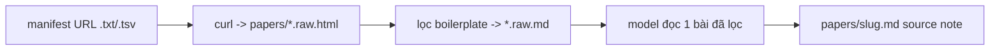
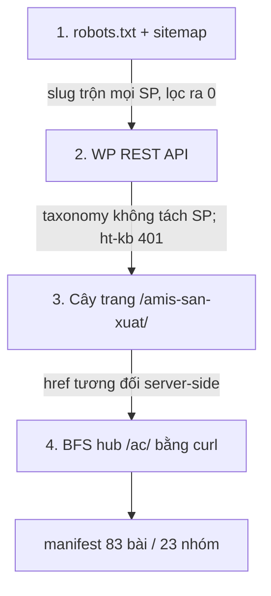

# Study case — Dựng manifest nguồn web tốn ít token (helpamis.misa.vn)

**Date**: 2026-07-03
**Status**: `manifest-built` (Phase A done, ingest defer)
**Project**: `research/amis-docs-digest/`
**Phiên**: Opus + user
**Guide sinh ra**: [`docs/guides/research/web-ingest.md`](../guides/research/web-ingest.md)

> Bổ trợ study case gốc [2026-07-03-misa-amis-san-xuat-knowledge-translation.md](2026-07-03-misa-amis-san-xuat-knowledge-translation.md) — cái đó chốt *cấu trúc project*; cái này chốt *cách kéo dữ liệu web về*.

---

## 1. Bối cảnh

Project `amis-docs-digest` ingest từ **web** (không PDF/EndNote). Câu hỏi user: *"có cách nào lấy dữ liệu docs về mà tốn ít token nhất không?"* — rồi yêu cầu dựng manifest đầy đủ trước khi ingest.

---

## 2. Nguyên tắc cốt lõi: tách "kéo về" khỏi "model đọc"

Token **chỉ** tốn khi nội dung chạy qua context của model. `curl` + `grep`/`awk` xử lý trên đĩa ≈ **0 token**.



**Luật:** dựng manifest hoàn toàn ngoài context; tải batch ra `.raw.*` (gitignore); model chỉ đọc bài đang xử lý; trung gian vào `.local/`.

---

## 3. Trình tự khám phá cấu trúc site (rẻ → đắt)

Chạy theo thứ tự, **dừng ở bước đầu cho manifest sạch**. Thực tế helpamis phải đi tới bước 4.



| # | Phương pháp | Kết quả helpamis | Bài học |
|---|-------------|------------------|---------|
| 1 | `robots.txt` → sitemap (`/wp-sitemap-posts-ht_kb-1.xml`) | 524 URL toàn site, slug dạng câu hỏi **trộn mọi sản phẩm** | Sitemap = danh sách rẻ nhất nhưng **không segment theo sản phẩm** → lọc `san-xuat` ra 0 |
| 2 | WP REST (`/wp-json/wp/v2/types`, `ht-kb-category`) | `ht-kb` **401**; category generic, `search=sản xuất` rỗng | REST gọn nhưng taxonomy phải **thực sự** tách sản phẩm mới dùng được |
| 3 | Trang landing sản phẩm `/amis-san-xuat/` | 13 hub `/ac/` + vài bài — **scope sạch** (có tiền tố sản phẩm) | Cây trang chuyên mục là **neo sạch nhất** khi sitemap/taxonomy bẩn |
| 4 | BFS các hub `/ac/` bằng `curl` | **83 bài / 23 nhóm** | href bài là **tương đối** → phải grep `href="/amis-san-xuat/kb/`, không phải URL tuyệt đối |

---

## 4. Cạm bẫy quyết định (mất nhiều thời gian nhất)

### 4.1 Tưởng nhầm AJAX → suýt dùng Chrome

Grep URL **tuyệt đối** trong HTML hub ra 0 link bài → kết luận sai "hub render bằng JS/AJOX, cần headless/Chrome".

**Sự thật:** đếm `hkb-article` trong HTML ra **23** → bài **có** render server-side. Href dùng dạng **tương đối**:

```
class="hkb-article__link" href="/amis-san-xuat/kb/lap-ke-hoach-san-xuat-tong-the/"
```

→ `curl` thuần đủ, **không cần Chrome MCP**. Bài học ghi vào guide: *khi grep link ra rỗng, kiểm tra href tương đối trước khi kết luận AJAX* (`grep -c hkb-article` / `<article`).

### 4.2 Nghi phân trang ẩn (nhiều hub đúng 5 bài)

Số 5 lặp lại → nghi cap hiển thị. Verify bằng `page/2`:

```bash
curl -sL ".../ac/kho-vat-tu/page/2/" | grep -c 'hkb-article__link'   # => 0
```

→ 5 là số thật, **không có bài ẩn**. Manifest 83 là closure đầy đủ.

### 4.3 Timeout khi crawl đệ quy per-hub

Crawl full-recursive **cho từng** top-hub → re-fetch subcat chồng chéo → **timeout 2 phút**. Sửa: crawl mỗi hub **đúng 1 lần** (dùng `seen_ac.txt` đã có), tag category theo hub. Bài học: **BFS 1 lần + set `seen`**, không re-crawl per-root.

---

## 5. Câu lệnh chốt (rút gọn — bản đầy đủ trong guide)

```bash
D=.local; B=https://helpamis.misa.vn
# seed: landing + 13 hub
curl -sL "$B/amis-san-xuat/" -o "$D/landing.html"
grep -oE 'href="https://helpamis\.misa\.vn/[^"]+"' "$D/landing.html" | sed -E 's/href="//;s/"//' | sort -u > "$D/links.txt"
# BFS hub, trích href TƯƠNG ĐỐI, set seen chống lặp
kb(){ grep -oE 'href="/amis-san-xuat/kb/[a-z0-9-]+/"' "$1" | sed -E 's#href="##;s#"##'; }
ac(){ grep -oE 'href="/amis-san-xuat/ac/[a-z0-9-]+/"' "$1" | sed -E 's#href="##;s#"##'; }
# ... vòng lặp queue/seen ... -> all_kb.txt (83 unique)
# verify không phân trang ẩn:
curl -sL "$B/amis-san-xuat/ac/kho-vat-tu/page/2/" | grep -c hkb-article__link   # 0
```

---

## 6. Artifact tạo ra

| File | Vai trò | Commit? |
|------|---------|---------|
| [`research/amis-docs-digest/papers/_sources-manifest.md`](../../research/amis-docs-digest/papers/_sources-manifest.md) | Manifest 83 bài / 23 nhóm + cột Status | ✅ |
| `research/amis-docs-digest/.local/manifest.tsv`, `all_kb.txt`, `seen_ac.txt` | Working files | ✗ gitignore |
| [`docs/guides/research/web-ingest.md`](../guides/research/web-ingest.md) | Guide reusable | ✅ |
| [`sessions/2026-07-03-web-ingest-manifest.md`](../../research/amis-docs-digest/sessions/2026-07-03-web-ingest-manifest.md) | Session note | ✅ |

---

## 7. Áp dụng lại cho site khác (checklist)

1. `robots.txt` → có `Sitemap:`? Lấy sitemap, thử lọc theo slug. **Trộn sản phẩm?** → bước 2.
2. `/wp-json/wp/v2/types` → có post type + taxonomy tách đúng scope? **Không / 401?** → bước 3.
3. Trang landing chuyên mục → trích link nội bộ (thử **cả href tương đối lẫn tuyệt đối**).
4. Grep link ra rỗng nhưng có `<article`/`hkb-article` → **href tương đối**, sửa regex.
5. Số bài lặp nghi cap → verify `page/2`.
6. Crawl đệ quy → **1 lần/URL + set seen**, tránh timeout.
7. Manifest commit dạng `papers/_sources-manifest.md` (có Status) — không kẹt trong `.local`.

---

## 8. Quyết định phiên

- **Scope ingest lần này**: chỉ dựng manifest, **dừng** (user chọn).
- **Khi ingest**: **pilot 3 bài** duyệt format trước khi batch (user chốt — lưu memory).
- Ưu tiên 8 nhóm core: kế hoạch SX, điều phối/thực thi, kho vật tư, kiểm tra chất lượng + tiêu chuẩn QC, báo cáo, giao việc, năng lực SX.

---

## 9. Tham chiếu

- Guide: [`docs/guides/research/web-ingest.md`](../guides/research/web-ingest.md)
- Study case cấu trúc project: [`2026-07-03-misa-amis-san-xuat-knowledge-translation.md`](2026-07-03-misa-amis-san-xuat-knowledge-translation.md)
- Routing: [`docs/guides/research/index-routing.md`](../guides/research/index-routing.md) (dòng "Ingest nguồn web")
